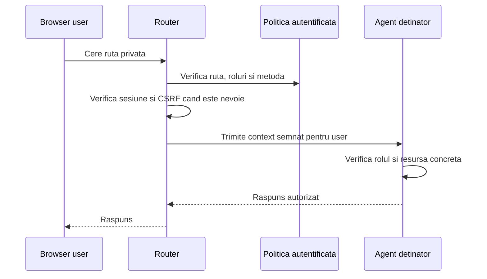

# Endpointuri Autentificate

Ultima revizuire: 2026-06-02

Acest document defineste noul contract pentru endpointuri autentificate. Structura lui incepe cu problema si motivatia, apoi ajunge la reguli, manifest si teste.

## 1. Problema Pe Care O Rezolvam

| Problema | Exemplu | Risc daca nu exista acest tip de acces |
| --- | --- | --- |
| Workspace-ul are date private. | Fisiere, profiluri, camere, task-uri, documente si setari. | Fara autentificare, resursele pot fi accesate de caller gresit. |
| Userii au roluri diferite. | User normal, owner, admin, participant, operator. | Daca verificam doar existenta unei sesiuni, orice user poate face prea mult. |
| O ruta nu este totuna cu o resursa. | Acelasi endpoint poate accesa documente diferite. | Routerul poate permite ruta, dar agentul trebuie sa verifice obiectul concret. |
| Browserul foloseste cookie-uri. | Mutatiile pot fi trimise prin cross-site request. | Fara CSRF sau body binding, sesiunea poate fi abuzata. |

## 2. De Ce Avem Nevoie De Endpointuri Autentificate

| Motiv | Explicatie | De ce nu folosim alt tip de acces |
| --- | --- | --- |
| Operatii normale de workspace. | Userul trebuie sa poata lucra cu resurse private. | Public si guest nu identifica membrul workspace-ului. |
| Audit pe user. | Trebuie sa stim cine a citit sau modificat o resursa. | MCP intern identifica agenti, nu inlocuieste identitatea userului. |
| Roluri si permisiuni. | Unele operatii cer admin, owner sau membru. | Public protejat are doar scope guest. |
| UX de aplicatie. | Userul se autentifica o data si foloseste mai multe suprafete. | API keys sau tokeni manuali nu sunt potriviti pentru browser UI. |

## 3. Cand Se Foloseste Si Cand Nu

| Situatie | Decizie | Motiv |
| --- | --- | --- |
| UI Explorer principala. | Se foloseste authenticated. | Aplicatia lucreaza cu workspace privat. |
| Setari de profil sau avatar. | Se foloseste authenticated. | Resursa tine de user. |
| Dashboard WebMeet pentru membri. | Se foloseste authenticated. | Camerele workspace cer membru sau owner. |
| Management provider sau policy. | Se foloseste MCP Admin sau ruta admin peste authenticated. | Login-ul nu este suficient pentru administrare. |
| Invitatie publica. | Nu se foloseste authenticated. | Invitatul nu are cont de workspace. |
| Tool intern intre agenti. | Nu se foloseste authenticated simplu. | MCP are nevoie de caller agent, tool si body hash. |

## 4. Model Conceptual



| Componenta | Responsabilitate | De ce |
| --- | --- | --- |
| Browser user | Prezinta sesiune autentificata. | Userul este actorul operatiilor workspace. |
| Router | Verifica sesiunea, rolurile minime si protectiile de transport. | Refuza devreme request-uri nepotrivite. |
| Agent | Verifica ACL-ul si politica resursei concrete. | Agentul cunoaste domeniul. |
| Audit | Leaga actiunea de user, resursa, rol si rezultat. | Operatiile private trebuie investigate si revocate. |

## 5. Cerinte De Securitate

| Cerinta | Specificatie | De ce |
| --- | --- | --- |
| Sesiune verificata | Fiecare request authenticated are user valid. | Identitatea este baza deciziei. |
| Rol minim | Routerul poate aplica roluri coarse. | Reduce expunerea inainte de agent. |
| Token downstream | Agentul primeste context semnat pentru audienta lui. | Headerul nesemnat nu este autoritate. |
| CSRF sau body binding | Mutatiile browser-cookie au protectie dedicata. | Cookie-urile pot fi trimise de alt site. |
| Autorizare de resursa | Agentul verifica ACL, ownership, membership sau policy. | Userul valid nu are acces universal. |
| Erori redactate | Raspunsurile nu expun secrete sau payload-uri interne. | Userii autentificati pot fi conturi compromise. |

## 6. Aplicare La Agentii Explorer

| Agent sau componenta | Aplicare potrivita | Motiv |
| --- | --- | --- |
| `explorer` | Aplicatie principala, fisiere, profil, avatar, setari si documente private. | Detine resurse workspace. |
| `webmeetAgent` | Dashboard, camere workspace si participant management. | Membrii si ownerii au drepturi diferite. |
| `soul-gateway` | Dashboard si setari non-publice. | Configurarea cere user si adesea rol admin. |
| `onlyOffice` | Editare documente private. | Documentul cere user si politica de document. |
| `gitAgent` | Actiuni Git initiate de user. | Repo-ul si credentialele sunt resurse private. |
| `tasksAgent` | Task-uri si planuri de lucru. | Task-urile sunt date de workspace. |
| `dpuAgent` | Date user-owned si profiluri. | DPU detine date sensibile. |
| `llmAssistant`, `soplangAgent`, `multimedia` | UI-uri sau actiuni initiate de user. | Contextul userului limiteaza operatiile. |

## 7. Detalii De Politica Si Manifest

Principiul pentru endpointuri autentificate este ca forma minima trebuie sa fie suficienta pentru cazul obisnuit. `accessType: "authenticated"` spune clasa de securitate. Restul campurilor sunt fie metadata de ruta cand blocul de securitate defineste ruta, fie override-uri pentru cazuri cu risc mai mare.

| Nivel | Forma | Cand se foloseste | De ce |
| --- | --- | --- | --- |
| Minim | `accessType: "authenticated"` | Cand ruta este deja definita in alta parte si are nevoie doar de protectie standard de user autentificat. | Evita manifesturi zgomotoase si reduce riscul de configurare gresita. |
| Ruta declarata | `id`, `kind`, `externalPath`, `accessType` | Cand blocul `security.routes` este si locul unde se declara ruta. | Routerul trebuie sa stie la ce cale se aplica regula. |
| Override de auth | `auth.providers`, `auth.requiredRoles`, `auth.session` | Cand ruta cere provider, rol sau durata de sesiune diferita de default. | Nu toate rutele au acelasi risc. |
| Override downstream | `downstreamToken` | Cand agentul are nevoie de audienta sau binding diferit de default. | Tokenul implicit trebuie sa acopere cazul normal fara configurare repetitiva. |
| Override browser safety | `csrf` | Cand ruta modifica reguli de CSRF fata de default-ul pentru mutatii cookie-based. | Mutatiile au risc diferit fata de citiri. |
| Override audit | `auditCategory` | Cand ruta trebuie grupata intr-o categorie de audit explicita. | Operatiile sensibile trebuie investigate usor. |

```json
{
  "security": {
    "accessType": "authenticated"
  }
}
```

| Default pentru forma minima | Regula | De ce |
| --- | --- | --- |
| Provider | Mosteneste providerul de autentificare al workspace-ului sau al rutei parinte. | Ruta obisnuita nu trebuie sa repete configuratia globala. |
| Rol | Orice user autentificat este acceptat la router, iar agentul verifica resursa. | Pentru operatii normale, ACL-ul de domeniu este mai important decat roluri coarse in manifest. |
| Metode | Metodele vin din contractul rutei, nu din securitate, daca ruta este declarata separat. | Securitatea nu trebuie sa dubleze schema HTTP existenta. |
| Downstream token | Routerul emite automat context semnat pentru agentul detinator. | Agentul are nevoie de dovada routerului fara configurare manuala. |
| CSRF | Mutatiile browser-cookie folosesc default-ul global de protectie. | Nu vrem ca fiecare ruta sa reinventeze protectia de baza. |
| Audit | Categoria implicita este derivata din agent si ruta. | Auditul exista si fara camp explicit. |

Cand securitatea este folosita ca loc de declarare a rutei, nu doar ca tag atasat unei rute existente, forma minima extinsa este:

```json
{
  "security": {
    "routes": [
      {
        "id": "explorer-avatar-settings",
        "kind": "http",
        "accessType": "authenticated",
        "externalPath": "/explorer/avatar-settings/*"
      }
    ]
  }
}
```

Campurile suplimentare apar doar cand ruta are reguli speciale:

```json
{
  "security": {
    "routes": [
      {
        "id": "soul-gateway-management",
        "kind": "http",
        "accessType": "authenticated",
        "externalPath": "/soul-gateway/management/*",
        "auth": {
          "requiredRoles": ["admin"],
          "session": { "maxAgeSeconds": 3600 }
        },
        "csrf": { "mode": "strict" },
        "auditCategory": "gateway-management"
      }
    ]
  }
}
```

| Camp sau flag | Regula | De ce |
| --- | --- | --- |
| `accessType` | Singurul camp obligatoriu cand regula este atasata unei rute deja declarate. | Clasa de acces este decizia de securitate principala. |
| `id` | Obligatoriu doar in `security.routes`. | Daca blocul defineste ruta, regula trebuie identificata pentru audit si override. |
| `kind` | Obligatoriu doar in `security.routes`. | Routerul trebuie sa stie daca regula este HTTP, MCP sau alta suprafata. |
| `externalPath` | Obligatoriu doar in `security.routes`. | Fara cale nu exista tinta de reachability. |
| `methods` | Optional pentru securitate; se declara numai daca politica de securitate restrange metodele. | Metodele sunt adesea contract de routing sau API, nu camp de securitate obligatoriu. |
| `auth.providers` | Optional. | Ruta obisnuita mosteneste providerul global. |
| `auth.requiredRoles` | Optional. | Doar rutele cu rol special trebuie sa-l declare. |
| `auth.session` | Optional. | Doar rutele mai sensibile cer durata de sesiune diferita. |
| `downstreamToken` | Optional. | Default-ul este emis automat pentru agentul detinator. |
| `csrf` | Optional. | Default-ul global protejeaza mutatiile; ruta declara doar exceptii sau strictete suplimentara. |
| `auditCategory` | Optional pentru rute normale si recomandat pentru rute sensibile. | Auditul implicit exista, dar categoriile explicite ajuta investigatiile. |

## 8. Teste De Acceptare

| Test | Rezultat asteptat | De ce |
| --- | --- | --- |
| Sesiune lipsa | Refuz inainte de agent. | Endpointul este autentificat. |
| Rol lipsa | Refuz inainte de operatie. | Login-ul singur nu este suficient. |
| CSRF lipsa pe mutatie | Refuz pentru metode configurate. | Protejeaza browser-cookie auth. |
| Token downstream cu audienta gresita | Refuz in agent. | Tokenii nu sunt globali. |
| Body modificat dupa emitere | Refuz in agent. | Payload-ul autorizat trebuie sa fie cel executat. |
| Resursa nepermisa | Refuz in agent chiar daca userul este autentificat. | Autorizarea de domeniu ramane obligatorie. |
