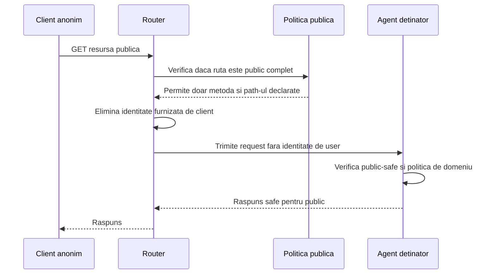
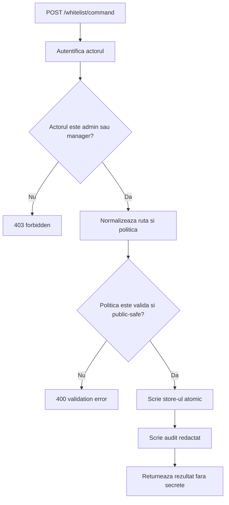

# Endpointuri Complet Publice

Ultima revizuire: 2026-06-02

Acest document defineste noul contract pentru endpointuri complet publice. Structura lui incepe cu problema si motivatia, apoi ajunge la reguli, manifest si teste.

## 1. Problema Pe Care O Rezolvam

| Problema | Exemplu | Risc daca nu exista acest tip de acces |
| --- | --- | --- |
| Unele informatii trebuie accesate de oricine. | Health checks, asset-uri publice, rapoarte publice, pagini publicate. | Daca cerem login pentru orice, sistemul devine inutil pentru monitorizare, sharing si continut public real. |
| Publicarea trebuie sa fie intentionata. | Un folder sau document poate fi share-uit public doar prin decizie explicita. | Daca publicul este dedus din path sau din configuratie implicita, apar scurgeri accidentale. |
| Lipsa identitatii schimba complet regulile. | Caller-ul anonim nu are user, rol sau sesiune guest. | Nu putem face autorizare pe user, deci trebuie limitate metoda, query-ul, cache-ul si raspunsurile. |
| Publicul nu trebuie sa devina director de workspace. | Un link public catre un raport nu inseamna lista publica de rapoarte. | Enumerarea de resurse devine posibila chiar daca fiecare resursa pare separata. |

## 2. De Ce Avem Nevoie De Endpointuri Complet Publice

| Motiv | Explicatie | De ce nu folosim alt tip de acces |
| --- | --- | --- |
| Monitorizare si health. | Serviciile externe trebuie sa poata verifica daca sistemul raspunde. | Public protejat ar cere token inutil pentru probes. |
| Continut public real. | Unele resurse sunt destinate publicului larg. | Authenticated ar bloca exact audienta dorita. |
| Link sharing readonly. | Un user sau admin poate publica o resursa controlata. | Public protejat este mai potrivit doar cand avem nevoie de sesiune guest. |
| API cu auth proprie de domeniu. | Un endpoint poate fi public la router, dar protejat prin API key sau token de document la agent. | Router auth nu este mereu credentialul corect pentru clienti externi. |

## 3. Cand Se Foloseste Si Cand Nu

| Situatie | Decizie | Motiv |
| --- | --- | --- |
| Health check cu raspuns minim. | Se poate folosi public complet. | Nu expune date de user si trebuie apelat fara sesiune. |
| Asset static fara secrete. | Se poate folosi public complet. | Continutul este destinat descarcarii publice. |
| Document publicat readonly. | Se poate folosi public complet daca agentul confirma starea public-safe. | Ruta este publica, dar resursa ramane validata de agent. |
| Invitatie WebMeet. | Nu se foloseste public complet. | Invitatii au nevoie de token temporar, room scope si rate limiting pe sesiune. |
| Chat WebAssist cu vizitator. | Nu se foloseste public complet. | Conversatia are nevoie de continuitate si control anti-abuz. |
| Operatie pe fisiere workspace. | Nu se foloseste public complet. | Fisierele de workspace cer user sau politica explicita de sharing. |
| Tool MCP. | Nu se foloseste public complet. | Tool-urile executa capabilitati si cer politica MCP. |
| Operatie admin. | Nu se foloseste public complet. | Administrarea cere rol, intentie si audit. |

## 4. Model Conceptual



| Componenta | Responsabilitate | De ce |
| --- | --- | --- |
| Client anonim | Poate cere doar rute publice declarate. | Nu are identitate verificabila. |
| Router | Decide reachability, metoda, query, cache, rate limit si denial. | Este punctul unic de intrare public. |
| Politica publica | Declara exact ce este public si cat timp. | Publicarea trebuie auditata si revocabila. |
| Agent detinator | Verifica daca resursa concreta este public-safe. | Agentul cunoaste domeniul si continutul. |

## 5. Cerinte De Securitate

| Cerinta | Specificatie | De ce |
| --- | --- | --- |
| Default deny | Nicio ruta nu este publica fara declaratie explicita. | Previne publicarea accidentala. |
| Readonly implicit | `GET` si `HEAD` sunt singurele metode implicite. | Mutatiile publice cer o specificatie separata. |
| Query inchis implicit | Query string-ul este respins daca nu este declarat. | Query-ul poate schimba sensul resursei. |
| Denial generic | Raspunsul nu confirma existenta resursei private. | Previne enumerarea. |
| Rate limiting | Limite pe IP, ruta si agent. | Publicul este accesibil automatizarii. |
| Revocare imediata | O regula dezactivata sau expirata opreste accesul si cache-ul. | Public sharing trebuie retras rapid. |
| Audit redactat | Logurile nu includ secrete, tokeni sau continut sensibil. | Traficul public poate contine input ostil. |

## 6. Aplicare La Agentii Explorer

| Agent sau componenta | Aplicare potrivita | Motiv |
| --- | --- | --- |
| `explorer` | Link sharing readonly pentru resurse marcate public-safe. | Explorer detine continut care uneori trebuie publicat controlat. |
| `soul-gateway` | API-uri care au auth proprie de domeniu. | Clientii externi pot folosi API key in loc de sesiune Explorer. |
| `onlyOffice` | Vizualizare sau callback-uri protejate de token de document. | Documentul ramane controlat de politica de document. |
| `webmeetAgent` | Asset-uri publice strict safe. | Intrarea in camera are nevoie de public protejat. |
| `webAssist` | Asset-uri widget statice. | Conversatia si history au nevoie de sesiune guest. |
| `gitAgent`, `dpuAgent`, `tasksAgent`, `soplangAgent`, `multimedia`, `webmeetStt` | Nu se aplica implicit. | Acesti agenti lucreaza cu capabilitati, date sensibile sau continut de workspace. |

## 7. Specificatie Router Whitelist Pentru Public Complet

| Subiect | Specificatie | De ce |
| --- | --- | --- |
| Rol whitelist | Whitelist-ul este politica explicita prin care o ruta `/<agent>/...` devine accesibila complet public. | Publicarea trebuie sa fie o decizie de securitate, nu un efect secundar al routing-ului. |
| URL public | URL-ul public ramane URL-ul obisnuit al agentului, de exemplu `/explorer/folder/report.html` sau `/explorer/stuff/sdocid124324`. | Nu vrem id-uri publice paralele care rup ownership-ul resursei. |
| Detinator resursa | Agentul din primul segment al rutei ramane detinatorul resursei. | Routerul decide reachability, dar agentul decide daca resursa concreta este public-safe. |
| Tipuri de match | Sunt permise doar match exact si prefix terminal `/*`. | Acopera link sharing si folder sharing fara complexitatea regex-urilor greu de auditat. |
| Mod public | Intrarea foloseste `accessType: "public"` sau `access: "public"` in store-ul operational. | Valoarea separa lipsa identitatii de guest si authenticated. |
| Mutatii | Whitelist-ul public complet permite implicit numai `GET` si `HEAD`. | Mutatiile publice necesita o specificatie separata. |

| Ce suporta whitelist-ul public | Specificatie | De ce |
| --- | --- | --- |
| Rute exacte | Exemplu `/explorer/stuff/sdocid124324`. | Permite publicarea unei singure resurse. |
| Rute folder | Exemplu `/explorer/folder/*`. | Permite publicarea controlata a unei familii readonly de resurse. |
| Metadata de mutatie | Creator, updater, timestamp-uri, manageri si motiv. | Orice expunere publica trebuie sa poata fi auditata. |
| Expirare | Fiecare intrare poate avea `expiresAt`. | Linkurile publice fara expirare devin datorie de securitate. |
| Dezactivare | `enabled: false` opreste regula fara stergere. | Operatorii au nevoie de rollback rapid si auditabil. |
| Fallback | Daca whitelist-ul nu permite request-ul, ruta nu devine publica. | Default-ul ramane deny pentru public complet. |

| Ce nu suporta whitelist-ul public | Regula | De ce |
| --- | --- | --- |
| Id-uri publice noi | Whitelist-ul nu creeaza aliasuri publice sau short ids. | Aliasurile paralele ascund ownership-ul si complica revocarea. |
| Director public | Nu exista endpoint public care listeaza intrarile whitelistate. | Listarea transforma sharing-ul selectiv in catalog public. |
| Auth sau admin router-owned | Caile de auth, admin si control plane nu pot fi whitelistate. | Whitelist-ul nu trebuie sa ocoleasca securitatea routerului. |
| MCP | Rutele si tool-urile MCP nu se publica prin whitelist public HTTP. | MCP executa capabilitati si are model separat. |
| Randare in router | Routerul nu randeaza continutul resursei. | Randarea si autorizarea de domeniu raman in agent. |

### 7.1 Store Operational

| Element store | Specificatie | De ce |
| --- | --- | --- |
| Locatie | Store-ul operational este un fisier durabil de politica, de exemplu `.ploinky/router-whitelist.json`. | Politica de publicare trebuie sa supravietuiasca restarturilor. |
| Separare de routing | Store-ul nu se amesteca in fisierul de routing runtime. | Routing-ul descrie topologie, whitelist-ul descrie securitate. |
| Scriere | Scriere atomica, cu lock, fisier temporar si rename. | Doua operatii simultane nu trebuie sa corupa politica. |
| Audit | Evenimente redactate intr-un log dedicat de whitelist. | Publicarea, revocarea si denial-urile trebuie investigate. |
| Versiune | Store-ul are `version`. | Schema trebuie migrata controlat. |

```json
{
  "version": 1,
  "updatedAt": "2026-06-02T00:00:00.000Z",
  "updatedBy": {
    "type": "user",
    "id": "local:admin",
    "username": "admin",
    "roles": ["admin"]
  },
  "managers": [
    {
      "scope": "global",
      "roles": ["admin"]
    }
  ],
  "entries": [
    {
      "id": "sha256-base64url-of-normalized-policy",
      "enabled": true,
      "routeKey": "explorer",
      "pathPattern": "/folder/reports/q2/*",
      "match": "prefix",
      "access": "public",
      "methods": ["GET", "HEAD"],
      "queryPolicy": { "mode": "deny-query" },
      "profile": "readonly",
      "expiresAt": "2026-07-01T00:00:00.000Z",
      "createdAt": "2026-06-02T00:00:00.000Z",
      "createdBy": {
        "type": "user",
        "id": "local:admin",
        "username": "admin",
        "roles": ["admin"]
      },
      "updatedAt": "2026-06-02T00:00:00.000Z",
      "updatedBy": {
        "type": "user",
        "id": "local:admin",
        "username": "admin",
        "roles": ["admin"]
      },
      "managedBy": {
        "roles": ["admin"],
        "users": [],
        "agents": []
      },
      "metadata": {
        "reason": "public readonly quarterly report",
        "labels": ["public-sharing"]
      }
    }
  ]
}
```

| Camp intrare | Specificatie | De ce |
| --- | --- | --- |
| `id` | Cheie tehnica derivata din politica normalizata sau generata stabil. | Identifica regula fara sa devina id public de resursa. |
| `enabled` | Activeaza sau dezactiveaza regula. | Permite oprirea rapida fara pierderea auditului. |
| `routeKey` | Agentul detinator al rutei. | Ownership-ul trebuie explicit. |
| `pathPattern` | Calea exacta sau prefixul terminal din interiorul agentului. | Politica trebuie sa fie lizibila si auditabila. |
| `match` | `exact` sau `prefix`. | Evita ambiguitatea. |
| `access` | `public` pentru public complet. | Diferentiaza public complet de guest si authenticated. |
| `methods` | Implicit `GET` si `HEAD`. | Previne mutatiile publice accidentale. |
| `queryPolicy` | Implicit `deny-query`. | Query-ul poate largi accesul. |
| `profile` | De obicei `readonly`. | Public complet nu trebuie sa aiba profil de scriere. |
| `expiresAt` | Data optionala de expirare. | Expunerea publica trebuie sa fie revocabila si limitabila in timp. |
| `createdBy` si `updatedBy` | Actorii care au creat si modificat regula. | Auditul trebuie sa arate responsabilitatea. |
| `managedBy` | Cine poate modifica regula. | Delegarea trebuie controlata fara admin global inutil. |
| `metadata.reason` | Motivul publicarii. | Fara motiv, regula nu poate fi revizuita corect. |

### 7.2 Normalizare Si Matching

| Regula de normalizare | Specificatie | De ce |
| --- | --- | --- |
| Parser URL | Routerul parseaza calea cu un URL parser, nu cu string splitting ad hoc. | Reduce erorile de encoding si edge cases. |
| Decodare | Segmentele se decodeaza o singura data, iar encoding-ul invalid este respins. | Decodarea repetata poate ascunde traversal sau cai diferite. |
| Traversal | Se resping `..`, bytes NUL, backslash tricks si segmente goale periculoase. | Publicul nu trebuie sa poata iesi din ruta declarata. |
| Canonicalizare | Calea devine POSIX-style canonica inainte de matching. | Aceeasi resursa trebuie sa aiba o reprezentare unica. |
| Route key | Primul segment trebuie sa corespunda unui agent/rute declarate in politica noua. | Politica nu trebuie sa tinteasca suprafete inexistente sau ambigue. |
| Wildcard | Se accepta doar wildcard terminal `/*`. | Wildcard-urile intermediare sunt greu de explicat si auditat. |
| Stare intrare | Intrarile disabled sau expirate sunt ignorate. | Revocarea si expirarea trebuie sa fie autoritative. |
| Prioritate | Match-ul exact castiga inaintea prefixului. | O regula ingusta trebuie sa poata controla exceptii fata de o regula larga. |
| Metoda | Metoda se verifica inainte de proxy. | Agentul nu trebuie sa primeasca request-uri publice nepermise. |
| Query | Query-ul se verifica inainte de proxy. | Parametrii pot schimba semnificatia request-ului. |

| Exemplu request | Rezultat | De ce |
| --- | --- | --- |
| `/explorer/stuff/sdocid124324` cu regula exacta | Permis daca metoda si query-ul sunt permise. | Ruta se potriveste exact unei resurse. |
| `/explorer/folder/reports/q2/index.html` cu regula `/folder/reports/q2/*` | Permis daca resursa este public-safe la agent. | Prefixul terminal acopera folderul publicat. |
| `/explorer/folder/reports/q2/index.html?token=x` cu `deny-query` | Refuzat. | Query-ul nu a fost declarat. |
| `/explorer/folder/../secret.txt` | Refuzat. | Traversal-ul este interzis. |
| `/auth/login` | Refuzat de whitelist public. | Auth-ul este control plane, nu resursa publicabila. |

### 7.3 Politica HTTP Publica

| Aspect | Regula | De ce |
| --- | --- | --- |
| Metode implicite | `GET` si `HEAD`. | Citirile readonly sunt singurul comportament public generic. |
| Metode de mutatie | `POST`, `PUT`, `PATCH`, `DELETE` sunt respinse implicit. | Mutatiile publice cer CSRF, replay, ownership, quota si audit separate. |
| Query implicit | `deny-query`. | Fail-closed previne extinderea tacita. |
| Query allowlist | Daca este necesar, politica declara chei permise sau matching exact. | Parametrii permisi trebuie sa fie vizibili in audit. |
| Content type | Tipurile MIME publice pot fi allowlistate. | Unele tipuri pot executa script sau descarca date periculoase. |
| Response size | Dimensiunea raspunsului public poate fi limitata. | Previne abuzul de bandwidth si scurgerile mari. |

### 7.4 Administrare Prin `/whitelist/command`

| Subiect | Specificatie | De ce |
| --- | --- | --- |
| Endpoint | `POST /whitelist/command`. | O singura suprafata centralizeaza validarea, autorizarea si auditul. |
| Acces | Endpointul nu este public si nu este guest. | Cine modifica public sharing modifica suprafata de atac. |
| Autentificare | Caller-ul este autentificat inainte de orice comanda. | Comenzile de politica nu pot fi anonime. |
| Autorizare | Caller-ul are rol admin sau grant explicit de manager. | Delegarea trebuie posibila fara a da admin global tuturor. |
| Raspuns | Raspunsurile includ validari, dar nu secrete sau continut de resursa. | Admin feedback nu trebuie sa scurga date. |

| Comanda | Scop | De ce |
| --- | --- | --- |
| `add_route` | Adauga sau inlocuieste o intrare de ruta. | Publicarea trebuie facuta explicit. |
| `remove_route` | Sterge o intrare dupa id sau pattern normalizat. | Revocarea trebuie sa fie clara. |
| `set_enabled` | Activeaza sau dezactiveaza o intrare. | Oprirea temporara nu trebuie sa stearga auditul. |
| `check_route` | Arata ce regula s-ar potrivi unei rute, fara sa citeasca resursa. | Operatorul poate diagnostica politica fara exfiltrare. |
| `list_routes` | Listeaza intrarile vizibile caller-ului autorizat. | Listarea este operatie admin, nu publica. |
| `grant_manager` | Acorda drept de management. | Delegarea operationala trebuie explicita. |
| `revoke_manager` | Revoca drept de management. | Accesul la politica trebuie retractabil. |
| `list_audit` | Citeste evenimente redactate. | Administrarea are nevoie de investigare. |



### 7.5 Revocare, Cache Si Denial

| Aspect | Specificatie | De ce |
| --- | --- | --- |
| Autoritate | Whitelist-ul se verifica pentru fiecare request public. | Revocarea trebuie sa aiba efect real. |
| Cache | Raspunsurile cache-uite nu sunt servite fara revalidarea politicii. | Cache-ul nu poate depasi securitatea. |
| Revocare | Stergere, dezactivare, expirare sau ingustare opresc accesul imediat. | Linkurile publice trebuie controlate operational. |
| Denial public | Denial-urile sunt generice. | Detaliile permit enumerarea resurselor. |
| Listare publica | Nu exista. | Listarea scurge metadata operationala. |

| Decizie | De ce |
| --- | --- |
| Public sharing este politica de router, nu agent separat. | Routerul este punctul de reachability; agentul separat ar crea a doua autoritate si id-uri paralele. |
| URL-ul public ramane URL-ul agentului. | Ownership-ul ramane clar si resursa nu primeste identitate publica paralela. |
| Store-ul whitelist este separat de routing. | Routing-ul este topologie, whitelist-ul este politica de securitate. |
| Fiecare intrare are creator, updater, manageri si motiv. | Publicarea este act de securitate si trebuie auditata. |
| Exact castiga inaintea prefixului. | Regulile inguste trebuie sa poata controla exceptii fata de reguli largi. |
| Denial-urile sunt generice. | Publicul nu trebuie sa poata afla daca o resursa privata exista. |

## 8. Detalii De Politica Si Manifest

```json
{
  "security": {
    "routes": [
      {
        "id": "explorer-public-report",
        "kind": "http",
        "accessType": "public",
        "externalPath": "/explorer/public/reports/*",
        "methods": ["GET", "HEAD"],
        "query": { "mode": "deny" },
        "dataClass": "public-safe",
        "cache": { "mode": "public", "maxAgeSeconds": 300 },
        "rateLimit": { "perMinute": 60, "burst": 20 },
        "auditCategory": "public-sharing"
      }
    ]
  }
}
```

| Camp sau flag | Regula | De ce |
| --- | --- | --- |
| `accessType` | `public`. | Diferentiaza lipsa identitatii de guest si authenticated. |
| `externalPath` | Ruta exacta sau prefix strict. | Politica trebuie sa fie auditabila. |
| `methods` | Implicit `GET` si `HEAD`. | Previne mutatii accidentale. |
| `query.mode` | Implicit `deny`. | Previne extinderea tacita prin parametri. |
| `dataClass` | `public-safe`. | Publicarea trebuie legata de clasificarea datelor. |
| `cache` | `public` sau `no-store`. | Cache-ul trebuie compatibil cu revocarea. |
| `rateLimit` | Obligatoriu. | Lipsa login-ului cere control anti-abuz. |

## 9. Teste De Acceptare

| Test | Rezultat asteptat | De ce |
| --- | --- | --- |
| Ruta nedeclarata | Refuz generic. | Default-ul este deny. |
| Metoda `POST` pe ruta readonly | Refuz inainte de agent. | Mutatiile publice nu sunt permise generic. |
| Query nepermis | Refuz inainte de agent. | Query-ul nu poate largi politica. |
| Header de identitate fals | Headerul este sters inainte de proxy. | Clientul anonim nu poate impersona routerul. |
| Resursa expirata | Refuz imediat. | Expirarea este parte din politica. |
| Cache dupa revocare | Raspunsul cache-uit nu este servit. | Revocarea trebuie sa fie autoritativa. |
| Traversal in path | Refuz inainte de matching. | Publicul nu poate iesi din pattern-ul publicat. |
| Match exact si prefix simultan | Regula exacta castiga. | Regulile specifice trebuie sa poata controla exceptii. |
| `/whitelist/command` fara admin | Refuz. | Administrarea whitelist-ului nu este publica. |
| Listare publica a whitelist-ului | Nu exista endpoint public. | Sharing-ul nu trebuie transformat in director public. |
