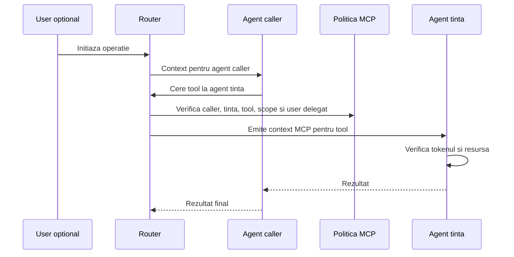

# Endpointuri MCP Interne

Ultima revizuire: 2026-06-02

Acest document defineste noul contract pentru endpointuri MCP interne. Structura lui incepe cu problema si motivatia, apoi ajunge la reguli, manifest si teste.

## 1. Problema Pe Care O Rezolvam

| Problema | Exemplu | Risc daca nu exista acest tip de acces |
| --- | --- | --- |
| Agentii trebuie sa colaboreze. | `gitAgent` poate avea nevoie de credentiale din `dpuAgent`. | Fara delegare controlata, agentii ar copia secrete sau ar inventa auth paralel. |
| Tool-urile sunt capabilitati. | Un tool poate citi secrete, scrie fisiere sau porni procese. | Autorizarea pe path HTTP este prea slaba. |
| Caller-ul poate fi agent, nu browser. | Un agent actioneaza uneori in numele unui user. | Fara user delegat, agentul poate ocoli ACL-ul userului. |
| Permisiunile trebuie sa fie pe tool. | Un agent poate avea tool-uri safe si tool-uri periculoase. | Permiterea agentului intreg da prea multe drepturi. |

## 2. De Ce Avem Nevoie De Endpointuri MCP Interne

| Motiv | Explicatie | De ce nu folosim alt tip de acces |
| --- | --- | --- |
| Cooperare intre agenti. | Agentii compun functionalitati intre ei. | Authenticated descrie browser-user, nu caller agent. |
| Least privilege pe capabilitati. | Politica poate permite doar un tool si doar o resursa. | Public sau guest nu au sens pentru capabilitati interne. |
| Delegare verificabila. | Userul initial ramane in context cand agentul actioneaza pentru el. | Secretele shared intre agenti nu dau audit bun. |
| Protectie impotriva replay-ului. | Invocarile sensibile au body hash, audienta si nonce. | HTTP route auth simplu nu descrie suficient executia tool-ului. |

## 3. Cand Se Foloseste Si Cand Nu

| Situatie | Decizie | Motiv |
| --- | --- | --- |
| Agent cheama tool-ul altui agent. | Se foloseste MCP intern. | Caller-ul si tool-ul trebuie autorizate. |
| User cheama tool prin UI Explorer. | Se foloseste MCP intern cu user delegat. | Agentul trebuie sa pastreze ACL-ul userului. |
| Browser citeste pagina privata. | Nu se foloseste MCP intern. | Endpointul autentificat este potrivit. |
| Vizitator trimite chat public. | Nu se foloseste MCP intern direct. | Public protejat limiteaza vizitatorul. |
| Operatie admin. | Nu se foloseste MCP intern normal. | Admin are clasa separata. |

## 4. Model Conceptual



| Componenta | Responsabilitate | De ce |
| --- | --- | --- |
| Agent caller | Cere explicit un tool al agentului tinta. | Caller-ul este parte din autorizare. |
| Router | Verifica politica caller-tinta-tool. | Este punctul de control intre agenti. |
| Agent tinta | Executa tool-ul dupa verificarea contextului. | Tinta detine capabilitatea. |
| User delegat | Limiteaza actiunea cand operatia este in numele unui user. | Agentul nu trebuie sa depaseasca drepturile userului. |

## 5. Cerinte De Securitate

| Cerinta | Specificatie | De ce |
| --- | --- | --- |
| Default deny | Niciun tool nu este apelabil intern fara politica. | Tool-urile noi nu trebuie expuse accidental. |
| Politica pe tool | Permisiunea mentioneaza tool-ul exact. | Agentii au capabilitati cu riscuri diferite. |
| Audienta tinta | Tokenul este valabil doar pentru agentul tinta. | Previne reutilizarea intre agenti. |
| Body hash | Payload-ul executat este cel autorizat. | Previne modificarea inputului. |
| User delegat | Operatiile pe date user cer user initial. | Pastreaza ACL-ul userului. |
| Replay protection | Mutatiile si secretele cer nonce sau jti. | Previne repetarea invocarilor sensibile. |
| Audit redactat | Logurile includ caller, tinta si tool, nu secrete sau payload-uri brute. | MCP poate transporta date sensibile. |

## 6. Aplicare La Agentii Explorer

| Agent | Aplicare potrivita | Motiv |
| --- | --- | --- |
| `gitAgent` | Caller pentru secrete GitHub si tinta pentru operatii Git. | Are nevoie de cooperare fara acces global. |
| `dpuAgent` | Tinta pentru date, profiluri si secrete. | Detine resurse sensibile. |
| `tasksAgent` | Tinta pentru task-uri si caller pentru automatizari. | Task-urile trebuie legate de user sau workspace. |
| `soplangAgent` | Tinta pentru executie controlata. | Executia este capabilitate. |
| `webAssist` | Tool-uri de chat, history si visitor registration in limitele scope-ului. | Interactioneaza cu vizitatori, dar ruleaza capabilitati interne. |
| `webmeetAgent` | Tool-uri pentru camere, evenimente si transcript. | Camera are useri, invitati si politici proprii. |
| `multimedia` | Procesare media interna. | Media poate contine date private. |
| `onlyOffice`, `webmeetStt`, `webmeetLivekitAiAgent` | Doar prin contract explicit daca expun tool-uri. | Serviciile auxiliare nu devin MCP automat. |

## 7. Detalii De Politica Si Manifest

```json
{
  "security": {
    "mcp": [
      {
        "id": "git-can-read-dpu-secret",
        "accessType": "mcp-internal",
        "allowedCallers": ["gitAgent"],
        "targetAgent": "dpuAgent",
        "tools": ["secret.read"],
        "resources": ["github-credentials"],
        "delegatedUser": { "required": true },
        "allowedRoles": ["workspace-owner"],
        "token": { "ttlSeconds": 60, "bind": ["tool", "bodyHash", "audience"] },
        "auditCategory": "secret-access",
        "reason": "git operations need scoped access to stored GitHub credentials"
      }
    ]
  }
}
```

| Camp sau flag | Regula | De ce |
| --- | --- | --- |
| `accessType` | `mcp-internal`. | Diferentiaza capabilitatile interne de HTTP si admin. |
| `allowedCallers` | Lista agentilor sau `user-session`. | Caller-ul este parte din decizie. |
| `targetAgent` | Agentul tinta. | Stabileste audienta tokenului. |
| `tools` | Tool-uri exacte. | Permisiunea nu se acorda pe agent intreg. |
| `resources` | Clase sau namespace-uri de resurse. | Tool-ul poate opera pe resurse diferite. |
| `delegatedUser.required` | Boolean. | Unele operatii cer user initial. |
| `token.bind` | Tool, body hash si audienta. | Tokenul trebuie legat de invocarea concreta. |

## 8. Teste De Acceptare

| Test | Rezultat asteptat | De ce |
| --- | --- | --- |
| Caller nepermis | Refuz in router. | Politica caller-tinta-tool este obligatorie. |
| Tool nepermis | Refuz in router. | Permisiunea nu este pe agent intreg. |
| Rol delegat lipsa | Refuz in router sau agent. | Userul initial conteaza. |
| Token cu audienta gresita | Refuz in agent tinta. | Audienta este granita tokenului. |
| Body hash mismatch | Refuz in agent tinta. | Payload-ul autorizat trebuie sa fie payload-ul executat. |
| Replay mutatie | Refuz. | Mutatiile nu trebuie repetate cu acelasi token. |
