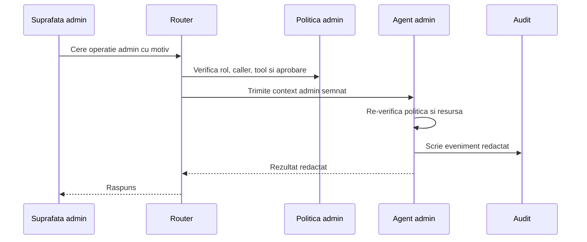

# Endpointuri MCP Admin

Ultima revizuire: 2026-06-02

Acest document defineste noul contract pentru endpointuri MCP Admin. Structura lui incepe cu problema si motivatia, apoi ajunge la reguli, manifest si teste.

## 1. Problema Pe Care O Rezolvam

| Problema | Exemplu | Risc daca nu exista acest tip de acces |
| --- | --- | --- |
| Unele tool-uri modifica control plane-ul. | Politici de acces, provideri, secrete, utilizatori, deployment. | Daca sunt tratate ca tool-uri normale, pot fi invocate accidental. |
| Modelele LLM pot selecta tool-uri automat. | Un client OpenAI-compatible primeste schema de tools. | Un model poate incerca o operatie admin fara intentie administrativa reala. |
| Admin-ul cere intentie explicita. | Rotire secret, stergere workspace, schimbare provider. | Rolul singur nu explica de ce se face schimbarea. |
| Operatiile admin au efect larg. | O regula gresita poate face date publice sau poate opri sistemul. | Fara aprobare si audit, incidentul nu poate fi controlat. |

## 2. De Ce Avem Nevoie De Endpointuri MCP Admin

| Motiv | Explicatie | De ce nu folosim alt tip de acces |
| --- | --- | --- |
| Separarea control plane-ului. | Administrarea nu este acelasi lucru cu folosirea aplicatiei. | Authenticated confirma userul, dar nu intentia admin. |
| Ascundere din tool discovery generic. | Tool-urile admin nu trebuie sa ajunga in lista obisnuita. | MCP intern normal poate fi descoperit de agenti sau clienti. |
| Motiv si audit. | Fiecare schimbare admin trebuie explicata. | Tool-urile normale nu cer mereu motiv. |
| Aprobari pe risc. | Unele operatii cer confirmare sau doi operatori. | Public, guest si authenticated nu modeleaza aprobarea. |

## 3. Cand Se Foloseste Si Cand Nu

| Situatie | Decizie | Motiv |
| --- | --- | --- |
| Schimbare de politica de acces. | Se foloseste MCP Admin. | Modifica cine poate accesa ce. |
| Citire, rotire sau export de secret. | Se foloseste MCP Admin sau privileged internal cu reguli echivalente. | Secretele pot compromite sisteme externe. |
| Provider management. | Se foloseste MCP Admin. | Afecteaza costuri, date si iesiri externe. |
| User management. | Se foloseste MCP Admin. | Afecteaza identitati si escaladare. |
| Operatie normala pe documentul userului. | Nu se foloseste MCP Admin. | Endpointul autentificat si politica de resursa sunt suficiente. |
| Agent intern citeste o resursa permisa. | Nu se foloseste MCP Admin daca nu atinge control plane. | MCP intern este suficient. |

## 4. Model Conceptual



| Componenta | Responsabilitate | De ce |
| --- | --- | --- |
| Suprafata admin | Exprima intentie administrativa verificata. | Un model sau client generic nu este suficient. |
| Router | Verifica roluri, caller, aprobare si politica admin. | Admin-ul trebuie controlat inainte de agent. |
| Agent admin | Aplica politica de domeniu si executa mutatia. | Agentul detine control plane-ul concret. |
| Audit | Inregistreaza actor, motiv, operatie si rezultat. | Operatiile admin trebuie investigate si revizuite. |

## 5. Cerinte De Securitate

| Cerinta | Specificatie | De ce |
| --- | --- | --- |
| Default deny | Tool-urile admin sunt refuzate fara politica explicita. | Admin-ul accidental este inacceptabil. |
| Ascundere implicita | Tool-urile admin nu apar in discovery generic sau OpenAI-compatible. | Selectia automata de tool-uri nu este intentie admin. |
| Rol admin | Actorul are rol sau grant administrativ explicit. | User autentificat nu inseamna admin. |
| Caller aprobat | Operatia vine din suprafata sau agent admin permis. | Un agent normal nu trebuie sa administreze doar pentru ca userul e admin. |
| Motiv obligatoriu | Mutatiile admin includ motiv. | Auditul trebuie sa explice schimbarea. |
| Aprobare pe risc | Politica poate cere confirmare sau doi operatori. | Unele actiuni sunt distructive. |
| Audit redactat | Logurile nu contin secrete brute, tokeni sau payload-uri sensibile. | Auditul nu trebuie sa devina exfiltrare. |

## 6. Aplicare La Agentii Explorer

| Agent sau componenta | Aplicare potrivita | Motiv |
| --- | --- | --- |
| `soul-gateway` | Provider management, model routing, quotas, budgets, credential leasing admin. | Afecteaza costuri si furnizori externi. |
| `dpuAgent` | Rotire secrete, export secrete, politici de date. | Detine material sensibil. |
| `explorer` | User management, workspace settings, public sharing grants, security policy UI. | Este shell-ul operational al workspace-ului. |
| `gitAgent` | Operatii destructive pe repo si credential binding global. | Poate modifica cod si credentiale. |
| `webmeetAgent` | Recording policy, room admin override, LiveKit control, invite revocation globala. | Afecteaza camere si infrastructura live. |
| `webAssist` | Prompt policy, visitor policy, lead routing, hidden tool configuration. | Interactioneaza cu vizitatori si modele. |
| `llmAssistant` | Model/tool policy si guvernanta prompturilor. | Poate schimba felul in care agentii folosesc modele. |
| `soplangAgent`, `tasksAgent`, `multimedia` | Override-uri globale, retention, quotas si politici. | Pot afecta date sau costuri la nivel de workspace. |
| `onlyOffice`, `webmeetStt`, `webmeetLivekitAiAgent` | Configurare infrastructura sau control worker. | Serviciile auxiliare nu primesc admin implicit. |

## 7. Detalii De Politica Si Manifest

```json
{
  "security": {
    "mcp": [
      {
        "id": "security-policy-update",
        "accessType": "mcp-admin",
        "admin": true,
        "tool": "security.policy.update",
        "allowedRoles": ["admin"],
        "allowedCallers": ["explorer-admin-ui"],
        "hiddenFromGenericTools": true,
        "hiddenFromOpenAI": true,
        "requiresReason": true,
        "approval": { "mode": "confirm" },
        "auditCategory": "security-policy",
        "reason": "administrators must manage security policy explicitly"
      }
    ]
  }
}
```

| Camp sau flag | Regula | De ce |
| --- | --- | --- |
| `accessType` | `mcp-admin`. | Diferentiaza administrarea de MCP intern normal. |
| `admin` | `true`. | Marcaj redundant util pentru lintere si UI. |
| `hiddenFromGenericTools` | `true` implicit. | Tool-ul nu trebuie descoperit de clienti generici. |
| `hiddenFromOpenAI` | `true` implicit. | Modelele nu trebuie sa selecteze admin tools automat. |
| `allowedRoles` | Roluri admin sau specializate. | Login-ul nu este suficient. |
| `allowedCallers` | Suprafete admin aprobate. | Intentia admin vine din canal dedicat. |
| `requiresReason` | `true` pentru mutatii. | Fiecare schimbare trebuie explicata. |
| `approval.mode` | `none`, `confirm` sau `two-person`. | Nivelul de risc decide frictiunea. |

## 8. Teste De Acceptare

| Test | Rezultat asteptat | De ce |
| --- | --- | --- |
| Tool admin fara flag `admin` | Manifest invalid. | Marcajul este obligatoriu pentru detectie. |
| Tool admin vizibil generic | Manifest invalid sau build fail. | Admin tools nu apar in discovery generic. |
| User fara rol admin | Refuz. | Authenticated nu este admin. |
| Caller neaprobat | Refuz. | Rolul userului nu autorizeaza orice agent sa administreze. |
| Motiv lipsa | Refuz pentru mutatii. | Schimbarile trebuie explicate. |
| Aprobare lipsa | Refuz cand politica cere. | Actiunile cu risc mare cer confirmare. |
| Audit cu secret brut | Test esuat. | Auditul nu poate scurge credentiale. |
