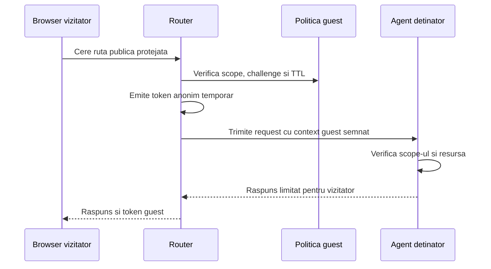

# Endpointuri Publice Protejate

Ultima revizuire: 2026-06-02

Acest document defineste noul contract pentru endpointuri publice protejate. Structura lui incepe cu problema si motivatia, apoi ajunge la reguli, manifest si teste.

## 1. Problema Pe Care O Rezolvam

| Problema | Exemplu | Risc daca nu exista acest tip de acces |
| --- | --- | --- |
| Vizitatorii trebuie sa interactioneze cu sistemul fara cont. | Invitatii WebMeet, widget WebAssist, formulare publice. | Daca cerem cont, fluxul public nu functioneaza. |
| Vizitatorii nu sunt complet anonimi operational. | Avem nevoie de rate limit, sesiune, expirare si blocare. | Daca folosim public complet, nu putem controla abuzul pe sesiune. |
| Vizitatorii nu sunt useri de workspace. | Un invitat la o camera nu trebuie sa vada Explorer sau MCP intern. | Daca folosim authenticated, le dam o identitate prea puternica. |
| Linkurile publice pot fi copiate. | Un link WebMeet poate ajunge la alt browser. | Fara scope si TTL, linkurile devin credentiale permanente. |

## 2. De Ce Avem Nevoie De Endpointuri Publice Protejate

| Motiv | Explicatie | De ce nu folosim alt tip de acces |
| --- | --- | --- |
| Control anti-abuz. | Tokenul anonim permite rate limiting, blocare si telemetry pe sesiune. | Public complet nu are sesiune. |
| Continuitate de vizitator. | Chat-ul, formularul sau camera au nevoie sa recunoasca acelasi browser. | Public complet trateaza fiecare request ca izolat. |
| Scope de produs. | Tokenul poate fi valabil doar pentru o camera, un widget sau un link. | Authenticated ar lega fluxul de user de workspace. |
| Expirare si revocare. | Tokenul poate fi retras sau lasat sa expire. | Un link public complet nu are identitate operationala de revocat. |

## 3. Cand Se Foloseste Si Cand Nu

| Situatie | Decizie | Motiv |
| --- | --- | --- |
| Invitatie WebMeet. | Se foloseste public protejat. | Invitatul are nevoie de room scope si TTL. |
| Widget WebAssist. | Se foloseste public protejat. | Vizitatorul are nevoie de sesiune si rate limit. |
| Formular public cu submit. | Se foloseste public protejat. | Submit-ul este mutatie si cere replay control. |
| Asset static. | Nu se foloseste public protejat. | Public complet este suficient. |
| Operatie de workspace. | Nu se foloseste public protejat. | Cere user autentificat. |
| Tool MCP intern. | Nu se foloseste public protejat. | Cere politica MCP. |
| Operatie admin. | Nu se foloseste public protejat. | Cere admin verificat si intentie explicita. |

## 4. Model Conceptual



| Componenta | Responsabilitate | De ce |
| --- | --- | --- |
| Vizitator | Foloseste tokenul doar in scope-ul primit. | Nu este user de workspace. |
| Router | Emite token, aplica challenge, TTL, binding si rate limit. | Routerul controleaza intrarea publica. |
| Agent | Verifica resursa concreta, de exemplu camera, visitor session sau document. | Agentul cunoaste regulile produsului. |
| Politica guest | Stabileste scope, metode, durata si revocare. | Guest-ul trebuie limitat explicit. |

## 5. Cerinte De Securitate

| Cerinta | Specificatie | De ce |
| --- | --- | --- |
| Scope obligatoriu | Fiecare token are scope unic. | Tokenul nu trebuie reutilizat intre produse. |
| TTL scurt | Tokenii guest expira. | Linkurile si tokenii pot fi copiate. |
| Binding | Tokenul poate fi legat de browser, origin, link id sau context. | Reduce replay-ul intre contexte. |
| Challenge optional | Politica poate cere captcha, soft challenge sau proof-of-work. | Unele rute publice atrag trafic automat. |
| Mutatii controlate | Submit, chat si join folosesc nonce sau idempotenta. | Vizitatorii pot repeta request-uri. |
| Separare de workspace | Tokenul guest nu acorda acces la Explorer general. | Guest nu este user. |
| Audit redactat | Evenimentele includ scope si rezultat, nu secrete. | Observabilitatea trebuie sa ramana sigura. |

## 6. Aplicare La Agentii Explorer

| Agent sau componenta | Aplicare potrivita | Motiv |
| --- | --- | --- |
| `webmeetAgent` | Invitatii, join room, guest chat si guest assets necesare camerei. | Camera publica are nevoie de room scope si participant identity temporara. |
| `webAssist` | Widget public, visitor registration, chat si history pe sesiune vizitator. | Vizitatorul are continuitate fara acces de workspace. |
| `explorer` | Documente sau foldere partajate cand este nevoie de sesiune guest. | Unele share-uri trebuie limitate pe link, timp sau browser. |
| `onlyOffice` | Vizualizare document cu token guest si token de document. | Documentul nu trebuie expus doar prin path. |
| `soul-gateway` | Portaluri publice de onboarding, nu API client standard. | API-ul standard foloseste auth proprie de domeniu. |
| `gitAgent`, `dpuAgent`, `tasksAgent`, `llmAssistant`, `soplangAgent`, `multimedia`, `webmeetStt` | Nu se aplica implicit. | Capabilitatile si datele lor nu sunt pentru vizitatori anonimi. |

## 7. Detalii De Politica Si Manifest

```json
{
  "security": {
    "routes": [
      {
        "id": "webmeet-public-invite",
        "kind": "http",
        "accessType": "public-protected",
        "externalPath": "/webmeet/invite/*",
        "methods": ["GET", "POST"],
        "anonymousToken": {
          "scope": "webmeet-invite",
          "ttlSeconds": 900,
          "bindTo": ["browser", "origin", "linkId"],
          "forceAnonymous": true
        },
        "challenge": { "mode": "soft" },
        "rateLimit": { "perMinute": 30, "burst": 10 },
        "auditCategory": "guest-access"
      }
    ]
  }
}
```

| Camp sau flag | Regula | De ce |
| --- | --- | --- |
| `accessType` | `public-protected`. | Diferentiaza guest-ul de public complet si user autentificat. |
| `anonymousToken.scope` | String unic. | Scope-ul este granita principala a tokenului. |
| `anonymousToken.ttlSeconds` | Durata scurta. | Tokenul guest nu trebuie sa fie credential permanent. |
| `anonymousToken.bindTo` | Browser, origin, link id sau context. | Reduce furtul si replay-ul. |
| `anonymousToken.forceAnonymous` | Boolean. | Unele linkuri trebuie sa ignore login-ul existent. |
| `challenge.mode` | `none`, `soft`, `captcha` sau `proof-of-work`. | Challenge-ul se alege dupa risc. |
| `rateLimit` | Obligatoriu. | Tokenul singur nu opreste abuzul. |

## 8. Teste De Acceptare

| Test | Rezultat asteptat | De ce |
| --- | --- | --- |
| Token lipsa | Routerul emite token doar daca politica permite si challenge-ul trece. | Public protejat nu este public complet. |
| Scope gresit | Agentul refuza request-ul. | Tokenul nu este transferabil intre fluxuri. |
| Token expirat | Refuz si event de audit. | TTL-ul este control real. |
| Replay nonce | Refuz pentru mutatii sensibile. | Previne repetarea actiunilor guest. |
| Login existent cu `forceAnonymous` | Routerul foloseste guest, nu user. | Linkul public trebuie sa fie predictibil. |
| Rate limit depasit | Refuz temporar fara detalii sensibile. | Reduce abuzul automat. |
