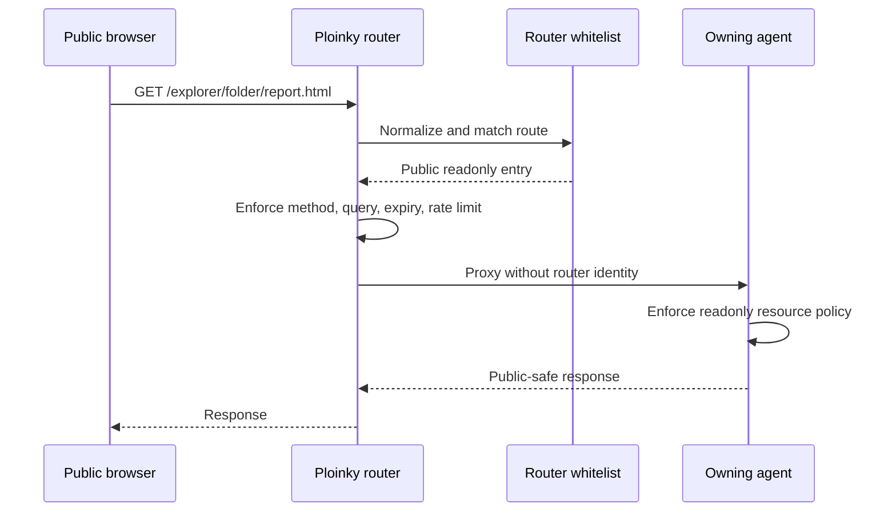
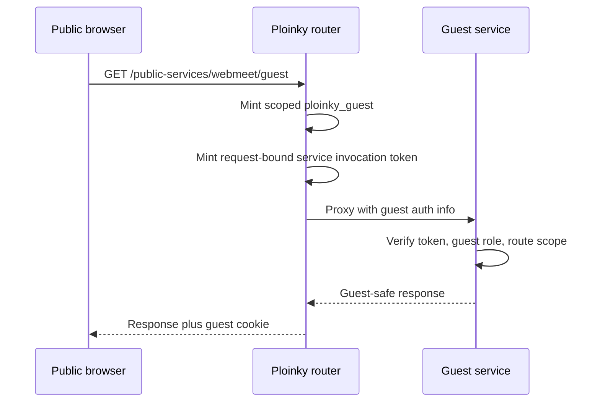
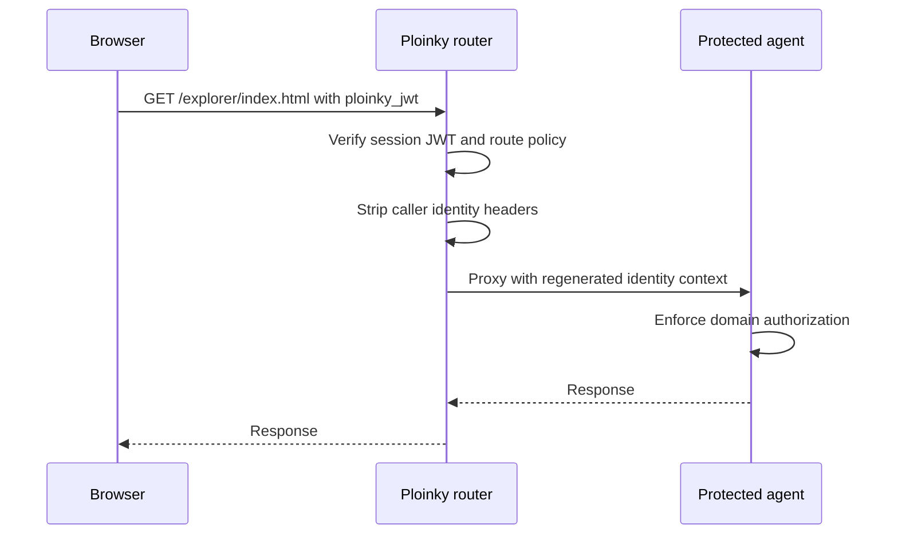
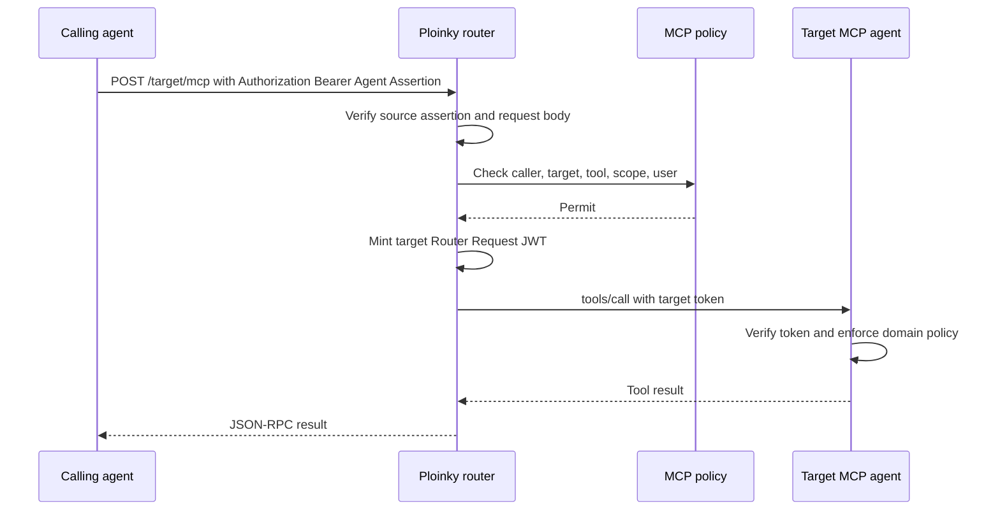
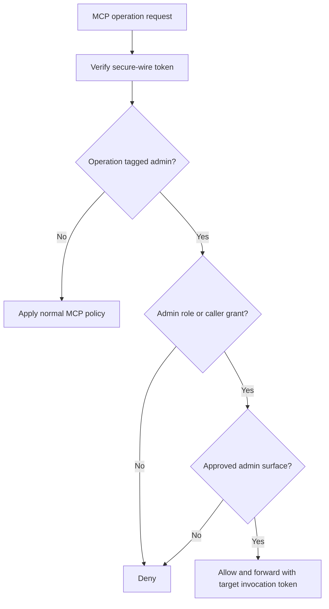

# New Explorer And Ploinky Security Model

Last reviewed: 2026-06-02

This document defines the proposed new security model for Explorer-facing Ploinky routes. It is organized around five access types. Each type has a clear rule, implementation contract, examples, and rationale.

The model keeps one central invariant: the Ploinky router is the public trust broker, but the owning agent still owns resource rendering and domain authorization. The router may grant reachability, mint session or invocation tokens, and enforce route policy; it must not become the owner of every product-specific permission rule.

## Access Type Matrix

| Access type | Applied rule | Notes and examples |
| --- | --- | --- |
| Fully public endpoints | Explicitly declared in a whitelist and accessible without authentication. | Used for health checks or strictly controlled public resources. Also covers Link Sharing through router-owned whitelist entries. |
| Public protected endpoints | The client first obtains a temporary anonymous token bound to the session or browser, then sends it on every request. | The token enables rate limiting, expiry, blocking, and filtering of trivial automated requests. WebAssist can use this model, and WebMeet public links already follow the same guest-token shape. |
| Authenticated endpoints | The authenticated user receives a JWT and sends it to the router on every request. | The JWT identifies the user, roles, and rights. The router allows only authorized operations. This is the default mode. |
| Internal MCP endpoints | Agents may call each other, but access must be controlled through a whitelist or MCP policy. | Administrators explicitly define which agents may access which MCP tools or resources. |
| MCP Admin endpoints | Administrative endpoints must be explicitly marked as special operations and restricted by role. | Admin operations should be role-tagged. Initially, all admin operations must be inaccessible by default through OpenAI-compatible APIs exposed by Ploinky agents to Soul Gateway. |

## 1. Fully Public Endpoints

### Rule

Fully public endpoints are reachable without a Ploinky login, without a guest token, and without an authenticated user JWT. They are allowed only when they are explicitly declared as public policy.

There are two valid public endpoint families:

- router-owned safe public endpoints, such as `/health`;
- selected existing `/<agent>/...` routes declared through router-owned whitelist entries.

Link Sharing belongs to the second family. A shared link remains the ordinary Ploinky URL, such as `/explorer/folder/report.html` or `/explorer/stuff/sdocid124324`. The router checks the whitelist, then proxies to the owning agent. The owning agent still serves the resource and enforces readonly and resource-specific policy.

### Policy Declaration

For link sharing and other selected public agent routes, the router must persist policy in a durable whitelist store, for example `.ploinky/router-whitelist.json`. The detailed public route specification is in `router-whitelist-public-access.md`.

An entry must include:

- `routeKey`, such as `explorer`;
- `pathPattern`, such as `/folder/*` or `/stuff/sdocid124324`;
- `match`, either `exact` or `prefix`;
- `access: "public"`;
- allowed methods, defaulting to `GET` and `HEAD`;
- query policy, defaulting to `deny-query`;
- enabled/expiry state;
- creator, updater, manager, timestamp, and reason metadata.

### Router Requirements

The router must:

1. Normalize the route before matching.
2. Reject invalid encoding, NUL bytes, traversal segments, unknown route keys, non-terminal wildcards, disabled entries, and expired entries.
3. Match exact entries before prefix entries.
4. Enforce method and query policy before proxying.
5. Strip caller-supplied Ploinky identity headers before proxying.
6. Apply rate limiting before reaching the owning agent.
7. Return generic denial responses that do not reveal whether the agent, resource, owner, or document id exists.
8. Avoid public listing of whitelisted resources.
9. Re-check whitelist policy before serving cached public output.
10. Log allow, deny, cache, and rate-limit outcomes with secrets and content redacted.

### Downstream Agent Requirements

The owning agent must:

- serve only safe readonly content for public routes;
- enforce any domain-specific document policy, ACL, publication state, or link-sharing state;
- avoid leaking private metadata in public responses;
- treat router reachability as necessary but not sufficient proof that a resource is safe to render.

### Examples

- `/health` can remain public because it is router-owned health metadata.
- `/explorer/folder/*` can be public only if a whitelist entry exists and the Explorer route serves readonly, public-safe content.
- `/explorer/stuff/sdocid124324` can be public only as an exact route entry.
- `/auth/login`, `/whitelist/command`, router admin paths, and aggregate MCP paths must never be exposed through this public whitelist.

### Decisions And Reasons

| Decision | Why |
| --- | --- |
| Public routes require explicit whitelist policy | Public reachability is a security grant and must not emerge accidentally from route existence. |
| Shared links keep the existing `/<agent>/...` URL | The router controls access while the owning agent remains visibly responsible for the resource. |
| Public methods default to `GET` and `HEAD` | Public writes need CSRF, replay, ownership, quota, and write-policy controls that are outside this access type. |
| Query strings are denied by default | Query parameters often carry ids, filters, tokens, or actions that can widen access silently. |
| Denials are generic | Detailed errors can reveal private resource existence to unauthenticated clients. |
| Public listing is forbidden | A list endpoint would turn individual shared links into a public directory. |



## 2. Public Protected Endpoints

### Rule

Public protected endpoints are reachable without a prior authenticated login, but the client must first receive a temporary anonymous or guest token. The token is bound to the session, browser, route scope, or invite context and must be sent on subsequent requests.

This is not full workspace authentication. It is a scoped guest identity that allows the router and service to apply expiry, rate limiting, blocking, abuse controls, and route-specific guest behavior.

### Policy Declaration

Public protected endpoints may be declared in either of these ways:

- a manifest-declared HTTP service with `access: "guest"`;
- a router whitelist entry with `access: "guest"`.

The policy should include:

- guest scope, such as `webmeet-public-service` or `whitelist-route:<entryId>`;
- expiry;
- allowed methods and query policy;
- optional service invocation requirement;
- route-specific blocklist or rate-limit bucket.

### Router Requirements

The router must:

1. Mint or validate a short-lived `ploinky_guest` JWT.
2. Bind the guest token to the declared guest scope.
3. Honor an existing authenticated session, and mint a scoped guest identity only when no user is logged in.
4. Strip caller-supplied Ploinky identity headers.
5. Regenerate guest identity metadata for the downstream service.
6. Mint a request-bound invocation token when the service expects to trust `x-ploinky-auth-info`.
7. Apply route and token rate limits before proxying.
8. Support revocation or blocking of guest sessions, route scopes, or abuse buckets.

For router-whitelisted guest routes, the optional invocation token should use tool name `__whitelist_route__`. For manifest HTTP services, the invocation token uses `__http_service__`.

### Downstream Agent Requirements

The service or agent must:

- verify the router-issued invocation token before trusting `x-ploinky-auth-info`;
- enforce guest role and guest scope;
- refuse guest self-promotion into authenticated user privileges;
- apply product-specific invite, room, document, or browser-session policy;
- keep guest-visible operations narrower than authenticated operations.

### Examples

- WebMeet public links use guest routing plus WebMeet room guest tokens before LiveKit access is issued.
- A public WebAssist entry route can mint a temporary anonymous browser/session token, then require that token on follow-up requests.
- A public support chat route may use guest identity for abuse tracking while still exposing only guest-safe operations.

### Decisions And Reasons

| Decision | Why |
| --- | --- |
| Public protected endpoints use guest tokens instead of full anonymous access | Guest tokens allow expiry, blocking, rate limiting, and scoped behavior without requiring a real user account. |
| Guest scope is required | A token for one public surface must not become reusable across unrelated guest routes. |
| Authenticated sessions take precedence | A signed-in user should not be silently downgraded to a weaker guest identity. |
| Invocation verification is required before trusting auth info | `x-ploinky-auth-info` is contextual metadata unless backed by a router-signed, request-bound proof. |
| Guest operations stay narrower than authenticated operations | Guest identity is weaker than user identity and should not authorize workspace-level actions. |



## 3. Authenticated Endpoints

### Rule

Authenticated endpoints require a valid user session. After login, the user receives a router session JWT. The browser sends that JWT to the router on each protected request, usually through the `ploinky_jwt` cookie.

This is the default access mode for Explorer workspace routes, protected HTTP services, first-party browser surfaces, and user-specific operations.

### Policy Declaration

Authenticated endpoints may be declared through:

- static route auth such as `local`, `pwd`, or `sso`;
- manifest HTTP service `access: "authenticated"`;
- route-specific whitelist policy with `access: "authenticated"` that narrows access by role, user, or manager policy.

Authenticated policy may narrow the normal requirement, but it must not weaken it. The owning agent still performs resource-level authorization.

### Router Requirements

The router must:

1. Authenticate the user through local password auth or SSO.
2. Mint a `ploinky_jwt` session token with user id, username/email when available, roles, expiry, and session revision.
3. Verify the session JWT on each protected request.
4. Strip caller-supplied identity headers.
5. Regenerate authoritative `X-Ploinky-*` identity headers when proxying HTTP services.
6. Mint MCP or HTTP-service invocation tokens only for the proxied internal request.
7. Enforce route-specific roles or user policy when declared.
8. Redirect browser routes or return `401`/`403` according to route type.

### Downstream Agent Requirements

The agent must:

- treat router identity as caller context, not as complete domain authorization;
- enforce resource ownership, ACLs, scopes, and product-specific permissions;
- verify invocation tokens before executing MCP tools, reading MCP resources, or trusting sensitive HTTP-service auth info;
- avoid exposing secrets, tokens, prompts, hidden files, or confidential documents through authenticated-but-unauthorized requests.

### Examples

- Explorer application routes use local password auth declared by `ploinky: "pwd enable"`.
- Explorer office session creation is a protected HTTP service.
- Soul Gateway management is protected by router authentication plus an admin HTTP-service invocation check.
- DPU-backed confidential operations require authenticated user context plus DPU ACL checks.

### Decisions And Reasons

| Decision | Why |
| --- | --- |
| Authenticated access is the default | Most workspace routes are user-specific and should not be reachable anonymously. |
| The browser receives only the session JWT, not internal invocation tokens | Invocation tokens authorize internal router-to-agent operations and should not become browser-held bearer grants. |
| Router identity does not replace domain authorization | The router knows who the caller is; the owning agent knows whether that caller may access a specific resource. |
| Route-specific authenticated whitelist policy can only narrow access | Central policy must not accidentally weaken an agent's normal auth requirement. |
| Caller-supplied identity headers are stripped | Clients must not be able to spoof user id, roles, or session context. |



## 4. Internal MCP Endpoints

### Rule

Internal MCP endpoints allow agent-to-agent tool calls and resource reads, but only through router-mediated secure wire and explicit MCP policy. Agents must not call each other with ad hoc shared secrets, direct internal bearer tokens, or custom caller assertion headers.

The policy is not path-based. It is based on caller principal, target principal, MCP tool or resource, delegated user, scope, signed request body, expiry, and replay protection.

### Policy Declaration

Administrators must explicitly declare which caller agents may access which target MCP operations. A policy entry should include:

- caller principal, such as `agent:explorer`;
- target principal, such as `agent:dpuAgent`;
- allowed tools and resources;
- allowed user roles or delegated user constraints;
- scopes, such as `document:read`;
- expiry and enabled state;
- creator, updater, and reason metadata.

Example:

```json
{
  "enabled": true,
  "caller": "agent:explorer",
  "target": "agent:dpuAgent",
  "tools": ["read_document"],
  "resources": [],
  "scopes": ["document:read"],
  "userRoles": ["local", "admin"]
}
```

### Router Requirements

The router must:

1. Require the calling agent to re-enter the router with a DS013 Agent Assertion carried as `Authorization: Bearer <assertion>`.
2. Verify the source agent assertion signature, audience, operation, request hash, expiry, and replay id.
3. Resolve the caller principal from the verified assertion and any delegated user context from the routed request policy.
4. Check MCP policy for caller, target, operation, scope, and user constraints.
5. Mint a fresh target-audience invocation JWT only after policy permits the call.
6. Forward the request to the target MCP server with the new invocation token.
7. Deny `tools/call`, `resources/read`, and task-status reads when secure-wire or policy checks fail.

### Target Agent Requirements

The target agent must:

- verify the target-audience invocation JWT;
- verify expected tool/resource operation and canonical request hash;
- reject expired or replayed invocation ids;
- enforce domain authorization after secure-wire verification;
- avoid secrets in tool metadata because tool listing may remain discoverable.

### Examples

- `gitAgent` calls DPU through the router to store GitHub tokens. It signs an Agent Assertion with its own per-agent secret; the router mints a DPU-audience Router Request only if policy allows the internal delegated call.
- Explorer may call a DPU document-read tool only when the MCP policy allows Explorer, the target tool, and the delegated user role/scope.

### Decisions And Reasons

| Decision | Why |
| --- | --- |
| Internal MCP access is whitelist/policy-based | MCP operations can execute code or read resources, so route existence is not enough authority. |
| Agents must re-enter through the router | The router is the trust broker that can verify caller authority and mint target-audience tokens. |
| The caller token is not forwarded to the target as final authority | The target must receive a fresh token minted for its own audience and operation. |
| Body hash, expiry, and replay checks are mandatory | A valid token must not be reusable for a different request body, after expiry, or in replay. |
| Tool listing may be visible, execution may not | Metadata discovery can be useful, but executable operations require verified authority. |



## 5. MCP Admin Endpoints

### Rule

MCP Admin endpoints are administrative MCP tools or resources. They must be explicitly marked as privileged operations and denied by default unless the caller has an explicit admin grant and the request arrives through an approved admin surface.

OpenAI-compatible APIs exposed by Ploinky agents to Soul Gateway must not expose MCP Admin operations by default.

### Policy Declaration

Admin operations must carry stable metadata, such as:

- `annotations.ploinky.admin = true`;
- allowed user roles, at minimum for admin operations;
- optional allowed caller agents or bridges;
- optional approved admin surfaces;
- explicit policy for the delegated user role.

The initial policy should be deny-by-default:

- admin-tagged MCP tools are hidden or non-callable from ordinary OpenAI-compatible APIs;
- admin calls are rejected unless the route has authenticated admin identity or explicit agent admin grant;
- bridge exposure requires an explicit policy entry naming the bridge, target tool/resource, and delegated role.

### Router Requirements

The router must:

1. Detect admin-tagged MCP tools and resources.
2. Require authenticated admin user context or explicit admin caller grant.
3. Require the request to come through an approved admin surface.
4. Apply normal secure-wire checks before admin policy checks.
5. Deny admin operations by default for OpenAI-compatible and Soul Gateway-facing agent APIs.
6. Log admin allow/deny decisions with redaction.

### Agent Requirements

Agents exposing MCP Admin operations must:

- tag those operations explicitly;
- keep admin tools out of ordinary public tool surfaces unless policy allows exposure;
- enforce domain-specific admin checks after router policy;
- never place secrets in admin tool metadata;
- document role requirements and side effects.

### Examples

- A whitelist-management MCP tool is admin-tagged and callable only by an admin user through an approved management UI.
- An agent that exposes `/v1/chat/completions` to Soul Gateway must not make admin MCP tools reachable through that OpenAI-compatible route unless a specific admin bridge policy allows it.
- An internal diagnostic MCP resource that exposes logs must be admin-tagged and must redact tokens, prompts, content, screenshots, and internal payloads.

### Decisions And Reasons

| Decision | Why |
| --- | --- |
| Admin operations are tagged explicitly | The router and bridges need a stable way to distinguish privileged operations from ordinary MCP tools. |
| Admin operations are denied by default | Accidental exposure of admin tools is more dangerous than requiring explicit enablement. |
| Role metadata is required for admin operations | Admin policy must be inspectable by humans and enforceable by the router. |
| OpenAI-compatible APIs cannot expose admin tools by default | Those APIs are broad model-facing surfaces and should not become hidden control planes. |
| Admin logging is redacted | Admin operations are likely to touch sensitive policy, logs, secrets, or user data. |



## Global Denial And Logging Rules

All five access types inherit these rules:

- Public denials must not reveal resource existence.
- Authenticated denials may identify missing permissions but must not expose secrets or internal payloads.
- Logs must redact cookies, bearer tokens, invocation JWTs, API keys, prompts, resource contents, screenshots, DOM dumps, and hidden policy text.
- Direct agent ports are implementation details and should not be exposed as public trust boundaries.
- The router grants reachability and mints tokens; agents still enforce domain authorization.
