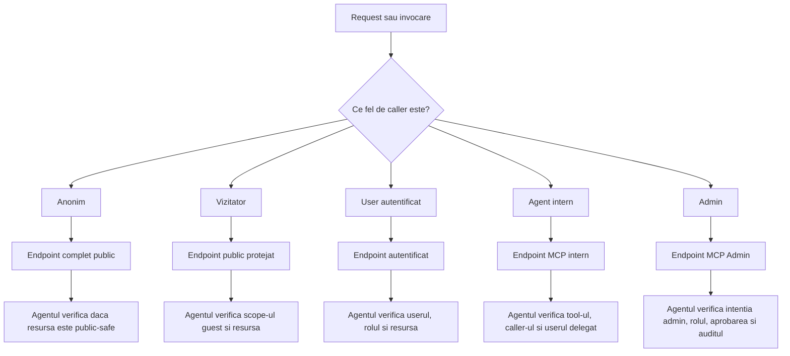

# Noul Model De Securitate Explorer Si Ploinky

Ultima revizuire: 2026-06-02

Acest document defineste un model de securitate nou, normativ si independent. El nu porneste de la implementarea existenta, ci de la problema de produs: Explorer are mai multe tipuri de caller, mai multe tipuri de resurse si mai multe niveluri de risc. Un singur mecanism de acces nu poate acoperi corect toate cazurile fara sa devina fie prea permisiv, fie prea greu de folosit.

## 1. Problema Pe Care O Rezolvam

| Problema | Consecinta daca nu este rezolvata | Directia modelului nou |
| --- | --- | --- |
| Unele resurse trebuie sa fie vizibile pe internet fara cont. | Daca le punem in acelasi model cu userii autentificati, riscam scurgeri de identitate sau reguli prea largi. | Avem o clasa separata pentru endpointuri complet publice. |
| Unele fluxuri sunt pentru vizitatori, dar au nevoie de control minim. | Daca le facem complet publice, nu putem limita abuzul, expirarea sau blocarea sesiunii. | Avem o clasa separata pentru endpointuri publice protejate. |
| Majoritatea operatiilor Explorer sunt operatii de workspace. | Daca nu cerem user autentificat, documentele, camerele, task-urile si profilurile pot fi accesate gresit. | Avem o clasa separata pentru endpointuri autentificate. |
| Agentii pot executa capabilitati, nu doar citi fisiere. | Daca autorizam MCP doar pe ruta HTTP, un agent poate chema tool-uri prea puternice. | Avem o clasa separata pentru endpointuri MCP interne. |
| Administrarea poate schimba politica, secrete si infrastructura. | Daca admin-ul este tratat ca tool normal, poate ajunge la clienti generici sau modele LLM. | Avem o clasa separata pentru endpointuri MCP Admin. |

## 2. De Ce Sunt Cinci Tipuri De Acces

| Criteriu | Public complet | Public protejat | Autentificat | MCP intern | MCP Admin |
| --- | --- | --- | --- | --- | --- |
| Caller | Necunoscut | Vizitator cu token temporar | User de workspace | Agent sau user prin agent | Operator sau agent administrativ |
| Identitate | Niciuna | Guest scoped | User si roluri | Caller agent si optional user delegat | Admin verificat |
| Risc dominant | Enumerare si abuz public | Replay si folosire intre scope-uri | Escaladare intre resurse | Escaladare intre tool-uri | Schimbare de control plane |
| Decizie principala | Ruta poate fi vazuta de oricine | Vizitatorul poate primi o sesiune limitata | Userul poate folosi resursa | Agentul poate chema tool-ul | Actorul poate administra sistemul |
| Motivul separarii | Fara identitate nu exista autorizare pe user | Guest nu este user | User nu este agent intern | Tool-ul nu este ruta statica | Admin nu este tool normal |

## 3. Model Conceptual



| Componenta | Rol in model | De ce |
| --- | --- | --- |
| Router | Clasifica request-ul, aplica politica de reachability si emite context verificabil. | Routerul este singurul loc care vede toate granitele de acces. |
| Agent detinator | Decide daca resursa sau tool-ul concret este permis. | Agentul cunoaste domeniul: documente, camere, secrete, provideri, fisiere sau media. |
| Declaratie de securitate | Declara intentia statica pentru rute si tool-uri, indiferent de formatul final al manifestului. | Intentia trebuie citita si auditata fara a inspecta codul. |
| Politica activa | Permite granturi, revocari, expirari si delegari operationale. | Nu toate deciziile de securitate sunt fixe in cod sau manifest. |
| Audit | Pastreaza cine a cerut, ce s-a decis si de ce. | Fara audit, modelul nu poate fi operat sau investigat. |

## 4. Documentele Detaliate

| Tip de acces | Document | Problema centrala pe care o rezolva |
| --- | --- | --- |
| Endpointuri complet publice | [new-security-model-fully-public.ro.md](new-security-model-fully-public.ro.md) | Cum expunem continut public fara identitate si fara sa transformam workspace-ul intr-un director public. |
| Endpointuri publice protejate | [new-security-model-public-protected.ro.md](new-security-model-public-protected.ro.md) | Cum permitem vizitatori controlati, cu sesiune temporara, fara sa le dam drepturi de workspace. |
| Endpointuri autentificate | [new-security-model-authenticated.ro.md](new-security-model-authenticated.ro.md) | Cum protejam operatiile normale de workspace prin user, roluri, sesiune si autorizare de resursa. |
| Endpointuri MCP interne | [new-security-model-internal-mcp.ro.md](new-security-model-internal-mcp.ro.md) | Cum permitem agentilor sa colaboreze fara sa primeasca acces implicit la toate tool-urile. |
| Endpointuri MCP Admin | [new-security-model-mcp-admin.ro.md](new-security-model-mcp-admin.ro.md) | Cum izolam administrarea de tool discovery generic, modele LLM si fluxuri normale de user. |

## 5. Aplicare La Agentii Explorer

| Agent sau componenta | Clase relevante | Motiv |
| --- | --- | --- |
| `explorer` | Public complet, public protejat, autentificat, MCP Admin pentru sharing si politica. | Explorer detine continut si configuratii de workspace. |
| `webmeetAgent` | Public protejat, autentificat, MCP intern, MCP Admin. | Are invitati, membri de camera, integrari si operatii administrative. |
| `webAssist` | Public protejat, MCP intern, MCP Admin. | Interactioneaza cu vizitatori, dar are tool-uri si politici interne. |
| `soul-gateway` | Public complet cu auth de domeniu, autentificat, MCP Admin. | Separa clientii API, dashboard-ul si administrarea providerilor. |
| `gitAgent` | MCP intern, MCP Admin. | Lucreaza cu repo-uri, fisiere si credentiale. |
| `dpuAgent` | MCP intern, MCP Admin. | Detine date sensibile, profiluri si secrete. |
| `tasksAgent` | Autentificat daca are UI, MCP intern, MCP Admin pentru override-uri. | Task-urile sunt date de workspace. |
| `soplangAgent` | MCP intern, MCP Admin. | Executa capabilitati si poate modifica programe sau politici. |
| `multimedia` | Autentificat daca are UI, MCP intern, MCP Admin pentru politici globale. | Media poate contine date personale si costuri de procesare. |
| `onlyOffice` | Public protejat sau autentificat. | Documentele cer token si politica de document. |
| `webmeetStt` | MCP intern sau serviciu intern inchis. | Transcrierea proceseaza continut sensibil. |
| `webmeetLivekitAiAgent` | MCP intern, MCP Admin pentru control worker. | Workerul media afecteaza camere live si infrastructura. |

## 6. Reguli Globale

| Regula | De ce |
| --- | --- |
| Nicio ruta si niciun tool nu exista in modelul de securitate fara manifest sau politica activa. | Implementarea ascunsa nu este auditabila. |
| Fiecare decizie de securitate include motiv in documentatie sau metadata de politica. | Motivul permite review, revocare si mentenanta fara ghicit. |
| Routerul nu accepta headere de identitate trimise de caller ca autoritate. | Caller-ul poate falsifica headere; autoritatea trebuie sa vina din context emis de router. |
| Agentul verifica autorizarea de domeniu dupa ce verifica contextul routerului. | Identitatea verificata nu garanteaza automat acces la orice resursa. |
| Tool-urile admin sunt ascunse implicit fata de clienti generici si modele LLM. | Selectia automata de tool-uri nu este intentie administrativa. |

## 7. Detalii Comune De Manifest

Forma cea mai scurta a unei reguli de securitate trebuie sa declare doar clasa de acces. Campurile suplimentare apar cand acelasi bloc defineste ruta sau cand ruta are nevoie de reguli mai stricte decat default-ul.

```json
{
  "security": {
    "accessType": "authenticated"
  }
}
```

| Nivel de configurare | Campuri tipice | De ce |
| --- | --- | --- |
| Tag de securitate | `accessType` | Ruta este definita deja, iar securitatea trebuie doar sa spuna clasa de acces. |
| Declaratie de ruta | `id`, `kind`, `externalPath`, `accessType` | Blocul de securitate defineste si tinta politicii. |
| Override-uri | Roluri, metode, tokeni, CSRF, audit, rate limit | Apar doar cand default-ul nu este suficient pentru risc. |

```json
{
  "security": {
    "version": 1,
    "defaultAccess": "deny",
    "routes": [
      {
        "id": "route-id",
        "kind": "http",
        "accessType": "authenticated",
        "externalPath": "/services/example/",
        "methods": ["GET", "POST"],
        "resourceClass": "workspace-data",
        "auditCategory": "example"
      }
    ],
    "mcp": [
      {
        "id": "tool-policy-id",
        "accessType": "mcp-internal",
        "tool": "tool_name",
        "allowedCallers": ["callerAgent"],
        "allowedRoles": ["user"],
        "auditCategory": "tooling"
      }
    ]
  }
}
```

| Camp | Regula | De ce |
| --- | --- | --- |
| `security.version` | Versiunea schemei de securitate este obligatorie. | Permite migrari controlate fara ambiguitate intre generatii de manifest. |
| `security.defaultAccess` | Valoarea implicita este `deny`. | O ruta sau un tool nou nu trebuie sa devina accesibil doar pentru ca exista in agent. |
| `routes[].accessType` | Trebuie sa fie una dintre clasele HTTP ale modelului. | Fiecare clasa are controale si audit diferit. |
| `mcp[].accessType` | Trebuie sa fie `mcp-internal` sau `mcp-admin`. | Tool-urile MCP nu trebuie amestecate cu HTTP route policy. |
| `auditCategory` | Categoria logica de audit este obligatorie pentru rute si tool-uri sensibile. | Evenimentele de securitate trebuie sa fie grupabile si investigabile. |
