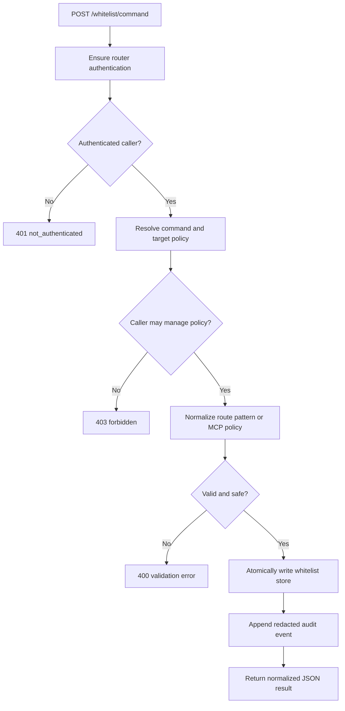
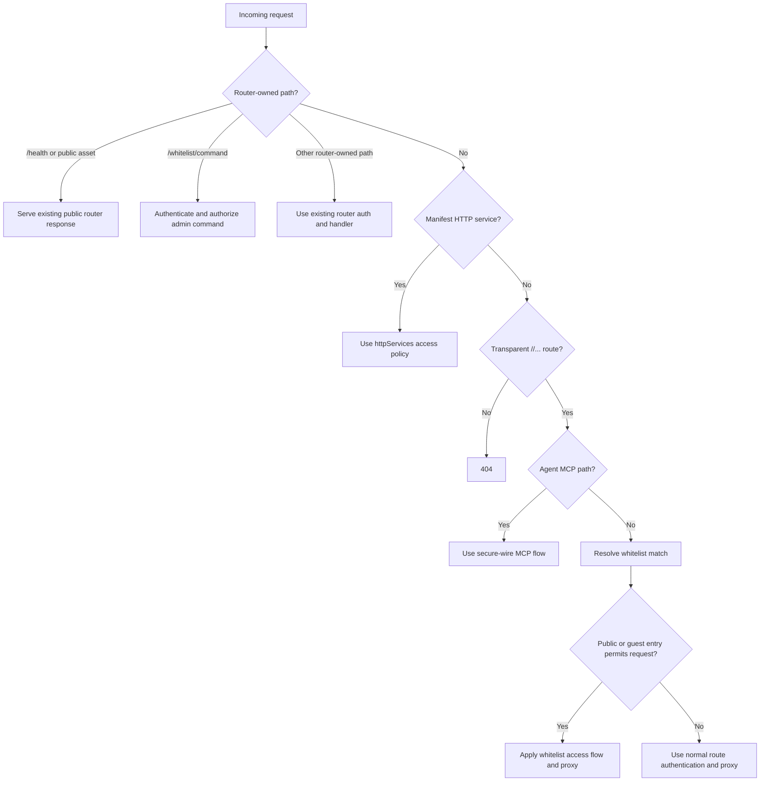
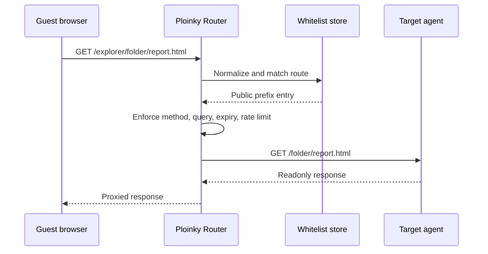
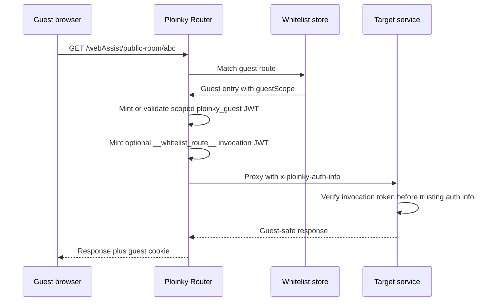
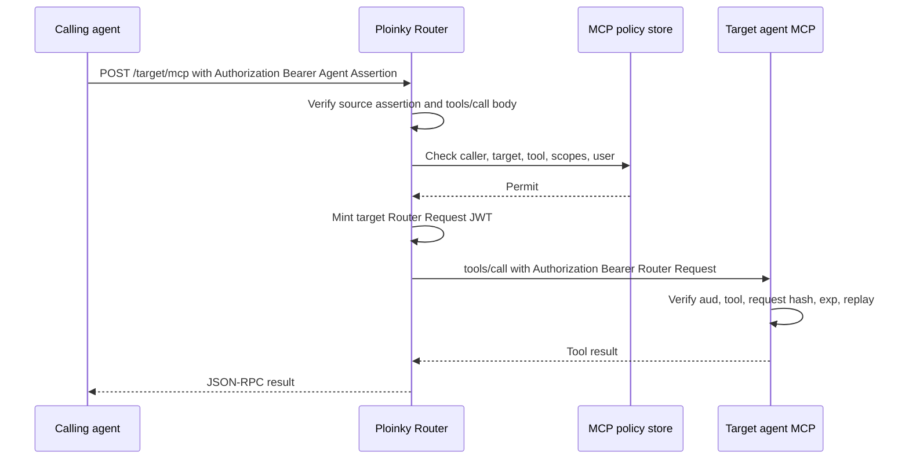
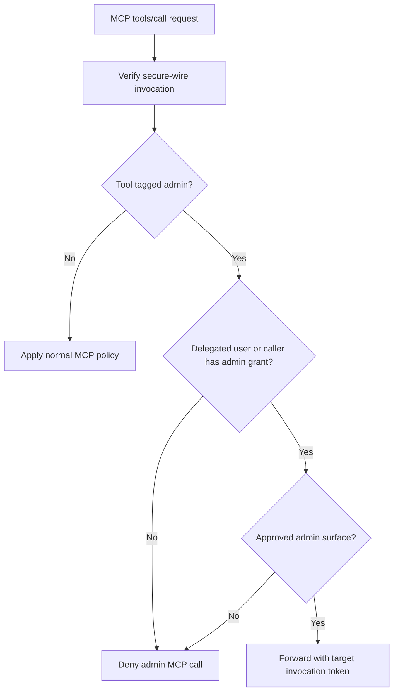

# Router Whitelist Public Access Specification

Last reviewed: 2026-06-02

This document defines the proposed Explorer-facing security specification for public access through a router-owned whitelist. It is based on the current Ploinky router, auth, HTTP service, guest-session, and MCP secure-wire contracts, plus the proposed Ploinky implementation contract in `../../ploinky/docs/specs/DS013-router-whitelist-public-access.md`.

The design replaces the earlier idea of a separate PublicSharing agent. Public sharing becomes durable router policy. The public URL remains the existing Ploinky URL, such as `/explorer/folder/report.html` or `/explorer/stuff/sdocid124324`; the router decides whether that route is allowed, and the owning agent still serves the resource and enforces domain-specific readonly behavior.

## Goals

The whitelist must support:

- exact routes, such as `/explorer/stuff/sdocid124324`;
- terminal wildcard folder routes, such as `/explorer/folder/*`;
- metadata about who created, modified, and may modify each whitelist entry;
- public readonly access without authentication where explicitly allowed;
- public protected access through scoped guest sessions;
- normal authenticated access as the default fallback;
- admin-managed MCP tool/resource permissions for internal agent-to-agent calls;
- admin MCP tagging so privileged operations are not exposed through OpenAI-compatible APIs by default.

The whitelist must not create new public resource ids, expose a public listing of shared resources, whitelist router-owned auth/admin paths, or move resource rendering logic into Ploinky core.

## Decision Rationale Index

Every new decision in this specification must state why it exists. The reason is part of the security contract, not decoration.

| Decision | Why |
| --- | --- |
| Public sharing is router policy, not a PublicSharing agent | The router is already the public trust broker. Moving public authorization to another agent would add a dependency, a second policy decision point, and a risk of parallel resource identifiers. |
| Shared links keep the ordinary `/<agent>/...` URL | Existing URLs keep ownership clear: the router grants reachability, while the owning agent still owns resource rendering and domain authorization. |
| Whitelist state lives in `.ploinky/router-whitelist.json` | Routing state is runtime topology and may be rewritten during startup. Whitelist state is durable authorization policy and must preserve audit metadata across restarts. |
| Each entry records creator, updater, managers, timestamps, and reason metadata | Public reachability is a security change. Operators need to know who granted it, who may change it, and why it was granted. |
| Only active or enabled agent route keys can be whitelisted | A whitelist entry should target a real Ploinky surface. This prevents stale or typoed policy from becoming active unexpectedly after a later agent is enabled. |
| Router-owned auth, admin, and aggregate MCP paths cannot be whitelisted | Those paths are router control planes. Whitelisting them would bypass the router's own authentication and administration model. |
| Exact matches and terminal `/*` prefixes are the only route patterns | These two shapes cover resource links and folder-style sharing while remaining easy to normalize, audit, index, and reason about. |
| Exact matches win before prefix matches | A narrower rule must be able to override a broader folder rule so admins can reason about exceptions deterministically. |
| Public entries default to `GET` and `HEAD` only | Public mutation semantics need CSRF, ownership, replay, quota, and write-policy controls that are not defined by this route-sharing spec. |
| Query strings are denied by default | Query parameters often carry document ids, actions, filters, tokens, or authorization context. Treating arbitrary queries as harmless would silently widen access. |
| Administration uses one `POST /whitelist/command` endpoint | A single command surface centralizes authentication, authorization, validation, locking, audit logging, and response shaping. |
| `/whitelist/command` requires router authentication and manager authorization | Public users must never be able to grant, inspect, or infer public access policy. Manager grants let control be delegated without making every caller a global admin. |
| Public denials are generic | Detailed denials would let unauthenticated users enumerate agents, document ids, owners, or protected-but-existing resources. |
| No public endpoint lists whitelisted resources | A listing API would turn selected links into a public directory and would leak operational sharing metadata. |
| `public`, `guest`, and `authenticated` are separate access modes | They carry different identity semantics: no identity, scoped pseudonymous identity, and normal user identity. Mixing them would make downstream authorization ambiguous. |
| Caller-supplied Ploinky identity headers are always stripped | Browser clients cannot be allowed to spoof router identity or auth-info headers before proxying to an agent. |
| Guest/protected whitelist routes may include `__whitelist_route__` invocation proof | Downstream agents need a cryptographic way to distinguish router-issued auth context from ordinary proxied headers. |
| MCP access is governed by MCP policy, not route path whitelisting | MCP calls execute tools and read resources; they need caller, target, tool/resource, delegated user, body-hash, expiry, and replay checks. |
| Admin MCP operations must be tagged and denied by default | Admin tools should not accidentally appear through OpenAI-compatible APIs or generic agent-card consumers. |
| Cached public output must re-check whitelist policy before being served | Revocation must take effect immediately. Cache performance cannot outrank authorization state. |
| The router does not render public resources itself | Rendering is domain-specific. Keeping it in the owning agent avoids moving business logic and resource ACLs into Ploinky core. |
| Internal agents must use secure wire, not custom shared secret headers, to mutate policy | Ploinky already has signed, audience-bound, body-bound invocation tokens. Extra shared headers would be weaker and harder to audit. |
| Public routes require rate limiting and redacted logs | Public access removes the login barrier, so abuse controls and privacy-preserving observability become mandatory. |

## Router-Owned Whitelist Store

The router should persist whitelist state in a durable policy file under `.ploinky/`, for example `.ploinky/router-whitelist.json`. It should not store this policy inside `.ploinky/routing.json`, because routing state is runtime topology and can be rewritten during startup.

The store should contain route entries, MCP policies, manager grants, and mutation metadata:

```json
{
  "version": 1,
  "updatedAt": "2026-06-02T00:00:00.000Z",
  "updatedBy": {
    "type": "user",
    "id": "local:admin",
    "username": "admin",
    "roles": ["local", "admin"]
  },
  "managers": [
    {
      "scope": "global",
      "roles": ["admin"]
    }
  ],
  "entries": [
    {
      "id": "sha256-base64url-of-normalized-policy",
      "enabled": true,
      "routeKey": "explorer",
      "pathPattern": "/folder/*",
      "match": "prefix",
      "access": "public",
      "methods": ["GET", "HEAD"],
      "queryPolicy": { "mode": "deny-query" },
      "profile": "readonly",
      "expiresAt": null,
      "createdAt": "2026-06-02T00:00:00.000Z",
      "createdBy": {
        "type": "user",
        "id": "local:admin",
        "username": "admin",
        "roles": ["local", "admin"]
      },
      "updatedAt": "2026-06-02T00:00:00.000Z",
      "updatedBy": {
        "type": "user",
        "id": "local:admin",
        "username": "admin",
        "roles": ["local", "admin"]
      },
      "managedBy": {
        "roles": ["admin"],
        "users": [],
        "agents": []
      },
      "metadata": {
        "reason": "public readonly report",
        "labels": ["public-sharing"]
      }
    }
  ],
  "mcpPolicies": []
}
```

The router should write the store atomically with a lock, using a temporary file and rename. It should also write redacted audit events under `.ploinky/logs/`, for example `.ploinky/logs/router-whitelist.log`.

## Route Normalization And Matching

Whitelist entries are valid only for existing transparent agent routes of the form `/<ploinky-agent-name>/...`. The first path segment must match an active route key or an enabled route that can be resolved by Ploinky.

Normalization must happen both when adding policy and when checking requests:

1. Parse the request with the URL parser.
2. Decode path segments once and reject invalid encoding.
3. Reject NUL bytes, traversal segments, `..`, backslash path tricks, empty route keys, and unknown route keys.
4. Normalize the path to a canonical POSIX-style path.
5. Allow only exact routes and terminal wildcard prefixes.
6. Interpret `/<agent>/folder/*` as a prefix entry for route key `<agent>` and path prefix `/folder/`.
7. Interpret `/<agent>/stuff/sdocid124324` as an exact entry.
8. Ignore disabled or expired entries.
9. Resolve exact matches before prefix matches.
10. Enforce method and query policy before proxying.

The default public method set is `GET` and `HEAD`. Public mutation methods such as `POST`, `PUT`, `PATCH`, and `DELETE` should remain denied until a separate specification defines public mutation controls.

Query handling must fail closed. The default query policy is `deny-query`. If a route needs query parameters, the whitelist entry must declare exact query matching or an allowlist of accepted query keys.

## `/whitelist/command`

Whitelist administration should use a single router-owned endpoint:

```text
POST /whitelist/command
```

This endpoint is not public and is not guest-accessible. The router must authenticate the caller first, then authorize the command against admin roles or explicit whitelist-manager grants.

Initial commands:

| Command | Purpose |
| --- | --- |
| `add_route` | Add or replace an exact or wildcard route entry |
| `remove_route` | Remove an entry by id or normalized route pattern |
| `set_enabled` | Enable or disable an entry |
| `check_route` | Show which entry would match a route, without reading the resource |
| `list_routes` | List entries visible to the caller |
| `grant_manager` | Add a global or entry-scoped manager grant |
| `revoke_manager` | Remove a manager grant |
| `list_audit` | Read redacted audit events for admins |

Mutation metadata must identify the user or verified agent principal that changed the policy. If future internal agents can mutate whitelist policy, they must use router-mediated secure wire rather than a custom shared secret header.



## Request Classification

The router must preserve existing Ploinky behavior and evaluate the whitelist only for transparent agent HTTP routes.



## Fully Public Readonly Access

A route entry with `access: "public"` permits a request without a router login and without a guest token. This mode is only appropriate for narrow readonly resources.

Router requirements:

- match the normalized path against exact and prefix entries;
- reject disabled, expired, method-disallowed, and query-disallowed requests;
- apply rate limiting before proxying;
- strip caller-supplied Ploinky identity headers;
- proxy to the target agent's existing local upstream route;
- log allow, deny, cache, and rate-limit outcomes with redaction;
- return a generic denial message when the route is not public.

The router must not reveal whether a denied resource exists.



## Public Protected Guest Access

A route entry with `access: "guest"` allows a visitor to reach the route without prior login, but only after the router mints or validates a short-lived scoped guest session.

This mode mirrors existing guest HTTP services:

- default guest scope should be derived from the whitelist entry id, such as `whitelist-route:<entryId>`;
- authenticated sessions take precedence over guest sessions;
- the router mints a scoped guest identity only when no user is logged in;
- downstream services that trust router identity should verify a router-issued invocation token.

The optional invocation token should use tool name `__whitelist_route__` and sign a body containing method, external path, search string, route key, and whitelist entry id.



## Authenticated Access

Authenticated access remains the default. If no public or guest whitelist entry permits a request, the router must use normal Ploinky route authentication.

An entry with `access: "authenticated"` may add route-specific central policy, such as requiring `admin` or `publisher` roles, but it must not weaken the target route's normal auth requirement. The owning agent still enforces domain-specific authorization for the actual resource.

## Internal MCP Access

MCP access is not path whitelisting. It is policy over caller principal, target principal, tool or resource, delegated user, scope, and signed request body.

Agent-to-agent calls must use a DS013 Agent Assertion carried as `Authorization: Bearer <assertion>`. The router verifies the source agent assertion, checks MCP policy, and only then mints a target-audience Router Request token for the target agent.

Example MCP policy:

```json
{
  "id": "mcp-policy-id",
  "enabled": true,
  "caller": "agent:explorer",
  "target": "agent:dpuAgent",
  "tools": ["read_document", "summarize_document"],
  "resources": [],
  "scopes": ["document:read"],
  "userRoles": ["local", "admin"],
  "expiresAt": null
}
```

Tool listing may remain discoverable, but `tools/call`, `resources/read`, and task-status reads must be denied unless secure-wire verification succeeds and MCP policy permits the operation.



## Admin MCP Operations

Admin tools and resources should be tagged with stable metadata, for example `annotations.ploinky.admin = true` or an equivalent manifest marker. The router must deny admin-tagged MCP calls unless the verified user or caller principal has an explicit admin grant.

OpenAI-compatible agent APIs must not expose admin-tagged MCP operations by default. A bridge may expose them only when the route has authenticated admin identity and an explicit policy entry allows that bridge, the target tool, and the delegated user role.



## Caching, Revocation, And Error Handling

The whitelist is authoritative for every public request. Cached output must never bypass whitelist lookup. If an entry is removed, disabled, expired, or narrowed, cached output for that route must stop being served immediately.

Public denials must be generic. Admin command responses may include validation details but must not include secrets, cookies, bearer tokens, invocation JWTs, prompts, resource contents, screenshots, DOM dumps, or internal payloads.

No public API should list whitelisted resources. Listing is an authenticated admin operation through `/whitelist/command`.

## Implementation Outline

The Ploinky implementation should add:

1. `cli/services/routerWhitelist.js` for loading, normalizing, indexing, mutating, locking, and atomically writing whitelist policy.
2. `cli/server/whitelistHandlers.js` for `/whitelist/command` validation, authorization, and audit logging.
3. Router request handling that marks `/whitelist/command` as router-owned and protected.
4. Whitelist resolution before normal authentication for non-MCP transparent agent HTTP routes.
5. Reuse of existing Ploinky identity-header stripping before every whitelisted proxy.
6. Optional `__whitelist_route__` invocation minting for guest/protected public routes.
7. MCP proxy policy checks after delegated caller verification and before target invocation minting.
8. Tests for normalization, exact and prefix matching, query rejection, admin authorization, public denial secrecy, guest scoping, header stripping, and MCP policy denial.

## Security Consequences

The proposed whitelist adds controlled public reachability, not a broader public workspace. It keeps public sharing explicit, auditable, revocable, and scoped to routes that an admin selected. It also keeps domain-specific authorization inside agents, where resource ownership already lives.

Public deployment still requires the hardening called out in the Ploinky security model: explicit bind-host and proxy controls, TLS, CSRF or origin controls for cookie-authenticated mutation routes, login and public-route rate limiting, upload and response-size limits, and careful monitoring.
