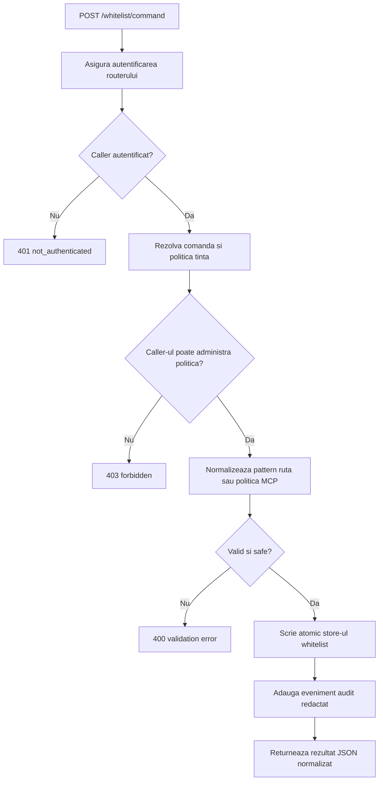
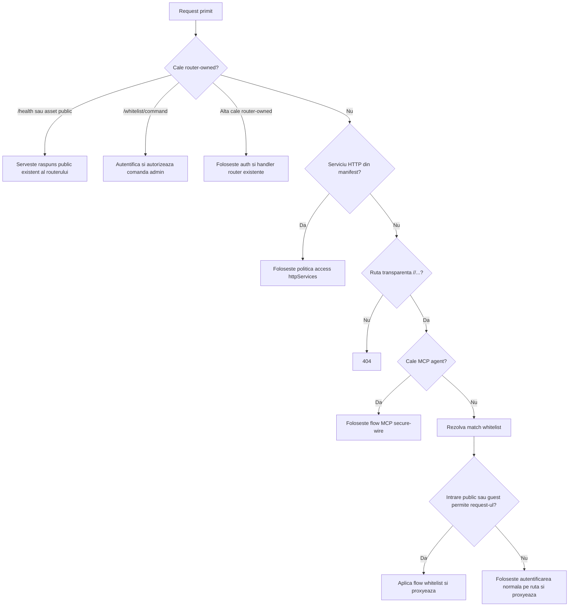
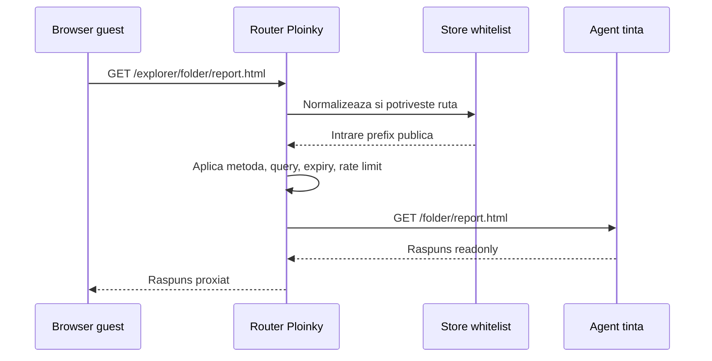
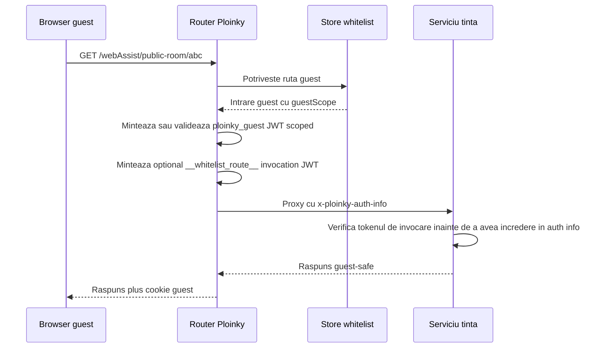
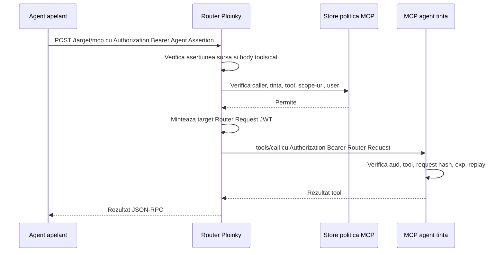
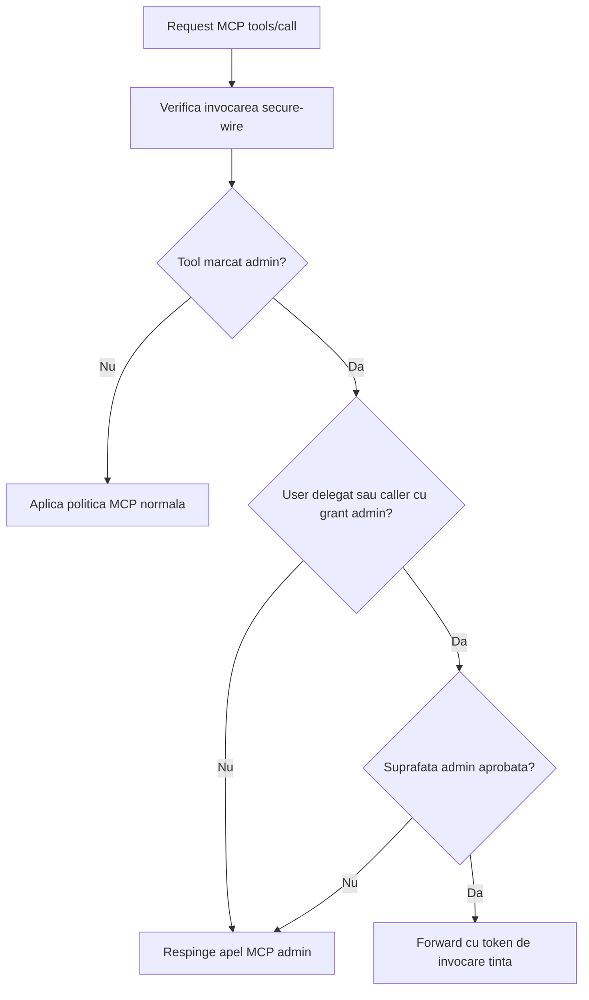

# Specificatie Pentru Acces Public Prin Router Whitelist

Ultima revizuire: 2026-06-02

Acest document defineste specificatia de securitate Explorer, propusa pentru acces public printr-un whitelist detinut de router. Se bazeaza pe contractele curente Ploinky pentru router, auth, servicii HTTP, sesiuni guest si MCP secure-wire, plus contractul de implementare Ploinky propus in `../../ploinky/docs/specs/DS013-router-whitelist-public-access.md`.

Designul inlocuieste ideea anterioara de agent PublicSharing separat. Public sharing devine politica durabila de router. URL-ul public ramane URL-ul Ploinky existent, de exemplu `/explorer/folder/report.html` sau `/explorer/stuff/sdocid124324`; routerul decide daca ruta este permisa, iar agentul detinator serveste in continuare resursa si aplica regulile readonly specifice domeniului.

## Obiective

Whitelist-ul trebuie sa suporte:

- rute exacte, precum `/explorer/stuff/sdocid124324`;
- rute folder cu wildcard terminal, precum `/explorer/folder/*`;
- metadata despre cine a creat, modificat si poate modifica fiecare intrare whitelist;
- acces readonly public fara autentificare, acolo unde este permis explicit;
- acces public protejat prin sesiuni guest cu scope;
- acces autentificat normal ca fallback implicit;
- permisiuni MCP tool/resource administrate prin politica pentru apeluri interne agent-catre-agent;
- tagging MCP admin, astfel incat operatiile privilegiate sa nu fie expuse implicit prin API-uri OpenAI-compatible.

Whitelist-ul nu trebuie sa creeze id-uri publice noi pentru resurse, sa expuna o lista publica de resurse partajate, sa whitelist-eze cai router-owned de auth/admin sau sa mute logica de randare a resurselor in Ploinky core.

## Index De Motive Pentru Decizii

Fiecare decizie noua din aceasta specificatie trebuie sa spuna de ce exista. Motivul este parte din contractul de securitate, nu decoratie.

| Decizie | De ce |
| --- | --- |
| Public sharing este politica de router, nu agent PublicSharing | Routerul este deja brokerul public de incredere. Mutarea autorizarii publice intr-un alt agent ar adauga o dependinta, un al doilea punct de decizie si riscul unor identificatori paraleli pentru resurse. |
| Linkurile partajate pastreaza URL-ul obisnuit `/<agent>/...` | URL-urile existente pastreaza ownership-ul clar: routerul acorda reachability, iar agentul detinator pastreaza randarea resursei si autorizarea de domeniu. |
| Starea whitelist locuieste in `.ploinky/router-whitelist.json` | Starea de routing este topologie runtime si poate fi rescrisa la startup. Starea whitelist este politica durabila de autorizare si trebuie sa pastreze metadata de audit intre restarturi. |
| Fiecare intrare inregistreaza creator, updater, manageri, timestamp-uri si metadata de motiv | Reachability-ul public este o schimbare de securitate. Operatorii trebuie sa stie cine l-a acordat, cine il poate modifica si de ce a fost acordat. |
| Doar route keys active sau enabled pot fi whitelistate | O intrare whitelist trebuie sa tinteasca o suprafata Ploinky reala. Asta previne ca o politica stale sau scrisa gresit sa devina activa pe neasteptate cand un agent este activat ulterior. |
| Caile router-owned de auth, admin si MCP agregat nu pot fi whitelistate | Acele cai sunt control planes ale routerului. Whitelistarea lor ar ocoli modelul propriu de autentificare si administrare al routerului. |
| Sunt permise doar match-uri exacte si prefixe terminale `/*` | Cele doua forme acopera linkuri de resursa si partajare folder, ramanand usor de normalizat, auditat, indexat si explicat. |
| Match-urile exacte castiga inaintea prefixelor | O regula mai ingusta trebuie sa poata suprascrie o regula de folder mai larga, astfel incat administratorii sa poata rationa determinist despre exceptii. |
| Intrari publice folosesc implicit doar `GET` si `HEAD` | Mutatiile publice au nevoie de controale CSRF, ownership, replay, quota si write-policy care nu sunt definite de aceasta specificatie de route-sharing. |
| Query string-urile sunt respinse implicit | Parametrii query poarta des document ids, actiuni, filtre, tokeni sau context de autorizare. Tratarea query-urilor arbitrare ca inofensive ar largi accesul in tacere. |
| Administrarea foloseste un singur endpoint `POST /whitelist/command` | O singura suprafata de comanda centralizeaza autentificarea, autorizarea, validarea, locking-ul, audit logging-ul si forma raspunsurilor. |
| `/whitelist/command` cere autentificare router si autorizare de manager | Userii publici nu trebuie sa poata acorda, inspecta sau infera politica de acces public. Granturile de manager permit delegare fara ca fiecare caller sa devina admin global. |
| Denial-urile publice sunt generice | Denial-urile detaliate ar permite userilor neautentificati sa enumere agenti, document ids, owneri sau resurse protejate care exista. |
| Niciun endpoint public nu listeaza resurse whitelistate | Un API de listare ar transforma linkurile selectate intr-un director public si ar scurge metadata operationala de sharing. |
| `public`, `guest` si `authenticated` sunt moduri de acces separate | Au semantici diferite de identitate: fara identitate, identitate guest cu scope si identitate normala de user. Amestecarea lor ar face autorizarea downstream ambigua. |
| Headerele de identitate Ploinky trimise de caller sunt mereu sterse | Clientii browser nu pot fi lasati sa falsifice identitatea routerului sau headerele auth-info inainte de proxy catre agent. |
| Rutele guest/protected whitelist pot include dovada de invocare `__whitelist_route__` | Agentii downstream au nevoie de o metoda criptografica pentru a distinge auth context emis de router de headere proxiate obisnuite. |
| Accesul MCP este guvernat de politica MCP, nu de whitelist pe path | Apelurile MCP executa tool-uri si citesc resurse; au nevoie de caller, tinta, tool/resursa, user delegat, body hash, expiry si replay checks. |
| Operatiile MCP admin trebuie marcate si respinse implicit | Tool-urile admin nu trebuie sa apara accidental prin API-uri OpenAI-compatible sau consumatori generici de agent-card. |
| Output-ul public cache-uit trebuie sa re-verifice politica whitelist inainte de servire | Revocarea trebuie sa aiba efect imediat. Performanta cache-ului nu poate depasi starea de autorizare. |
| Routerul nu randeaza resursele publice | Randarea este specifica domeniului. Pastrarea ei in agentul detinator evita mutarea logicii de business si ACL-urilor de resursa in Ploinky core. |
| Agentii interni trebuie sa foloseasca secure wire, nu headere custom cu secret partajat, pentru mutatii de politica | Ploinky are deja tokeni de invocare semnati, legati de audienta si body. Headerele shared ad hoc ar fi mai slabe si mai greu de auditat. |
| Rutele publice necesita rate limiting si loguri redactate | Accesul public elimina bariera de login, deci controalele de abuz si observabilitatea cu pastrarea confidentialitatii devin obligatorii. |

## Store Whitelist Detinut De Router

Routerul ar trebui sa persiste starea whitelist intr-un fisier de politica durabil sub `.ploinky/`, de exemplu `.ploinky/router-whitelist.json`. Nu ar trebui sa stocheze aceasta politica in `.ploinky/routing.json`, deoarece starea de routing este topologie runtime si poate fi rescrisa in timpul startup-ului.

Store-ul ar trebui sa contina intrari de ruta, politici MCP, granturi de manager si metadata de mutatie:

```json
{
  "version": 1,
  "updatedAt": "2026-06-02T00:00:00.000Z",
  "updatedBy": {
    "type": "user",
    "id": "local:admin",
    "username": "admin",
    "roles": ["local", "admin"]
  },
  "managers": [
    {
      "scope": "global",
      "roles": ["admin"]
    }
  ],
  "entries": [
    {
      "id": "sha256-base64url-of-normalized-policy",
      "enabled": true,
      "routeKey": "explorer",
      "pathPattern": "/folder/*",
      "match": "prefix",
      "access": "public",
      "methods": ["GET", "HEAD"],
      "queryPolicy": { "mode": "deny-query" },
      "profile": "readonly",
      "expiresAt": null,
      "createdAt": "2026-06-02T00:00:00.000Z",
      "createdBy": {
        "type": "user",
        "id": "local:admin",
        "username": "admin",
        "roles": ["local", "admin"]
      },
      "updatedAt": "2026-06-02T00:00:00.000Z",
      "updatedBy": {
        "type": "user",
        "id": "local:admin",
        "username": "admin",
        "roles": ["local", "admin"]
      },
      "managedBy": {
        "roles": ["admin"],
        "users": [],
        "agents": []
      },
      "metadata": {
        "reason": "public readonly report",
        "labels": ["public-sharing"]
      }
    }
  ],
  "mcpPolicies": []
}
```

Routerul ar trebui sa scrie store-ul atomic, cu lock, folosind fisier temporar si rename. Ar trebui de asemenea sa scrie evenimente de audit redactate sub `.ploinky/logs/`, de exemplu `.ploinky/logs/router-whitelist.log`.

## Normalizarea Si Matching-ul Rutelor

Intrarile whitelist sunt valide doar pentru rute transparente de agent existente, de forma `/<ploinky-agent-name>/...`. Primul segment de cale trebuie sa se potriveasca unui route key activ sau unei rute enabled care poate fi rezolvata de Ploinky.

Normalizarea trebuie sa aiba loc atat cand se adauga politica, cat si cand se verifica request-uri:

1. Parseaza request-ul cu URL parser.
2. Decodeaza segmentele de cale o singura data si respinge encoding invalid.
3. Respinge NUL bytes, segmente traversal, `..`, trucuri cu backslash in path, route keys goale si route keys necunoscute.
4. Normalizeaza calea la o cale canonica POSIX-style.
5. Permite doar rute exacte si prefixe wildcard terminale.
6. Interpreteaza `/<agent>/folder/*` ca intrare prefix pentru route key `<agent>` si prefix cale `/folder/`.
7. Interpreteaza `/<agent>/stuff/sdocid124324` ca intrare exacta.
8. Ignora intrarile disabled sau expirate.
9. Rezolva match-urile exacte inaintea match-urilor prefix.
10. Aplica politica de metoda si query inainte de proxy.

Setul implicit de metode publice este `GET` si `HEAD`. Metodele publice de mutatie precum `POST`, `PUT`, `PATCH` si `DELETE` ar trebui sa ramana respinse pana cand o specificatie separata defineste controale pentru mutatii publice.

Gestionarea query-urilor trebuie sa esueze inchis. Politica implicita de query este `deny-query`. Daca o ruta are nevoie de parametri query, intrarea whitelist trebuie sa declare matching exact de query sau un allowlist de chei query acceptate.

## `/whitelist/command`

Administrarea whitelist-ului ar trebui sa foloseasca un singur endpoint router-owned:

```text
POST /whitelist/command
```

Acest endpoint nu este public si nu este accesibil guest. Routerul trebuie sa autentifice caller-ul mai intai, apoi sa autorizeze comanda fata de roluri admin sau granturi explicite de whitelist-manager.

Comenzi initiale:

| Comanda | Scop |
| --- | --- |
| `add_route` | Adauga sau inlocuieste o intrare de ruta exacta sau wildcard |
| `remove_route` | Sterge o intrare dupa id sau pattern de ruta normalizat |
| `set_enabled` | Activeaza sau dezactiveaza o intrare |
| `check_route` | Arata ce intrare s-ar potrivi unei rute, fara sa citeasca resursa |
| `list_routes` | Listeaza intrarile vizibile caller-ului |
| `grant_manager` | Adauga un grant manager global sau scoped pe intrare |
| `revoke_manager` | Sterge un grant manager |
| `list_audit` | Citeste evenimente de audit redactate pentru admini |

Metadata de mutatie trebuie sa identifice userul sau principal-ul de agent verificat care a schimbat politica. Daca agenti interni viitori pot muta politica whitelist, trebuie sa foloseasca secure wire mediat de router, nu un header custom cu secret partajat.



## Clasificarea Request-urilor

Routerul trebuie sa pastreze comportamentul Ploinky existent si sa evalueze whitelist-ul doar pentru rute HTTP transparente de agent.



## Acces Readonly Complet Public

O intrare de ruta cu `access: "public"` permite un request fara login router si fara token guest. Acest mod este potrivit doar pentru resurse readonly inguste.

Cerintele routerului:

- potriveste calea normalizata cu intrari exacte si prefix;
- respinge request-uri disabled, expirate, cu metoda nepermisa sau query nepermis;
- aplica rate limiting inainte de proxy;
- sterge headerele de identitate Ploinky furnizate de caller;
- proxyeaza catre ruta upstream locala existenta a agentului tinta;
- logheaza rezultate allow, deny, cache si rate-limit cu redactare;
- returneaza mesaj generic de denial cand ruta nu este publica.

Routerul nu trebuie sa dezvaluie daca o resursa respinsa exista.



## Acces Public Protejat Guest

O intrare de ruta cu `access: "guest"` permite unui vizitator sa ajunga la ruta fara login anterior, dar doar dupa ce routerul minteaza sau valideaza o sesiune guest cu scope si durata scurta.

Acest mod oglindeste serviciile HTTP guest existente:

- scope-ul guest implicit ar trebui derivat din id-ul intrarii whitelist, de exemplu `whitelist-route:<entryId>`;
- sesiunile autentificate au prioritate fata de sesiunile guest;
- routerul minteaza o identitate guest cu scope doar cand nu exista user logat;
- serviciile downstream care au incredere in identitatea routerului ar trebui sa verifice un token de invocare emis de router.

Tokenul optional de invocare ar trebui sa foloseasca tool name `__whitelist_route__` si sa semneze un body care contine metoda, calea externa, search string-ul, route key-ul si id-ul intrarii whitelist.



## Acces Autentificat

Accesul autentificat ramane implicit. Daca nicio intrare whitelist public sau guest nu permite request-ul, routerul trebuie sa foloseasca autentificarea normala Ploinky pe ruta.

O intrare cu `access: "authenticated"` poate adauga politica centrala specifica rutei, precum cerinta de rol `admin` sau `publisher`, dar nu trebuie sa slabeasca cerinta normala de auth a rutei tinta. Agentul detinator aplica in continuare autorizarea specifica domeniului pentru resursa efectiva.

## Acces MCP Intern

Accesul MCP nu este whitelisting pe path. Este politica peste principal caller, principal tinta, tool sau resursa, user delegat, scope si body semnat al request-ului.

Apelurile agent-catre-agent trebuie sa foloseasca o DS013 Agent Assertion trimisa ca `Authorization: Bearer <assertion>`. Routerul verifica asertiunea agentului sursa, verifica politica MCP si doar apoi minteaza un Router Request cu audienta tinta pentru agentul tinta.

Exemplu de politica MCP:

```json
{
  "id": "mcp-policy-id",
  "enabled": true,
  "caller": "agent:explorer",
  "target": "agent:dpuAgent",
  "tools": ["read_document", "summarize_document"],
  "resources": [],
  "scopes": ["document:read"],
  "userRoles": ["local", "admin"],
  "expiresAt": null
}
```

Listarea tool-urilor poate ramane discoverable, dar `tools/call`, `resources/read` si citirile de task-status trebuie respinse daca verificarea secure-wire nu reuseste sau politica MCP nu permite operatia.



## Operatii MCP Admin

Tool-urile si resursele admin ar trebui marcate cu metadata stabila, de exemplu `annotations.ploinky.admin = true` sau un marker echivalent in manifest. Routerul trebuie sa respinga apelurile MCP admin-tagged daca userul verificat sau principal-ul caller nu are grant admin explicit.

API-urile OpenAI-compatible ale agentilor nu trebuie sa expuna implicit operatii MCP admin-tagged. O punte le poate expune doar cand ruta are identitate admin autentificata si o intrare de politica explicita permite acea punte, tool-ul tinta si rolul userului delegat.



## Cache, Revocare Si Erori

Whitelist-ul este autoritativ pentru fiecare request public. Output-ul cache-uit nu trebuie sa ocoleasca niciodata lookup-ul whitelist. Daca o intrare este stearsa, dezactivata, expirata sau ingustata, output-ul cache-uit pentru acea ruta trebuie sa inceteze imediat sa fie servit.

Denial-urile publice trebuie sa fie generice. Raspunsurile de comanda admin pot include detalii de validare, dar nu trebuie sa includa secrete, cookie-uri, bearer tokens, invocation JWTs, prompturi, continut de resurse, screenshot-uri, DOM dumps sau payload-uri interne.

Niciun API public nu ar trebui sa listeze resurse whitelistate. Listarea este o operatie admin autentificata prin `/whitelist/command`.

## Outline De Implementare

Implementarea Ploinky ar trebui sa adauge:

1. `cli/services/routerWhitelist.js` pentru load, normalizare, indexare, mutatie, locking si scriere atomica a politicii whitelist.
2. `cli/server/whitelistHandlers.js` pentru validarea `/whitelist/command`, autorizare si audit logging.
3. Tratarea in router astfel incat `/whitelist/command` sa fie router-owned si protected.
4. Rezolvare whitelist inainte de autentificarea normala pentru rute HTTP transparente non-MCP de agent.
5. Refolosirea stergerii existente de headere de identitate Ploinky inaintea fiecarui proxy whitelistat.
6. Mintare optionala de invocare `__whitelist_route__` pentru rute publice guest/protected.
7. Verificari de politica MCP dupa verificarea caller-ului delegat si inaintea mintarii invocarii tinta.
8. Teste pentru normalizare, match exact si prefix, respingere query, autorizare admin, secrecy pentru denial public, guest scoping, header stripping si denial de politica MCP.

## Consecinte De Securitate

Whitelist-ul propus adauga reachability publica controlata, nu un workspace public mai larg. Pastreaza public sharing explicit, auditabil, revocabil si limitat la rute selectate de admin. Pastreaza de asemenea autorizarea specifica domeniului in agenti, acolo unde ownership-ul resurselor exista deja.

Deployment-ul public necesita in continuare hardening-ul cerut in modelul de securitate Ploinky: bind-host si controale proxy explicite, TLS, CSRF sau origin controls pentru rute de mutatie autentificate prin cookie, rate limiting pentru login si rute publice, limite de upload si response size, si monitorizare atenta.
