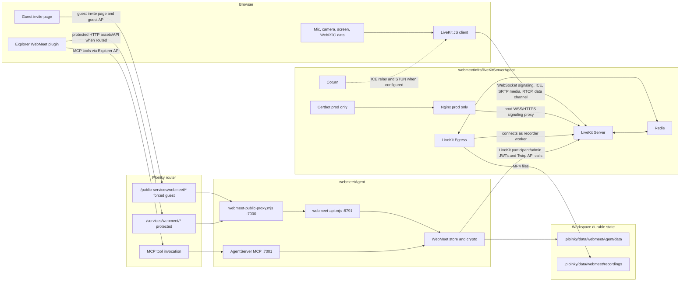
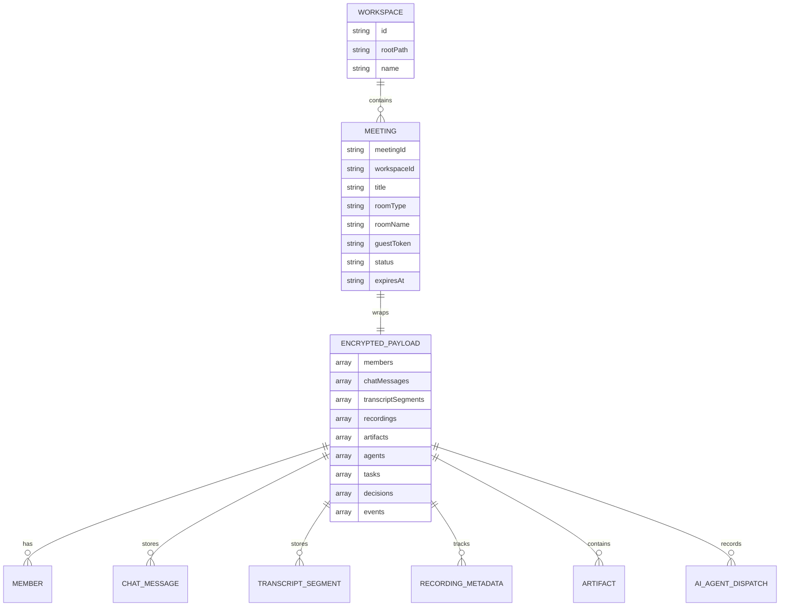
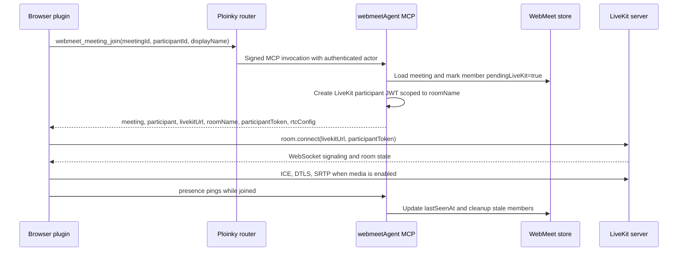
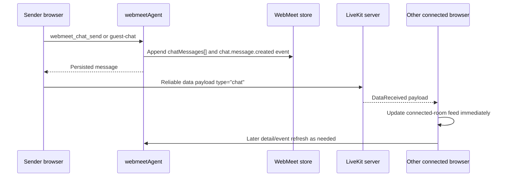
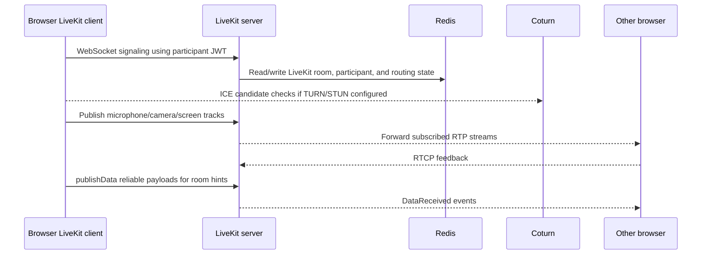
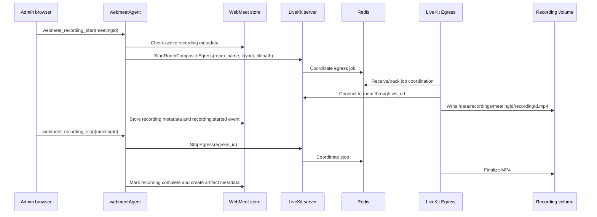
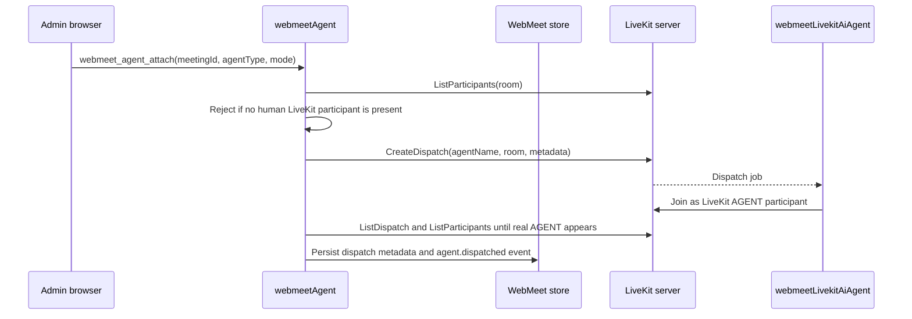
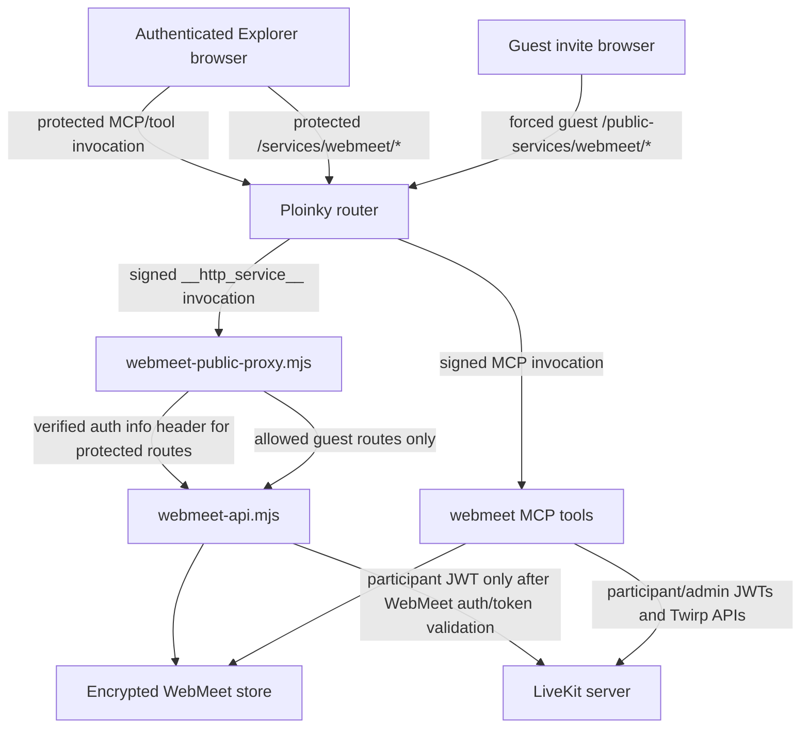

# WebMeet Agent And Infrastructure Architecture

Date: 2026-05-22

This document describes the current WebMeet architecture across `webmeetAgent/` and `webmeetInfra/`. It focuses on what a WebMeet room or meeting is, how browser traffic is split between WebMeet and LiveKit, how chat and realtime messages move, how WebMeet talks to the LiveKit server, and what is stored in WebMeet state, Redis, and LiveKit egress.

## Short Version

WebMeet is split into an application control plane and a media plane.

| Area | Owner | Main responsibility |
| --- | --- | --- |
| WebMeet control plane | `webmeetAgent` | Workspaces, rooms/meetings, invite tokens, participant membership, chat, transcript, artifacts, AI dispatch metadata, recording commands, LiveKit participant JWTs |
| Browser meeting UI | `webmeetAgent/IDE-plugins/webmeet-tool-button` | Explorer dashboard modal, guest page, LiveKit browser connection, media controls, chat composer, participant rendering |
| Live media plane | `liveKitServerAgent` from `webmeetInfra` | LiveKit SFU, WebSocket signaling, WebRTC negotiation, RTP/RTCP forwarding, LiveKit data-channel delivery |
| Recording plane | `liveKitServerAgent` from `webmeetInfra` | Room composite egress worker, MP4 rendering/writing |
| LiveKit runtime coordination | `liveKitServerAgent` from `webmeetInfra` | Redis runtime state for LiveKit nodes, rooms, participant routing, and egress coordination |
| TURN/STUN | `liveKitServerAgent` from `webmeetInfra` | Optional ICE relay/STUN support for browsers |
| Production TLS for LiveKit signaling | `liveKitServerAgent` from `webmeetInfra` | HTTPS/WebSocket TLS termination and certificate lifecycle for the LiveKit signaling hostname |

The most important invariant is:

> WebMeet rooms are discovered, authorized, and persisted by `webmeetAgent`. LiveKit rooms carry the live media session. Redis is not the WebMeet application database.

## Source Map

Primary implementation points:

| Concern | Files |
| --- | --- |
| WebMeet manifest, HTTP surfaces, data volumes, LiveKit env | `webmeetAgent/manifest.json` |
| WebMeet process startup | `webmeetAgent/scripts/startAgent.sh` |
| Public/protected HTTP proxy and guest routing | `webmeetAgent/server/webmeet-public-proxy.mjs` |
| WebMeet REST API | `webmeetAgent/server/webmeet-api.mjs` |
| MCP tool surface | `webmeetAgent/tools/webmeet_tool.mjs`, `webmeetAgent/mcp-config.json` |
| Durable meeting store, LiveKit tokens, LiveKit APIs, egress calls | `webmeetAgent/lib/webmeetStore.mjs` |
| Workspace/data paths | `webmeetAgent/lib/workspacePaths.mjs` |
| Payload encryption | `webmeetAgent/lib/webmeetCrypto.mjs` |
| Event append files | `webmeetAgent/lib/webmeetQueue.mjs` |
| Explorer WebMeet plugin API client | `webmeetAgent/IDE-plugins/webmeet-tool-button/components/webmeet-dashboard-modal/services/webmeet-api-client.js` |
| Browser LiveKit connection | `webmeetAgent/IDE-plugins/webmeet-tool-button/components/webmeet-dashboard-modal/controllers/livekit-room-controller.js` |
| Browser room session and LiveKit event handling | `webmeetAgent/IDE-plugins/webmeet-tool-button/components/webmeet-dashboard-modal/controllers/room-session-methods.js` |
| Browser media publish controls | `webmeetAgent/IDE-plugins/webmeet-tool-button/components/webmeet-dashboard-modal/controllers/webmeet-media-controller.js` |
| Browser chat/transcript behavior | `webmeetAgent/IDE-plugins/webmeet-tool-button/components/webmeet-dashboard-modal/service-components/chat-transcript-component.js` |
| Guest browser session behavior | `webmeetAgent/IDE-plugins/webmeet-tool-button/components/webmeet-dashboard-modal/service-components/guest-session-manager.js` |
| LiveKit server, Egress, Redis, Coturn, Nginx, Certbot manifest | `webmeetInfra/liveKitServerAgent/manifest.json` |
| Generated infra config | `webmeetInfra/liveKitServerAgent/scripts/hooks/preinstall.sh` |
| In-container media supervisor | `webmeetInfra/liveKitServerAgent/scripts/start-livekit-server-agent.sh` |
| Media runtime health endpoint | `webmeetInfra/liveKitServerAgent/scripts/health/livekit-server-agent-health.sh` |

Primary local specs:

| Spec | Why it matters |
| --- | --- |
| `webmeetAgent/docs/specs/DS002-room-state-and-access.md` | Team room versus public guest room behavior |
| `webmeetAgent/docs/specs/DS004-livekit-media-runtime.md` | Canonical WebMeet media runtime, storage, Redis, LiveKit, egress, and deployment boundaries |
| `webmeetAgent/docs/specs/DS005-self-hosted-livekit-ai-agents.md` | LiveKit AI agent dispatch contract |
| `webmeetAgent/docs/specs/DS007-no-agent-tag-meeting-chat.md` | Chat behavior and no provider dispatch from WebMeet chat |
| `webmeetInfra/docs/specs/DS002-livekit-server-agent.md` | Consolidated LiveKit server, Egress, Redis, Coturn, Nginx, and Certbot topology |
| `webmeetInfra/docs/specs/DS003-ploinky-runtime-invariants.md` | Ploinky runtime boundary for the media infrastructure agent |

## System Overview



## What A Room Or Meeting Is

The UI usually says "room". The backend uses the term "meeting". There are two related objects:

| Concept | Meaning | Stored where |
| --- | --- | --- |
| WebMeet meeting record | Durable application object with id like `meeting_<uuid>`, workspace id, title, `roomType`, `roomName`, optional `guestToken`, status, expiration, wrapped data-encryption key, and encrypted payload | `.ploinky/data/webmeetAgent/data/meetings/*.json` through the `/data` container mount |
| LiveKit room | Media-room name used by LiveKit. It is derived from the WebMeet record as `${WEBMEET_ROOM_PREFIX || "webmeet"}-${workspaceId}-${meetingId}`, sanitized and capped to 160 chars | LiveKit runtime state, with coordination in Redis while active |

WebMeet has two room types:

| WebMeet `roomType` | UI meaning | Access model |
| --- | --- | --- |
| `team` | Normal workspace room | Authenticated Explorer user enters through protected MCP/API paths |
| `guest` | Public meeting | Admin-created invite URL contains `room=<meetingId>&token=<guestToken>`; guest APIs validate both router guest identity and the stored meeting token |

A guest room is still a WebMeet meeting record. The `guestToken` is stored in the meeting metadata, not in LiveKit or Redis. LiveKit only sees participants that join with a valid LiveKit participant JWT issued by `webmeetAgent`.



## Storage Boundaries

### WebMeet Durable Store

`webmeetAgent` mounts `.ploinky/data/webmeetAgent/data` at `/data`. The path helper builds these subtrees:

| Path under `/data` | Purpose |
| --- | --- |
| `workspaces/` | Workspace records derived from the workspace root |
| `meetings/` | Durable meeting records with encrypted payloads |
| `events/<meetingId>/` | Append-only meeting event JSON files |
| `events/workspaces/<workspaceId>/` | Append-only workspace event JSON files |
| `jobs/{pending,processing,done,failed}/` | WebMeet job queue folders |

Meeting payloads are encrypted with AES-256-GCM using a per-meeting data key. That data key is wrapped by the WebMeet master key. The encrypted payload contains members, chat messages, transcript segments, recording metadata, artifacts, tasks, decisions, AI agent metadata, and event snapshots.

### Recording Files

`webmeetAgent` and the Egress process supervised by `liveKitServerAgent` both use the shared recording volume `.ploinky/data/webmeet/recordings`, mounted in containers as `/data/recordings`.

The recording command stores files like:

```text
/data/recordings/<meetingId>/<recordingId>.mp4
```

The MP4 is the egress output. WebMeet separately persists recording metadata and an artifact record inside the encrypted meeting payload.

### Redis

Redis supervised by `liveKitServerAgent` is infrastructure runtime state for LiveKit and Egress, not the WebMeet app database.

Redis may contain:

| Redis can contain | Redis must not be treated as |
| --- | --- |
| LiveKit node state | Source of WebMeet room discovery |
| LiveKit room and participant runtime state | Source of WebMeet membership records |
| Message bus/routing state used by LiveKit | Durable chat store |
| Egress coordination state | Durable transcript/artifact store |
| Runtime snapshots from `redis-server --save 60 1` | Permanent media or recording archive |

The generated Redis config runs `redis-server --save 60 1 --loglevel warning`, so it can snapshot LiveKit runtime data to disk. That snapshot is still an infrastructure artifact, not an application record.

### LiveKit Egress

The Egress process supervised by `liveKitServerAgent` stores two practical things:

| Location | Contents |
| --- | --- |
| `.ploinky/agents/liveKitServerAgent/egress.yaml` mounted at `/working-data/generated/egress.yaml` | Generated worker config: LiveKit API key/secret, `ws_url`, Redis address, health port |
| `.ploinky/data/webmeet/recordings` mounted at `/data/recordings` | MP4 room-composite outputs |

The egress worker does not own WebMeet chat, transcript, room list, invite tokens, or artifact policy. It subscribes to LiveKit as a recording worker, composites the room, writes the MP4, and uses Redis/LiveKit runtime coordination as required by LiveKit.

## Runtime Processes

`webmeetAgent/scripts/startAgent.sh` starts three Node processes in one agent container:

| Process | Default port | Role |
| --- | --- | --- |
| `server/webmeet-api.mjs` | `8791` | Local REST API used by proxy and some internal flows |
| `AgentServer` with `tools/webmeet_tool.mjs` | `7001` | MCP tool server used by Explorer and authenticated plugin calls |
| `server/webmeet-public-proxy.mjs` | `7000` | Manifest-facing HTTP service proxy for protected and guest routes |

The optional LiveKit AI worker is not started inside `webmeetAgent`. It is a separate `webmeetLivekitAiAgent` Ploinky agent.

## Browser To WebMeet Versus Browser To LiveKit

The browser intentionally speaks to two systems.

| Browser sends | Receiver | Path | Stored? | Purpose |
| --- | --- | --- | --- | --- |
| Workspace list, room list, create room, rename room, delete room | `webmeetAgent` | Explorer API `callAgentTool("webmeetAgent", ...)` to MCP, or protected `/services/webmeet/*` | Yes for mutations | Application control plane |
| Authenticated join/leave/presence | `webmeetAgent` | MCP tools such as `webmeet_meeting_join`, `webmeet_meeting_leave`, `webmeet_meeting_presence_ping` | Yes, membership and timestamps in encrypted meeting payload | Authorize and mint LiveKit token |
| Guest join/name/presence/chat/avatar/leave | `webmeetAgent` public proxy and API | `/public-services/webmeet/...` forced-guest HTTP route | Yes for membership/chat/events; avatar projection event is sanitized | Public invite flow |
| Chat message | `webmeetAgent` first | `webmeet_chat_send` or guest `guest-chat` API | Yes, in encrypted meeting payload | Authoritative chat write |
| Best-effort chat notification after persistence | LiveKit server | Reliable LiveKit data channel payload with `type: "chat"` | No | Fast in-room UI update for connected clients |
| Manual transcript and browser speech-recognition transcript | `webmeetAgent` | `webmeet_transcript_append` | Yes, in encrypted meeting payload | Transcript persistence |
| Mic, camera, screen share | LiveKit server | LiveKit WebRTC publish APIs | No WebMeet storage | Live media |
| Participant avatar projection and avatar state requests | LiveKit server | LiveKit participant attributes and reliable data channel payloads | Not as durable avatar source; WebMeet may record event metadata | Connected-room rendering |
| Recording start/stop button | `webmeetAgent` | MCP `webmeet_recording_start` and `webmeet_recording_stop` | Yes, metadata/artifact in WebMeet; MP4 by egress | Recording lifecycle |
| AI attach/detach button | `webmeetAgent` | MCP `webmeet_agent_attach` and `webmeet_agent_detach` | Yes, dispatch metadata after real LiveKit agent appears | LiveKit AI participant lifecycle |

Direct browser-to-LiveKit traffic includes:

- WebSocket signaling to `WEBMEET_PUBLIC_LIVEKIT_URL`.
- ICE/STUN/TURN negotiation.
- DTLS/SRTP media packets for microphone, camera, and screen share.
- RTCP feedback.
- LiveKit reliable data-channel payloads used for connected-room UI hints.
- LiveKit participant attributes such as `webmeetProfileAvatar` and user-id attributes.

Browser-to-WebMeet traffic includes:

- MCP tool calls from authenticated Explorer users.
- Guest public HTTP API calls from invite pages.
- Protected HTTP API/asset requests routed through Ploinky.
- Chat, transcript, room management, recording controls, AI controls, presence pings, and guest invite validation.

## Authenticated Join Flow



The participant JWT is created by `webmeetAgent` using the shared LiveKit API key and secret. The token is scoped to one LiveKit room and grants:

- `roomJoin`
- `canPublish`
- `canSubscribe`
- `canPublishData`

Authenticated joins also include user-id attributes in the LiveKit token when the Ploinky actor is known: `webmeetUserId`, `userId`, `workspaceUserId`, and `ploinkyUserId`.

## Guest Invite Flow

```mermaid
sequenceDiagram
    participant Admin as Admin browser
    participant A as webmeetAgent
    participant S as WebMeet store
    participant Guest as Guest browser
    participant Router as Ploinky router
    participant Proxy as webmeet public proxy
    participant API as webmeet API
    participant LK as LiveKit server

    Admin->>A: webmeet_meeting_create(roomType="guest")
    A->>S: Store meeting with random guestToken
    A-->>Admin: /public-services/webmeet/guest?room=meetingId&token=guestToken

    Guest->>Router: GET public invite URL
    Router->>Proxy: Signed __http_service__ invocation with guest role
    Proxy->>Proxy: Verify invocation JWT and guest identity
    Proxy-->>Guest: Guest page and assets

    Guest->>Router: POST join-guest with guestToken, displayName, participantId
    Router->>Proxy: Signed guest invocation
    Proxy->>API: Forward allowed guest route
    API->>S: Validate meeting roomType=guest and token; store guest member
    API-->>Guest: livekitUrl, roomName, participantToken, participantIdentity
    Guest->>LK: room.connect(livekitUrl, participantToken)
```

The public proxy only allows a narrow guest route set, including join, state, leave, presence, chat, avatar, and guest transcript download. Generic Explorer access and protected WebMeet APIs are not exposed to guest invite sessions.

## Chat And Realtime Messages

Chat has an authoritative persistence path and a best-effort realtime path.



Important details:

- The durable chat write is always through `webmeetAgent`.
- The LiveKit data-channel copy is not the source of truth.
- LiveKit does not store WebMeet chat history.
- WebMeet chat does not dispatch provider commands such as `@open-interpreter`; those strings are ordinary meeting chat.

Other LiveKit data-channel payloads are also best-effort room UI hints:

| Payload type | Purpose |
| --- | --- |
| `participant.avatar.request` | Ask already-connected peers to republish their current avatar projection |
| `participant.avatar.updated` | Broadcast current avatar projection |
| `chat` | Broadcast persisted chat to connected clients quickly |
| `meeting.renamed` | Notify connected room after persisted rename |
| `agent.dispatched` / `agent.detached` | Notify connected room after persisted AI-agent change |

The WebMeet store also appends JSON event files for durable events such as `participant.joined`, `participant.left`, `participant.timed_out`, `chat.message.created`, `transcript.updated`, `recording.started`, `recording.stopped`, `artifact.created`, `agent.dispatched`, and `agent.detached`.

Authenticated dashboard code currently polls workspace events with `webmeet_workspace_events_list` for cross-room updates. The API also exposes meeting and workspace event streaming endpoints backed by filesystem watchers over the append-only event directories.

## Live Media Flow



The browser enables media through LiveKit client APIs:

| UI action | Browser code path | LiveKit operation |
| --- | --- | --- |
| Join room | `LivekitRoomController.connect()` | `room.connect(livekitUrl, participantToken, { autoSubscribe: true, rtcConfig })` |
| Microphone | `WebmeetMediaController.toggleMicrophone()` | `localParticipant.setMicrophoneEnabled(true, options)` or processed microphone track publish |
| Camera | `WebmeetMediaController.toggleCamera()` | `localParticipant.setCameraEnabled(true, captureOptions, publishOptions)` |
| Screen share | `WebmeetMediaController.toggleScreenShare()` | `localParticipant.setScreenShareEnabled(true, captureOptions, { simulcast: false, videoEncoding })` |
| Data channel | `dashboardRealtimeMethods.publishRealtimePayload()` | `localParticipant.publishData(..., { reliable: true })` |

Live audio/video/screen packets do not flow through `webmeetAgent`. Once the browser has a LiveKit token, media is browser to LiveKit to browser.

## How WebMeet Talks To LiveKit Server

`webmeetAgent` communicates with LiveKit server through HTTP/Twirp APIs at `WEBMEET_LIVEKIT_URL`. The code normalizes `ws://` to `http://` and `wss://` to `https://` when making server-side API calls.

| Operation | LiveKit Twirp service | `webmeetAgent` use |
| --- | --- | --- |
| List room participants | `livekit.RoomService/ListParticipants` | Reconcile WebMeet member list with actual LiveKit participants |
| Create AI dispatch | `livekit.AgentDispatchService/CreateDispatch` | Ask LiveKit to dispatch a named AI worker into a room |
| List AI dispatches | `livekit.AgentDispatchService/ListDispatch` | Confirm dispatch state and find active dispatches |
| Delete AI dispatch | `livekit.AgentDispatchService/DeleteDispatch` | Detach AI workers |
| Start recording | `livekit.Egress/StartRoomCompositeEgress` | Start room-composite MP4 egress |
| Stop recording | `livekit.Egress/StopEgress` | Stop active egress job |

All of these calls use short-lived server-side JWTs signed with the shared `WEBMEET_LIVEKIT_API_SECRET`.

Two different URLs matter:

| Env var | Used by | Example |
| --- | --- | --- |
| `WEBMEET_PUBLIC_LIVEKIT_URL` | Browser LiveKit client | `ws://127.0.0.1:7880` locally, `wss://livekit-skills.axiologic.dev` in production |
| `WEBMEET_LIVEKIT_URL` | `webmeetAgent` server-side Twirp API calls | `http://liveKitServerAgent:7880` in default, `http://liveKitServerAgent:17880` in dev, `http://host.containers.internal:7880` in prod |

`WEBMEET_EGRESS_URL` is present in context and is stored as recording metadata, but the recording control call itself goes to the LiveKit server Egress Twirp API. LiveKit then coordinates with the egress worker.

## Recording Flow



What is stored during recording:

| Data | Stored by | Location |
| --- | --- | --- |
| Egress job runtime state | LiveKit and egress | Redis/runtime internals |
| MP4 file | LiveKit Egress supervised by `liveKitServerAgent` | `.ploinky/data/webmeet/recordings/<meetingId>/<recordingId>.mp4` |
| Recording id, room name, egress id, status, file path, timestamps, egress response | `webmeetAgent` | Encrypted meeting payload `recordings[]` |
| Artifact entry pointing to the recording | `webmeetAgent` | Encrypted meeting payload `artifacts[]` |

## AI Participant Flow



`webmeetAgent` does not persist a fake AI participant just because `CreateDispatch` returned HTTP 200. Attach is considered successful only after a real LiveKit `AGENT` participant appears with the expected WebMeet attributes.

## Profile And Network Topology

| Profile | LiveKit server topology | Browser URL | Server-side WebMeet URL | Egress `ws_url` |
| --- | --- | --- | --- | --- |
| `default` | Bridge network alias `liveKitServerAgent`, published default ports | `ws://127.0.0.1:7880` by manifest default | `http://liveKitServerAgent:7880` | `ws://liveKitServerAgent:7880` |
| `dev` | Bridge network alias `liveKitServerAgent`, alternate ports | `ws://127.0.0.1:17880` by manifest default | `http://liveKitServerAgent:17880` | `ws://liveKitServerAgent:17880` |
| `prod` | Host network for LiveKit server | `wss://livekit-skills.axiologic.dev` | `http://host.containers.internal:7880` from bridge-resident `webmeetAgent` | `ws://host.containers.internal:7880` |

Production uses host networking for LiveKit so the SFU sees real client UDP addresses. The Nginx process supervised by `liveKitServerAgent` terminates TLS for WebSocket/HTTPS signaling on the public hostname and proxies to LiveKit `7880`. WebRTC media still needs direct media ports such as `7882-7892/udp` and TCP fallback `7881/tcp`; the TLS proxy is not the media relay.

## Security Boundaries



Key rules:

- Browser-facing WebMeet traffic enters through Ploinky router surfaces, not direct container ports.
- Protected WebMeet HTTP uses `/services/webmeet/*`.
- Forced guest invite traffic uses `/public-services/webmeet/*`.
- The public proxy verifies router-issued invocation JWTs before serving guest pages or forwarding APIs.
- Guest routes require both router guest identity and the stored WebMeet `guestToken`.
- `x-ploinky-auth-info` is trusted only after the proxy has verified the router invocation token for protected routes.
- LiveKit API key/secret values stay server-side. Browsers receive only scoped participant JWTs.
- Live media packets bypass `webmeetAgent`; that is intentional and keeps media latency out of the app control plane.

## What Does Not Happen

- Browsers do not ask Redis for room lists.
- WebMeet chat history is not stored in LiveKit.
- Live microphone, camera, or screen packets are not stored in the WebMeet meeting JSON.
- Live microphone, camera, or screen packets are not proxied through `webmeetAgent`.
- Redis is not the durable WebMeet database.
- Egress does not own invite validation, chat policy, transcript policy, or room discovery.
- A public guest invite does not grant general Explorer or MCP access.

## Quick Reference

| Question | Answer |
| --- | --- |
| What is a WebMeet room? | A durable WebMeet meeting record plus an associated LiveKit room name. |
| What is a LiveKit room? | The media session identified by the WebMeet-generated `roomName`. |
| Who creates LiveKit participant tokens? | `webmeetAgent`, after WebMeet auth or guest-token validation. |
| Where is chat stored? | Encrypted WebMeet meeting payload in `/data/meetings/*.json`. |
| Does chat also use LiveKit? | Yes, after persistence, as a best-effort reliable data-channel update to connected clients. |
| Where are recordings stored? | MP4 files under `.ploinky/data/webmeet/recordings`; metadata/artifacts in WebMeet payload. |
| What is in Redis? | LiveKit and egress runtime/coordination state, possibly snapshotted by Redis. |
| What goes browser to LiveKit directly? | Signaling, ICE, media tracks, RTCP, participant attributes, data-channel room hints. |
| What goes browser to WebMeet Agent? | Room management, join, guest validation, chat persistence, transcript, presence, recording controls, AI controls, persisted artifacts. |
| How does WebMeet call LiveKit? | HTTP/Twirp APIs on `WEBMEET_LIVEKIT_URL` with short-lived server-side JWTs. |
