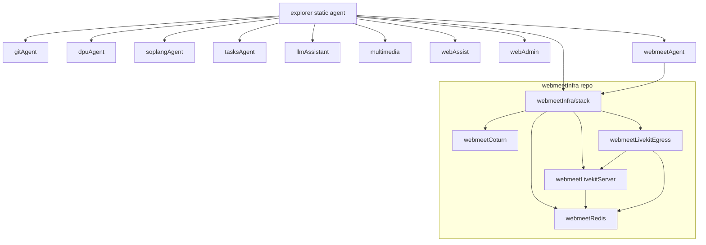
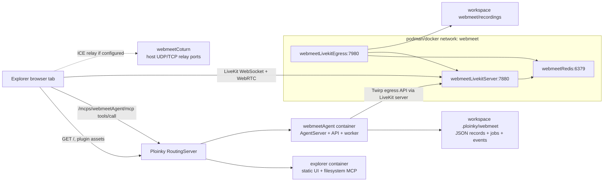
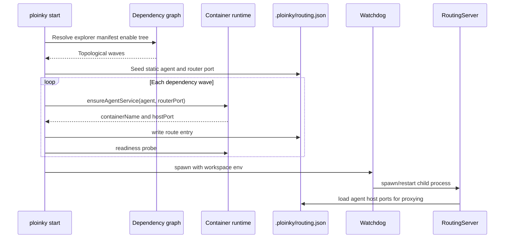
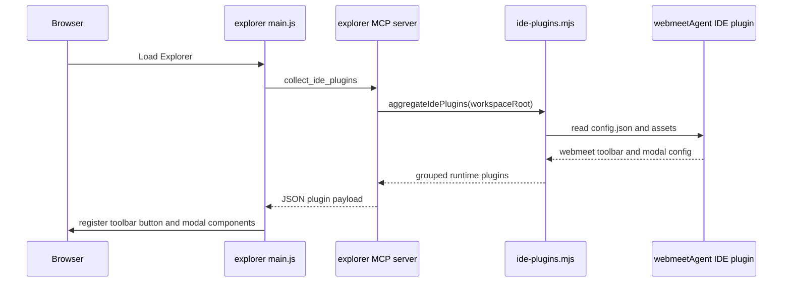
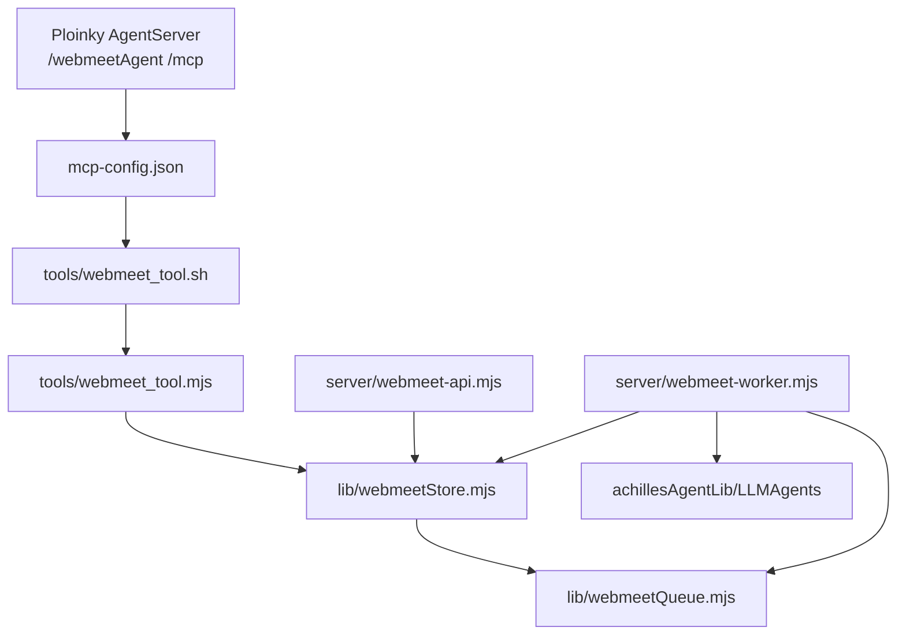
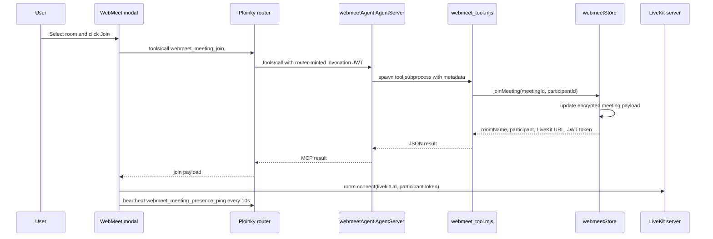
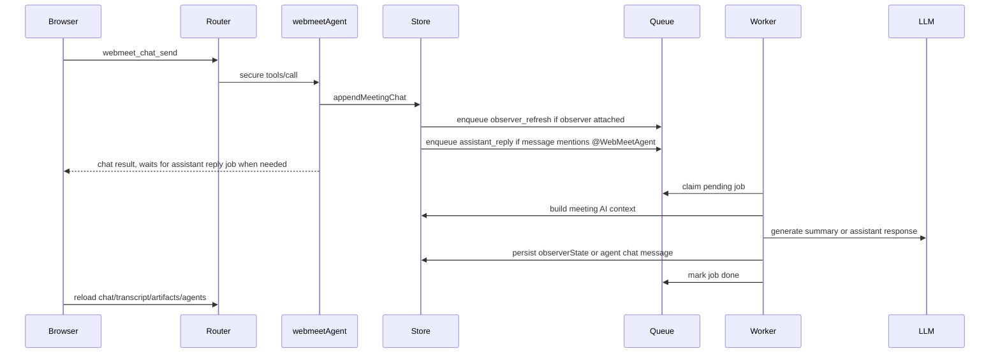
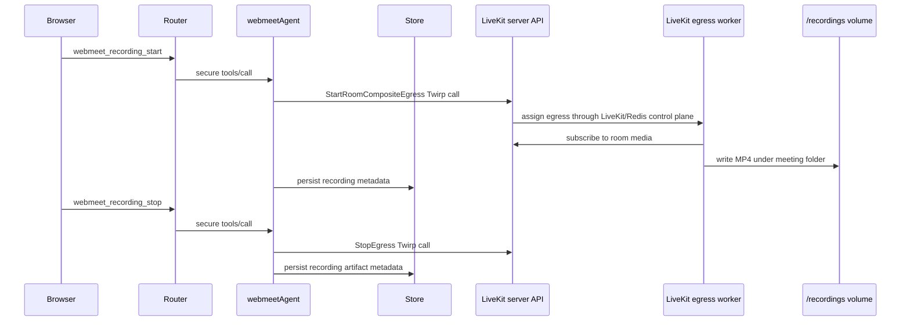
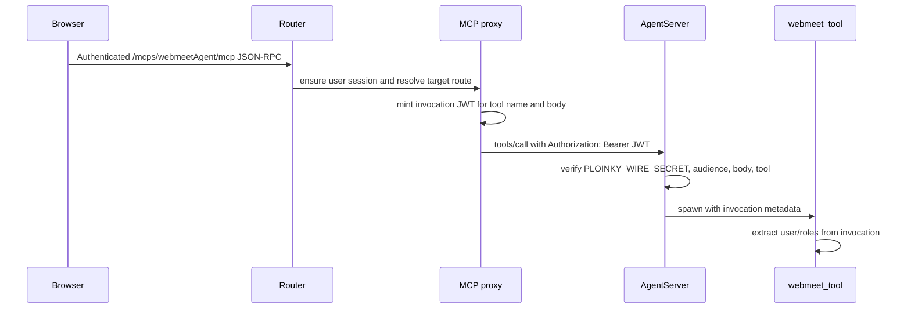

# WebMeet Infrastructure Architecture

This document describes how Ploinky, `AssistOSExplorer/explorer`, `webmeetAgent`, and the `webmeetInfra` Ploinky repo work together to provide the WebMeet experience inside Explorer.

Paths are relative to `/Users/danielsava/work/file-parser` unless noted.

## Scope

The current Explorer WebMeet path is:

1. `ploinky start fileExplorer/explorer <port>` or `ploinky start AchillesIDE/explorer <port>` starts Explorer as the static agent.
2. Explorer's manifest enables `webmeetAgent` and the `webmeetInfra/stack` dependency bundle.
3. `webmeetAgent` exposes the WebMeet MCP tools and ships the Explorer IDE plugin assets.
4. `webmeetInfra` runs the media infrastructure: Redis, LiveKit server, LiveKit egress, TURN/STUN, and a stack marker.

Ploinky also contains an older router-level `/webmeet` handler in `ploinky/cli/server/handlers/webmeet.js`. That handler is not the current Explorer plugin flow described here. The current UI path is the IDE plugin in `AssistOSExplorer/webmeetAgent/IDE-plugins/webmeet-tool-button`.

## Repository Roles

| Repository/path | Role |
|---|---|
| `ploinky/` | Workspace manager, manifest resolver, dependency graph starter, container runtime launcher, router, authenticated MCP proxy, secure-wire invocation token minting, and static/proxy surfaces. |
| `AssistOSExplorer/explorer/` | Static Explorer UI and filesystem MCP agent. Its manifest enables the rest of the Explorer agent pack and advertises the `webmeet` application plugin policy. |
| `AssistOSExplorer/webmeetAgent/` | App-facing WebMeet agent. Owns MCP tools, meeting persistence, LiveKit token minting, AI worker jobs, recording API calls, and the WebMeet IDE plugin assets. |
| `AssistOSExplorer/webmeetInfra/` | Separate Ploinky repo of runtime infrastructure agents consumed by `webmeetAgent` and Explorer. It does not own the app-facing WebMeet UI or meeting business logic. |

## Explorer Dependency Graph

`AssistOSExplorer/explorer/manifest.json` is the root of the runtime graph. It declares `webmeetInfra` as an external Ploinky repo and enables the WebMeet application plugin:

- `repos.webmeetInfra = https://github.com/PloinkyRepos/webmeetInfra.git`
- `enable` includes `webmeetInfra/stack` and `webmeetAgent global`
- `applicationPlugins.webmeet = true`

`webmeetAgent/manifest.json` also enables `webmeetInfra/stack`, so WebMeet infrastructure is pulled in if `webmeetAgent` is started independently.



Ploinky resolves this graph recursively with `workspaceDependencyGraph.js`, enables missing graph nodes in `.ploinky/agents.json`, starts nodes in topological waves, waits for readiness after each wave, writes `.ploinky/routing.json`, and finally launches the host-side `Watchdog.js` plus `RoutingServer.js`.

Expected WebMeet-related startup order:

| Wave | Agents |
|---|---|
| 1 | Non-WebMeet Explorer dependencies plus `webmeetRedis` and `webmeetCoturn` |
| 2 | `webmeetLivekitServer` |
| 3 | `webmeetLivekitEgress` |
| 4 | `webmeetInfra/stack` |
| 5 | `webmeetAgent` |
| 6 | `explorer` |

The exact wave labels also include the other Explorer agents. `start_only` manifests use TCP readiness; normal MCP agents use an MCP handshake.

## WebMeet Infrastructure Agents

| Agent | Container | Main job | Network | Important ports in `dev` profile | Notes |
|---|---|---|---|---|---|
| `webmeetInfra/stack` | `docker.io/library/busybox:1.36` | Dependency bundle and readiness marker | default Ploinky network | random host port to container `7000` unless already specified by Ploinky | Starts a tiny `httpd` with `ok`. It depends on all infra agents and gives Ploinky a single bundle node. |
| `webmeetRedis` | `docker.io/library/redis:7-alpine` | LiveKit state bus | `webmeet`, alias `webmeetRedis` | `16379:6379` | LiveKit server and egress refer to `webmeetRedis:6379`. Redis state is runtime state, not the durable WebMeet meeting store. |
| `webmeetCoturn` | `docker.io/coturn/coturn:4.6.2` | TURN/STUN relay | host-published ports; no `webmeet` alias | `13478:3478/tcp`, `13478:3478/udp`, `20000-20010:20000-20010/udp` | Runs with default dev credentials unless profile/env overrides are supplied. `webmeetAgent` can return TURN ICE servers in the join payload, and the browser passes them to LiveKit through `rtcConfig`. |
| `webmeetLivekitServer` | `docker.io/livekit/livekit-server:latest` | LiveKit SFU and LiveKit API | `webmeet`, alias `webmeetLivekitServer` | `17880:7880`, `17881:17881`, `17882-17892:17882-17892/udp` | Depends on Redis. A host preinstall hook generates `.ploinky/agents/webmeetLivekitServer/livekit.yaml`, mounted at `/code/livekit.yaml`. |
| `webmeetLivekitEgress` | `docker.io/livekit/egress:latest` | Recording worker | `webmeet`, alias `webmeetLivekitEgress` | `17980:7980` | Depends on LiveKit server and Redis. A host preinstall hook generates `.ploinky/agents/webmeetLivekitEgress/egress.yaml`. It mounts `webmeet/recordings` at `/recordings` and requires `SYS_ADMIN`. |

Default profile ports are similar but use host `7880/7881/7882-7892`, `7980`, `6379`, and `3478`. The `prod` profile binds public-facing infra ports to `0.0.0.0` and makes key LiveKit/TURN variables required.

## Generated LiveKit Configuration

The checked-in `webmeetLivekitServer/livekit.yaml` and `webmeetLivekitEgress/egress.yaml` files are placeholders. The actual files used at runtime are generated under `.ploinky/agents/...` by host preinstall hooks before the containers start.

`webmeetLivekitServer/scripts/hooks/preinstall.sh` writes:

- `port: 7880` for HTTP API and WebSocket signaling.
- `rtc.tcp_port`, used as a TCP fallback media path.
- `rtc.port_range_start` and `rtc.port_range_end`, used for UDP media sockets.
- `rtc.use_external_ip`, controlled by `WEBMEET_LIVEKIT_USE_EXTERNAL_IP`.
- Optional `rtc.node_ip` in dev, defaulting to `127.0.0.1` when external IP mode is off.
- `redis.address: webmeetRedis:6379`.
- The LiveKit API key/secret map under `keys`.

In the current `dev` profile, the host publishes LiveKit as:

- `17880:7880` for signaling and LiveKit API calls from the browser.
- `17881:17881` for the LiveKit TCP media fallback configured in generated YAML.
- `17882-17892:17882-17892/udp` for UDP media sockets.

The container still listens on `7880`, but the generated RTC media ports intentionally use the host-published development range. In `default` and `prod`, the generated RTC media ports are `7881` and `7882-7892/udp`.

`webmeetLivekitEgress/scripts/hooks/preinstall.sh` writes:

- `ws_url: ws://webmeetLivekitServer:7880`, which is the internal WebSocket path egress uses to join LiveKit rooms.
- `api_key` and `api_secret`, matching the LiveKit server keys.
- `redis.address: webmeetRedis:6379`.
- `health_port: 7980`.
- `insecure: true`, because egress talks to LiveKit over the private `webmeet` container network rather than TLS.

The egress container mounts `webmeet/recordings` at `/recordings` and receives `SYS_ADMIN`, which is required by the upstream LiveKit egress image for browser/compositor sandboxing. Treat egress as a privileged media-processing container and keep it off untrusted networks.

## Runtime Topology



`webmeetAgent` joins the `webmeet` network so it can resolve the internal LiveKit services by alias. It also gets Ploinky runtime router variables such as `PLOINKY_ROUTER_URL`, but the UI path normally enters it through the router MCP proxy, not through direct container-to-router calls.

## LiveKit Server Processing Model

The LiveKit server is the real-time media SFU. It is not an application server for WebMeet chat, meetings, summaries, or durable artifacts. Its primary jobs are signaling, room membership for media sessions, track publication, track subscription, packet routing, and media-session health.

When a participant joins:

1. The browser first calls the `webmeet_meeting_join` MCP tool through Ploinky.
2. `webmeetAgent` updates durable meeting presence and returns `livekitUrl`, `roomName`, and a LiveKit participant JWT.
3. The browser's LiveKit client opens a WebSocket signaling connection to the LiveKit URL.
4. LiveKit validates the JWT against the configured API key/secret and checks that the token permits joining that room.
5. The browser and LiveKit negotiate WebRTC transports, usually UDP when reachable and TCP fallback when needed.
6. The browser publishes microphone, camera, or screen-share tracks only when the user enables those controls.

Once media is active, LiveKit performs SFU work:

- It terminates each browser's WebRTC connection and manages DTLS-SRTP transport encryption for that hop.
- It receives RTP/RTCP packets for published audio/video/screen tracks.
- It tracks subscriber interest and forwards selected streams to the right participants.
- It handles bandwidth estimation, congestion feedback, NACK/PLI retransmission requests, simulcast/SVC layer selection where available, and track mute/unmute state.
- It re-encrypts media for each receiving WebRTC connection.
- It exposes room and egress control APIs over its HTTP/Twirp surface.

LiveKit normally forwards media rather than transcoding it. Browser clients encode their own microphone/camera/screen media. LiveKit chooses which encoded layers to forward and manages transport behavior, but room compositing and file encoding are handled by the separate egress worker, not by the main LiveKit server.

Because end-to-end media encryption is not configured in this codebase, LiveKit is a trusted media server. Browser-to-LiveKit and LiveKit-to-browser media hops are encrypted in transit, but the SFU terminates those connections so it can route media.

## Ploinky Startup And Routing



For containers, Ploinky appends runtime-owned router env after manifest/profile/secret env so stale workspace variables cannot override the live router port. This matters for WebMeet only indirectly, but it is critical for any agent-to-agent calls made from WebMeet tools or other Explorer agents.

## Explorer Plugin Discovery

Explorer does not hard-code the WebMeet UI. It asks its own MCP server for runtime IDE plugins:

1. Browser loads `explorer/main.js`.
2. `main.js` calls Explorer MCP tool `collect_ide_plugins`.
3. `explorer/utils/ide-plugins.mjs` scans the workspace and `.ploinky/repos/*/*/IDE-plugins`.
4. The WebMeet plugin config at `webmeetAgent/IDE-plugins/webmeet-tool-button/config.json` is returned.
5. Explorer filters the plugin through `applicationPlugins.webmeet`.
6. The toolbar button opens `webmeet-dashboard-modal`.



## WebMeet Agent Internals

`webmeetAgent/scripts/startAgent.sh` starts three processes in one container:

| Process | Role |
|---|---|
| `node /code/server/webmeet-api.mjs` | Internal HTTP API on `WEBMEET_API_PORT` (default `8791`). It mirrors the main WebMeet operations, but the Explorer plugin currently uses MCP tools instead. |
| `node /code/server/webmeet-worker.mjs` | Polls persistent job files for `observer_refresh`, `assistant_reply`, and `scribe_finalize`. |
| `sh /Agent/server/AgentServer.sh` | Ploinky AgentServer on port `7000`, exposing tools from `webmeetAgent/mcp-config.json`. |

Every MCP tool in `mcp-config.json` runs `tools/webmeet_tool.sh`, which launches `tools/webmeet_tool.mjs` as a fresh subprocess. Tool calls are stateless at the process level and share state through the workspace store.



## User Flow: Join A Room



The LiveKit participant token is created locally by `webmeetStore.mjs` using `WEBMEET_LIVEKIT_API_KEY` and `WEBMEET_LIVEKIT_API_SECRET`. The browser receives `WEBMEET_PUBLIC_LIVEKIT_URL` as `livekitUrl`.

## User Flow: Chat, Transcript, And AI Agents



Transcript follows the same persistence path. Manual transcript entries and browser `SpeechRecognition` entries call `webmeet_transcript_append`. If an observer agent is attached, transcript updates enqueue `observer_refresh`.

## User Flow: Recording



`WEBMEET_EGRESS_URL` is currently stored in recording metadata, while actual egress control calls go through `WEBMEET_LIVEKIT_URL` and LiveKit's `/twirp/livekit.Egress/*` API.

## Persistent Data Model

The durable WebMeet store is under the workspace, not inside Redis:

| Path | Contents |
|---|---|
| `.ploinky/webmeet/workspaces/*.json` | Current workspace record derived from workspace root. |
| `.ploinky/webmeet/meetings/*.json` | Meeting records. Each record has metadata plus an encrypted payload containing members, agents, chat, transcript, recordings, artifacts, tasks, decisions, and events. |
| `.ploinky/webmeet/events/<meetingId>/*.json` | Event log entries. |
| `.ploinky/webmeet/jobs/pending` | AI jobs waiting for the worker. |
| `.ploinky/webmeet/jobs/processing` | Jobs claimed by the worker. |
| `.ploinky/webmeet/jobs/done` | Completed jobs with results. |
| `.ploinky/webmeet/jobs/failed` | Failed jobs with error messages. |
| `webmeet/recordings` | Shared recording volume mounted into `webmeetAgent` and `webmeetLivekitEgress`. |

Meeting payload encryption uses a per-meeting DEK wrapped by `PLOINKY_WEBMEET_MASTER_KEY`. If that variable is absent, `webmeetStore.mjs` falls back to `PLOINKY_MASTER_KEY` or `PLOINKY_WIRE_SECRET`. Remote deployment currently persists `PLOINKY_WEBMEET_MASTER_KEY` through `ploinky var`, using the GitHub secret `PLOINKY_MASTER_KEY` as the value.

Meeting JSON writes are atomic (`temp + rename`) because multiple WebMeet tool subprocesses can touch the same meeting record concurrently.

## Authentication And Authorization



Admin-only WebMeet operations (`webmeet_meeting_create`, `webmeet_meeting_rename`, and `webmeet_close_meeting`) are enforced inside `webmeetStore.mjs` using the invocation-derived user info. A user is treated as admin if they have the `admin` role, username `admin`, id `local:admin`, or principal `user:local:admin`.

## WebMeet Security Model

WebMeet uses different security controls for the application plane, media plane, recording plane, and stored data.

| Boundary | Protection in current code | Important limits |
|---|---|---|
| Browser to Ploinky MCP | Browser calls go through the authenticated Ploinky router and MCP proxy. The proxy mints invocation metadata for tool calls. | This protects WebMeet application tools, not direct browser-to-LiveKit media sockets. |
| Ploinky to `webmeetAgent` | AgentServer verifies router-minted invocation JWTs using `PLOINKY_WIRE_SECRET`; tool subprocesses read invocation-derived user and role claims. | Tools must continue to derive authorization from invocation metadata, not from user-supplied fields. |
| Admin room management | `webmeetStore.mjs` gates create, rename, and close operations with `assertAdminAuthInfo()`. | Join, chat, transcript, recording, and agent attach operations currently do not all have admin-only checks. |
| LiveKit participant access | `webmeetAgent` signs LiveKit JWTs with `WEBMEET_LIVEKIT_API_SECRET`. Tokens are scoped to one room and grant `roomJoin`, `canPublish`, `canSubscribe`, and `canPublishData`. | Tokens currently last 8 hours. Anyone who obtains a participant token can use those grants until expiry. |
| LiveKit server API | Egress control calls use a short-lived server JWT with `roomRecord: true` against `WEBMEET_LIVEKIT_URL`. API key/secret stay server-side. | The LiveKit API/signaling port is also the browser WebSocket endpoint. If exposed publicly, protect it with strong keys, firewalling, and TLS termination. |
| LiveKit media transport | WebRTC uses encrypted media transports between browser and LiveKit. | No application-level end-to-end media encryption is configured, so LiveKit is trusted with media contents while routing. |
| Redis | LiveKit and egress use Redis at `webmeetRedis:6379` for runtime coordination on the `webmeet` network. | Redis has no app data durability role and no auth in the manifest. Publishing Redis to a public interface would be unsafe. |
| TURN/STUN | Coturn uses long-term credentials and publishes relay ports. `prod` requires `WEBMEET_TURN_EXTERNAL_IP` and `WEBMEET_TURN_PASSWORD`. When those values are present, `webmeetAgent` returns TURN ICE servers in `rtcConfig` and the browser passes them into `room.connect(...)`. | The manifest disables TLS/DTLS for TURN and uses static credentials. With `WEBMEET_ICE_TRANSPORT_POLICY=all`, TURN is a fallback; clients may still choose direct LiveKit media candidates when those work. |
| Durable meeting data | Meeting payloads are AES-256-GCM encrypted with a per-meeting DEK wrapped by `PLOINKY_WEBMEET_MASTER_KEY`. Writes are atomic temp-file renames. | Metadata outside encrypted payloads remains visible in meeting JSON. Losing or rotating the master key without migration makes stored payloads unreadable. |
| Recordings | Egress writes MP4 files to the shared `webmeet/recordings` volume. `webmeetAgent` stores artifact metadata. | Recording files are not encrypted by the WebMeet store layer. Access control depends on workspace filesystem/container exposure. |

Deployment hardening points:

- Use `wss://` for `WEBMEET_PUBLIC_LIVEKIT_URL` on public deployments.
- Keep `WEBMEET_LIVEKIT_URL` internal when possible.
- Do not expose Redis or egress health/control surfaces publicly.
- Replace dev credentials (`devkey`, `devsecret...`, TURN `webmeet:webmeet`) in any shared environment.
- Firewall LiveKit UDP/TCP media ranges and TURN relay ranges intentionally.
- Configure and verify TURN details in the browser LiveKit `rtcConfig` before relying on coturn for hostile NAT/firewall environments.
- Keep `PLOINKY_WEBMEET_MASTER_KEY`, `WEBMEET_LIVEKIT_API_SECRET`, `WEBMEET_TURN_PASSWORD`, and Ploinky wire secrets out of logs and client payloads.

## Configuration And Public Deployment Notes

The active Ploinky profile defaults to `dev`. In the skills deployment workflow, the deploy step explicitly runs `ploinky profile dev`.

Important WebMeet variables:

| Variable | Used by | Default in dev/default | Production note |
|---|---|---|---|
| `WEBMEET_PUBLIC_LIVEKIT_URL` | Browser join payload | `ws://127.0.0.1:17880` in `dev`, `ws://127.0.0.1:7880` in `default` | Must be a browser-reachable `ws://` or `wss://` URL for public deployments. |
| `WEBMEET_LIVEKIT_URL` | `webmeetAgent` server-side API calls | `http://webmeetLivekitServer:7880` | Should remain internal unless LiveKit is externalized. |
| `WEBMEET_LIVEKIT_API_KEY` | LiveKit tokens and API auth | `devkey` | Required in `prod`. |
| `WEBMEET_LIVEKIT_API_SECRET` | LiveKit tokens and API auth | `devsecretdevsecretdevsecretdevsecret` | Required in `prod`. |
| `WEBMEET_EGRESS_URL` | Recording metadata and runtime validation | `http://webmeetLivekitEgress:7980` | Required in `prod`. |
| `WEBMEET_TURN_EXTERNAL_IP` | Coturn advertised external IP | `127.0.0.1` | Required in `prod`. |
| `WEBMEET_TURN_PASSWORD` | Coturn long-term credential | `webmeet` | Required in `prod`. |
| `PLOINKY_WEBMEET_MASTER_KEY` | Meeting payload encryption | none | Must remain stable for stored meetings to decrypt. |

For a public URL like `https://skills.axiologic.dev`, the browser cannot use a loopback LiveKit URL unless it is running on the same host. A production-ready public WebMeet deployment needs a public LiveKit WebSocket endpoint, public RTP/TCP/UDP media routing, and TURN details wired into the client if relay is required.

## Capacity And Bottleneck Analysis

The current deployment is a single LiveKit server, one Redis instance, one coturn container, and one egress worker. That is adequate for a small-room workspace, but there are several scaling points to watch when many users join rooms at the same time.

| Component | Bottleneck risk | Why it can bottleneck | Signals to watch |
|---|---|---|---|
| LiveKit server network egress | High | Each published track can be forwarded to many subscribers. Server outbound bandwidth grows with participants, subscribed tracks, selected video layers, and screen shares. | NIC throughput, packet loss, LiveKit connection quality, high RTT, clients receiving lower layers. |
| LiveKit server CPU | Medium to high | SFU packet routing is lighter than transcoding, but the server still handles WebRTC transport encryption, RTCP feedback, packet retransmission, subscription decisions, and per-peer state. | Container CPU, scheduler latency, LiveKit logs, increasing reconnects. |
| LiveKit UDP media port range | Medium | The manifests expose only `7882-7892/udp` or `17882-17892/udp`, a narrow range for concurrent WebRTC media sockets. | New participants fail ICE/connect while signaling succeeds. |
| Browser clients | Medium | Each participant decodes remote media. Large rooms with many visible video tiles can overload client CPU/GPU before the server is saturated. | Browser CPU, dropped frames, UI jank, thermal throttling. |
| Egress worker | High during recording | Room composite recording subscribes to room media, renders/composites, encodes MP4, and writes to disk. This is much heavier than normal SFU forwarding. | Egress CPU/memory, slow recording start, failed egress jobs, delayed MP4 finalization. |
| Recording volume I/O | Medium | Long or concurrent recordings write large files to `webmeet/recordings`. | Disk usage, write latency, incomplete recording files. |
| Coturn | High when relay is used | TURN relays all media through coturn when direct WebRTC paths fail, doubling relay bandwidth pressure and adding CPU/socket load. | TURN port bandwidth, relay allocation count, users behind restrictive NAT. |
| Redis | Low to medium for this scale | LiveKit uses Redis for coordination/state. It is not carrying media packets, but it becomes important if LiveKit is clustered or room churn is high. | Redis CPU/memory, command latency, reconnect logs. |
| `webmeetAgent` tool subprocesses | Low for media, medium for chat/AI bursts | It is outside the media path, but each MCP tool call spawns a subprocess and writes JSON files. AI jobs are serialized by the worker. | MCP latency, job backlog size, file write errors. |

The main rule is that WebMeet media load is not proportional to MCP/API traffic. Once users are connected, the pressure is on LiveKit network egress and WebRTC session handling. For a room with `N` participants where everyone publishes camera and microphone, each browser sends roughly one local set of tracks to LiveKit, while LiveKit may send up to `N - 1` remote participant track sets back to each user depending on subscription and adaptive-stream decisions. LiveKit's aggregate outbound traffic therefore grows much faster than per-client uplink.

Specific current-code constraints:

- The browser creates `new Room({ adaptiveStream: true, dynacast: true })`, which helps because LiveKit can avoid forwarding unused video layers and publishers can avoid sending unneeded simulcast layers.
- The UI currently allows one camera or one screen share per participant; starting screen share disables camera and starting camera disables screen share. That limits per-user video tracks.
- Custom ICE servers are returned in the join payload when TURN env vars are configured, and `buildRtcConfigForSession()` passes them to LiveKit. With `WEBMEET_ICE_TRANSPORT_POLICY=all`, TURN remains a fallback instead of forcing all traffic through coturn.
- The single egress worker means simultaneous room-composite recordings can become the first CPU bottleneck.
- The single LiveKit node has no documented horizontal scaling or external load balancer in this repo.

Scaling options when load grows:

- Expand the LiveKit UDP port range and confirm firewall/NAT rules match it.
- Put the public LiveKit endpoint behind TLS and route media ports directly to the LiveKit host.
- Keep explicit TURN `iceServers` wiring enabled for restrictive networks, and use relay-only mode only for controlled smoke tests or networks that require it.
- Move recordings to dedicated egress capacity or limit concurrent recordings.
- Monitor LiveKit and egress containers separately; normal calls and recordings have very different resource profiles.
- For larger deployments, use LiveKit's multi-node pattern with Redis-backed coordination and an appropriate load-balancing strategy, rather than relying on this single-node Ploinky bundle.

## Operational Checks

Useful checks after startup:

```sh
ploinky status
podman ps --format "table {{.Names}}\t{{.Status}}\t{{.Ports}}"
podman exec <webmeetAgent-container> node /code/server/validate-runtime.mjs
```

Expected WebMeet containers:

- `webmeetRedis`
- `webmeetCoturn`
- `webmeetLivekitServer`
- `webmeetLivekitEgress`
- `stack`
- `webmeetAgent`

If LiveKit or egress fails to start, inspect the generated files:

- `.ploinky/agents/webmeetLivekitServer/livekit.yaml`
- `.ploinky/agents/webmeetLivekitEgress/egress.yaml`

If the WebMeet UI can list rooms but media does not connect, verify:

- `webmeet_meeting_join` returns a non-empty `participantToken`.
- `livekitUrl` is reachable from the browser.
- LiveKit media ports are published correctly for the active profile.
- TURN configuration is reachable and actually supplied to the browser client when needed.

## Source Files Reviewed

Primary Ploinky files:

- `ploinky/cli/services/workspaceDependencyGraph.js`
- `ploinky/cli/services/workspaceUtil.js`
- `ploinky/cli/services/docker/agentServiceManager.js`
- `ploinky/cli/services/startupReadiness.js`
- `ploinky/cli/server/RoutingServer.js`
- `ploinky/cli/server/mcp-proxy/index.js`
- `ploinky/Agent/server/AgentServer.mjs`

Primary Explorer/WebMeet files:

- `AssistOSExplorer/explorer/manifest.json`
- `AssistOSExplorer/explorer/main.js`
- `AssistOSExplorer/explorer/utils/ide-plugins.mjs`
- `AssistOSExplorer/webmeetAgent/manifest.json`
- `AssistOSExplorer/webmeetAgent/mcp-config.json`
- `AssistOSExplorer/webmeetAgent/scripts/startAgent.sh`
- `AssistOSExplorer/webmeetAgent/lib/webmeetStore.mjs`
- `AssistOSExplorer/webmeetAgent/lib/webmeetQueue.mjs`
- `AssistOSExplorer/webmeetAgent/lib/webmeetCrypto.mjs`
- `AssistOSExplorer/webmeetAgent/server/webmeet-worker.mjs`
- `AssistOSExplorer/webmeetAgent/server/validate-runtime.mjs`
- `AssistOSExplorer/webmeetAgent/IDE-plugins/webmeet-tool-button/config.json`
- `AssistOSExplorer/webmeetAgent/IDE-plugins/webmeet-tool-button/components/webmeet-dashboard-modal/controllers/livekit-room-controller.js`
- `AssistOSExplorer/webmeetAgent/IDE-plugins/webmeet-tool-button/components/webmeet-dashboard-modal/controllers/webmeet-media-controller.js`
- `AssistOSExplorer/webmeetAgent/IDE-plugins/webmeet-tool-button/components/webmeet-dashboard-modal/services/rtc-config.js`
- `AssistOSExplorer/webmeetInfra/*/manifest.json`
- `AssistOSExplorer/webmeetInfra/*/scripts/hooks/preinstall.sh`
