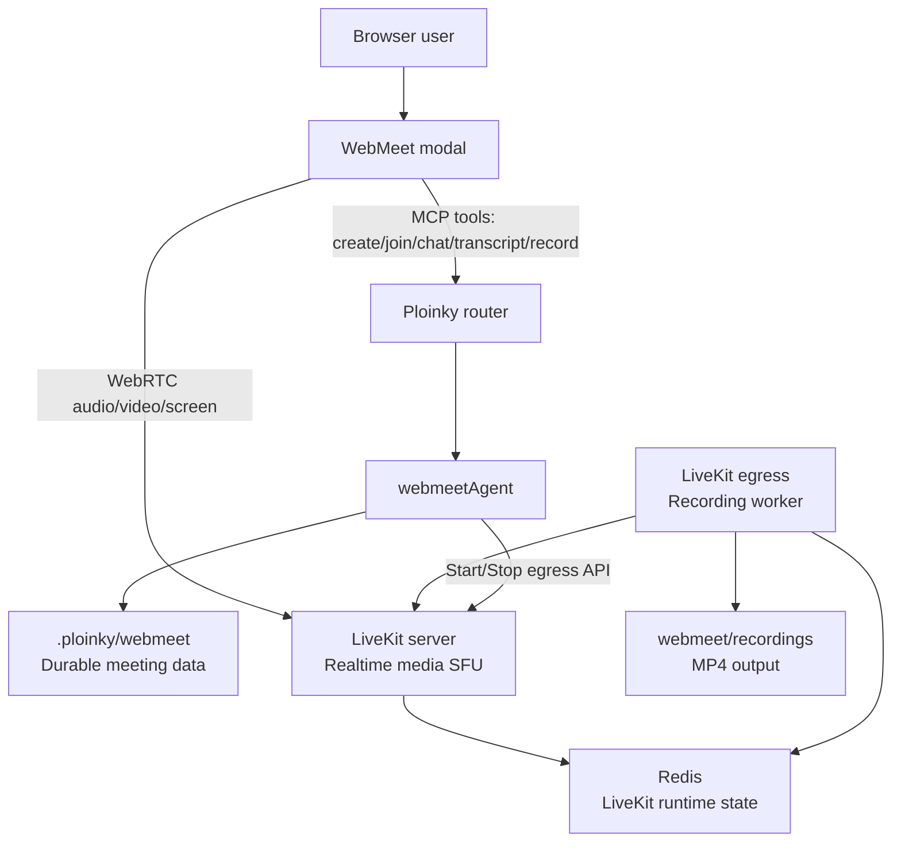
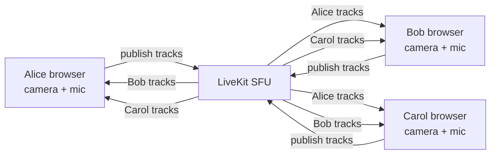
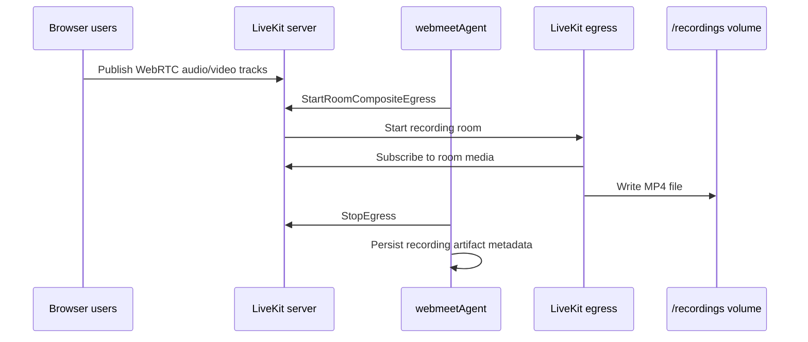
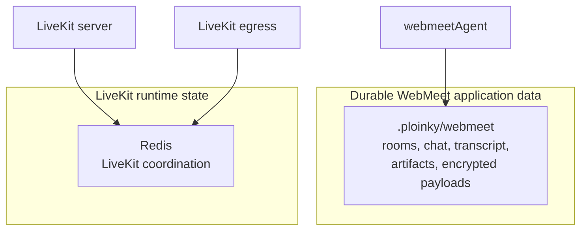
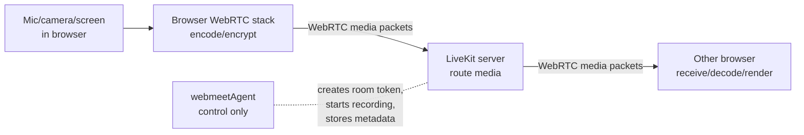
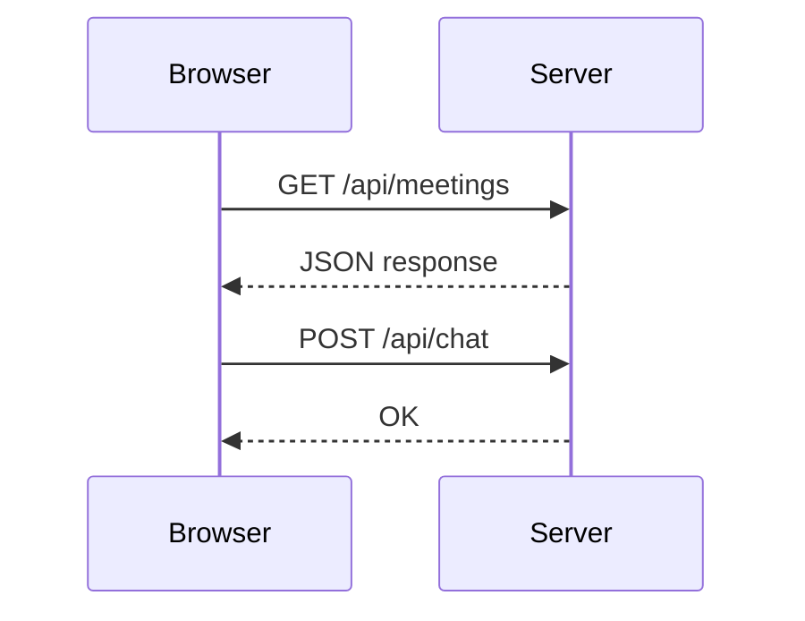
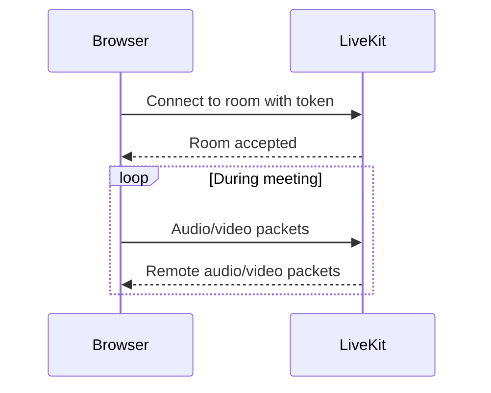
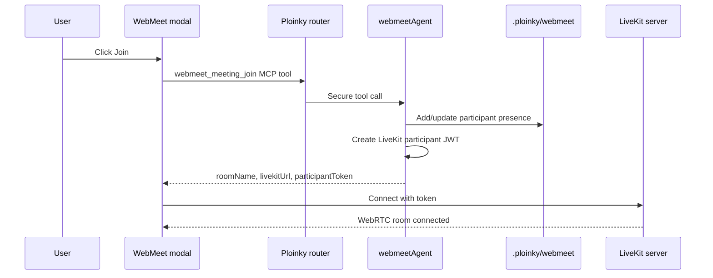
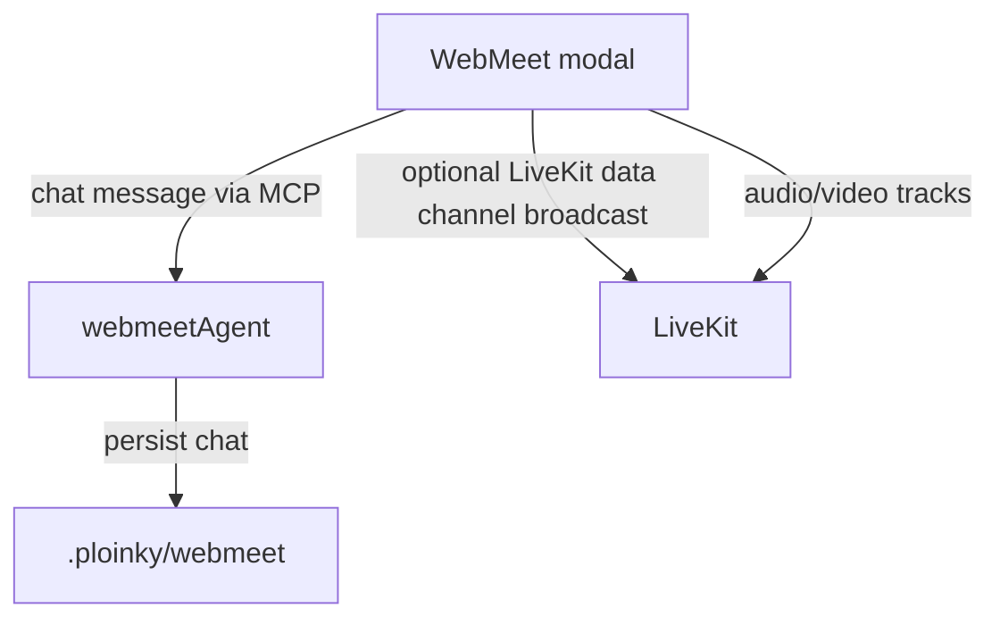

# WebMeet, LiveKit, Egress, Redis, And WebRTC

This document explains the WebMeet media stack in plain terms. It focuses only on WebMeet: what LiveKit does, why egress exists, what Redis stores, where streaming happens, and how WebRTC differs from normal HTTP.

## The Short Version

WebMeet has two different kinds of traffic:

| Plane | What it handles | Main code/service |
|---|---|---|
| Control plane | Rooms, users, chat, transcript, tokens, recording commands, artifacts | `webmeetAgent` through Ploinky MCP tools |
| Media plane | Live microphone, camera, screen share, and real-time media routing | LiveKit server through WebRTC |
| Recording plane | Capturing a LiveKit room into a file | LiveKit egress |
| LiveKit runtime state | Media-server coordination needed by LiveKit and egress | Redis |
| Durable WebMeet data | Meeting records, chat, transcript, artifacts, jobs | `.ploinky/webmeet` JSON files |

The most important point: `webmeetAgent` does not stream audio or video. It manages meeting state and gives the browser a LiveKit URL, room name, and token. The browser streams media directly to LiveKit.

## What LiveKit Server Is For

LiveKit is the media server. In this repo it runs as `webmeetInfra/webmeetLivekitServer`.

It is an SFU, or Selective Forwarding Unit. That means each browser sends its audio/video stream to LiveKit, and LiveKit forwards the right streams to the other browsers.

LiveKit helps with:

- joining a media room
- publishing microphone, camera, and screen-share tracks
- subscribing participants to each other's tracks
- adapting stream quality
- reducing bandwidth compared with every browser connecting directly to every other browser
- providing the backend API used by egress recording

Without LiveKit, WebMeet would need direct browser-to-browser WebRTC connections. That becomes difficult with more participants, firewalls, NAT, recording, and bandwidth management.

## What Egress Is For

Egress is the recording worker. In this repo it runs as `webmeetInfra/webmeetLivekitEgress`.

It is separate from LiveKit server because recording is heavy work:

- joining or subscribing to a room as a backend process
- receiving audio/video tracks
- compositing the room layout
- encoding the output
- writing an MP4 file

`webmeetAgent` starts and stops recording, but it does not record the media itself. It calls LiveKit's egress API. Egress writes the file to the shared `webmeet/recordings` volume.

## What Redis Stores

Redis is for LiveKit infrastructure state. In this repo it runs as `webmeetInfra/webmeetRedis`.

Redis is used by LiveKit server and egress so they can coordinate runtime media state. It is not the durable WebMeet application database.

Redis does not store:

- WebMeet chat history
- transcript
- meeting artifacts
- tasks or decisions
- durable meeting records

Those live under `.ploinky/webmeet` and are owned by `webmeetAgent`.

## Where Streaming Happens

Streaming is mostly client side plus LiveKit server side.

Client side:

- the browser captures microphone, camera, or screen
- the browser encodes media
- the browser sends WebRTC tracks to LiveKit
- the browser receives remote tracks from LiveKit and renders them

Server side:

- LiveKit receives streams
- LiveKit routes streams between participants
- egress can subscribe to a room and record it

Ploinky MCP and `webmeetAgent` are not in the live audio/video packet path.

## What WebRTC Is

WebRTC is a real-time communication technology built into browsers and native clients.

It lets browsers send low-latency:

- audio
- video
- screen share
- realtime data channel messages

WebRTC includes several pieces:

| Piece | Meaning |
|---|---|
| `getUserMedia` | Browser API for camera and microphone capture |
| `RTCPeerConnection` | Browser API for real-time media sessions |
| ICE | Finds a usable network path between peers or between browser and SFU |
| STUN | Helps discover public network addresses |
| TURN | Relays media when direct paths fail |
| SRTP | Encrypted realtime media transport |

In this project, the WebMeet plugin uses the LiveKit browser client, so most low-level WebRTC details are hidden behind LiveKit APIs.

## WebRTC vs HTTP

HTTP is request and response. It is excellent for pages, JSON APIs, files, and normal backend actions.

WebRTC is a long-lived real-time media session. After setup, packets flow continuously.

Main differences:

| Topic | HTTP | WebRTC |
|---|---|---|
| Shape | Request/response | Long-lived media session |
| Best for | APIs, pages, JSON, files | Live audio, video, screen share |
| Latency target | Normal web latency | Very low latency |
| Transport behavior | Reliable and ordered | Real-time; late media packets can be dropped |
| Common transport | TCP/TLS, HTTP/2, HTTP/3 | UDP when possible, with fallbacks |
| Browser API | `fetch`, forms, WebSocket, EventSource | `RTCPeerConnection`, media tracks |
| Scaling model | Standard web servers | Usually needs an SFU such as LiveKit |

The practical difference is this:

- With HTTP, waiting for missing data is usually correct.
- With live video, waiting for late packets causes freezing. It is often better to drop late media and keep the call moving.

## How Joining A WebMeet Room Works

After this point, audio/video does not go through the MCP tool path. It flows between the browser and LiveKit.

## How Chat Differs From Media

Chat is stored by `webmeetAgent`. Media is routed by LiveKit.

The UI may also broadcast a chat notification over LiveKit data channels, but the durable source of truth is the WebMeet store.

## Why This Split Exists

The split keeps each part doing the job it is good at:

| Need | Best component |
|---|---|
| Authenticated app actions | Ploinky router and MCP tools |
| Durable meeting data | `webmeetAgent` store under `.ploinky/webmeet` |
| Low-latency media routing | LiveKit server |
| Recording rooms | LiveKit egress |
| LiveKit service coordination | Redis |
| Browser UI | Explorer WebMeet plugin |

This is why WebMeet has more than one backend process. A normal HTTP/MCP agent is fine for commands and JSON state, but live audio/video needs WebRTC media infrastructure.

