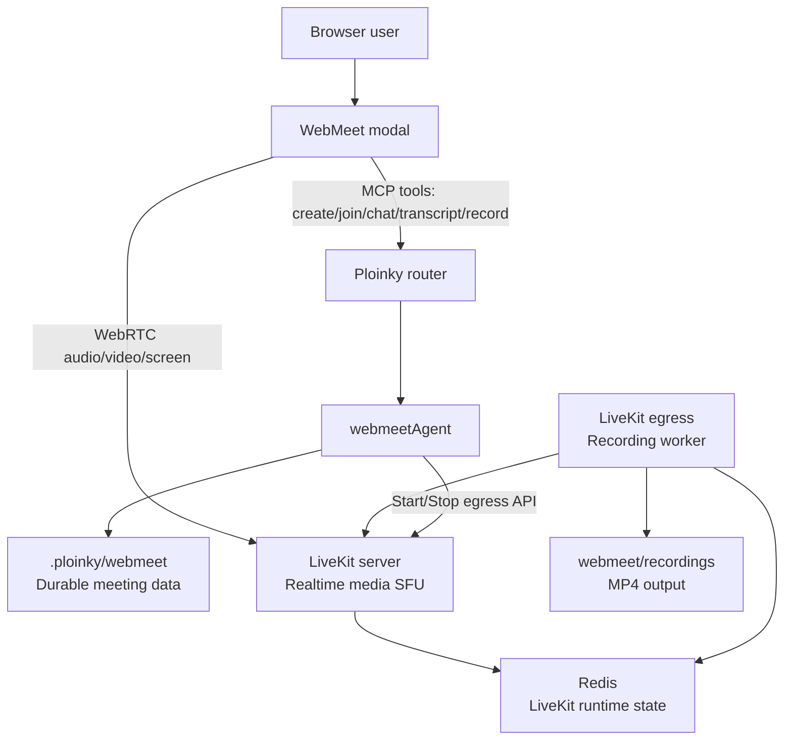
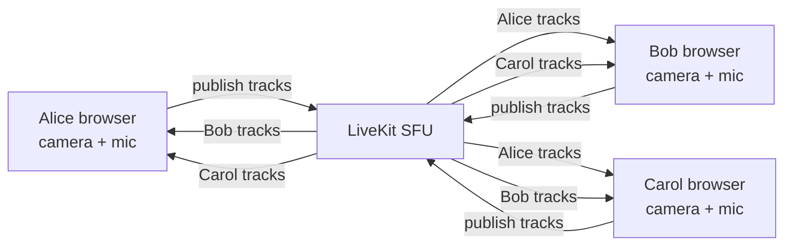
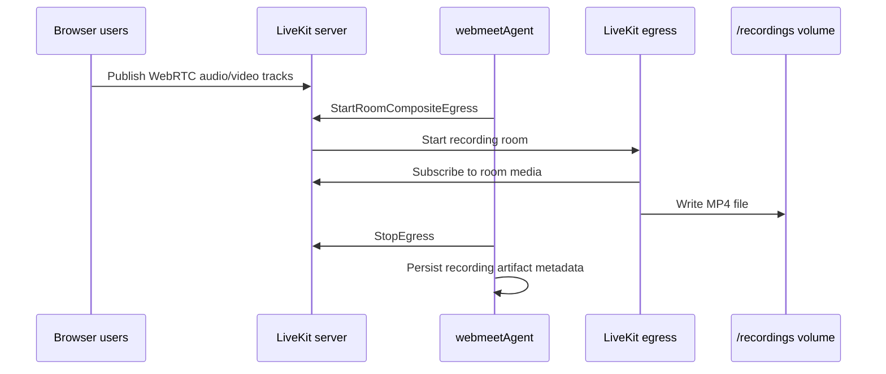
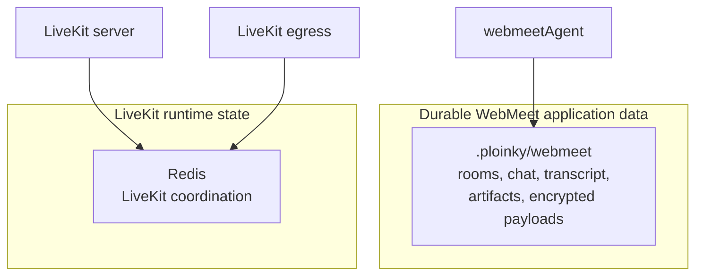
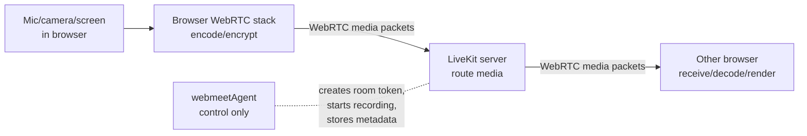
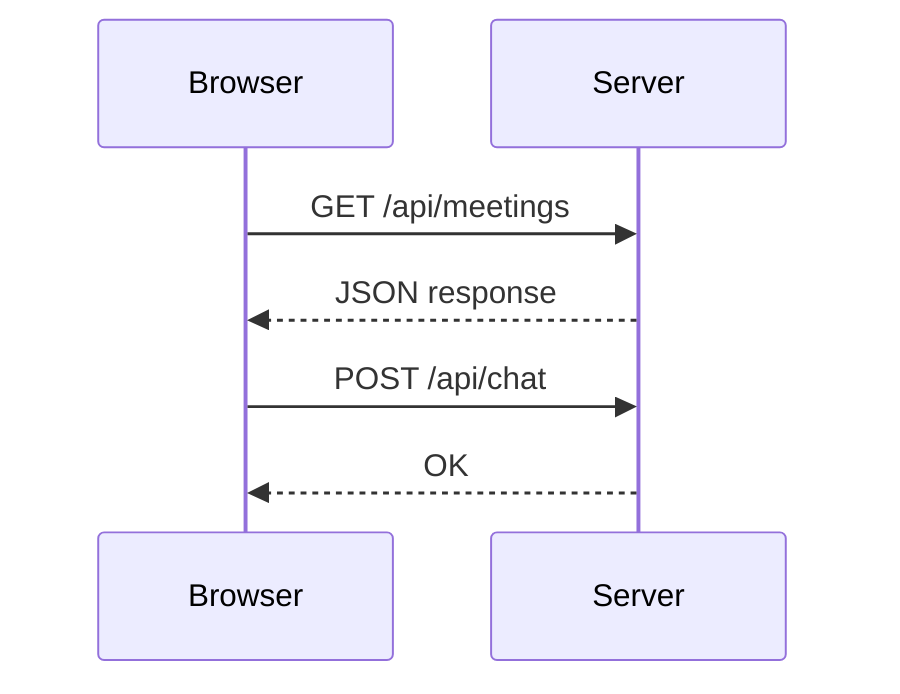
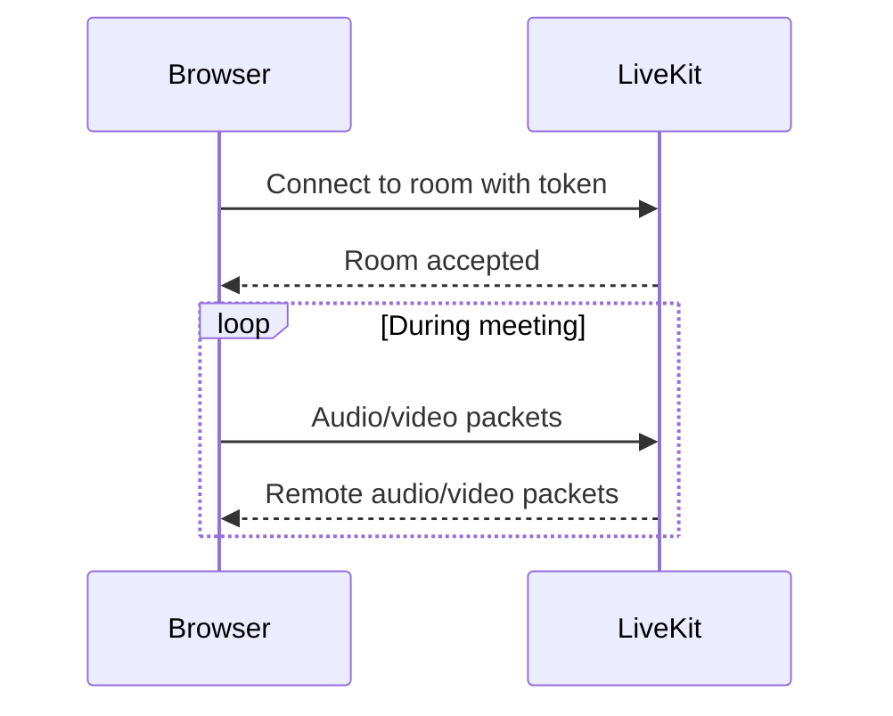
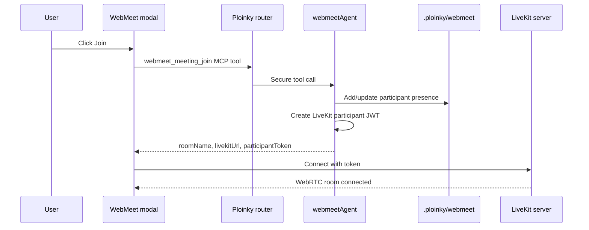
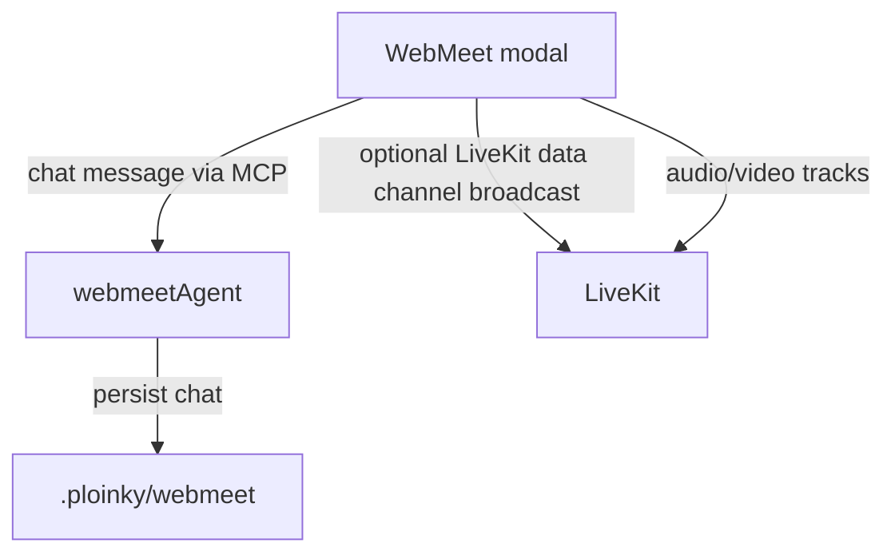

# WebMeet, LiveKit, Egress, Redis, And WebRTC

This document explains the WebMeet media stack in plain terms. It focuses only on WebMeet: what LiveKit does, why egress exists, what Redis stores, where streaming happens, and how WebRTC differs from normal HTTP.

## The Short Version

WebMeet has two different kinds of traffic:

| Plane | What it handles | Main code/service |
|---|---|---|
| Control plane | Rooms, users, chat, transcript, tokens, recording commands, artifacts | `webmeetAgent` through Ploinky MCP tools |
| Media plane | Live microphone, camera, screen share, and real-time media routing | LiveKit server through WebRTC |
| Recording plane | Capturing a LiveKit room into a file | LiveKit egress |
| LiveKit runtime state | Media-server coordination needed by LiveKit and egress | Redis |
| Durable WebMeet data | Meeting records, chat, transcript, artifacts, jobs | `.ploinky/webmeet` JSON files |

The most important point: `webmeetAgent` does not stream audio or video. It manages meeting state and gives the browser a LiveKit URL, room name, and token. The browser streams media directly to LiveKit.

## What LiveKit Server Is For

LiveKit is the media server. In this repo it runs as `webmeetInfra/webmeetLivekitServer`.

It is an SFU, or Selective Forwarding Unit. That means each browser sends its audio/video stream to LiveKit, and LiveKit forwards the right streams to the other browsers.

LiveKit helps with:

- joining a media room
- publishing microphone, camera, and screen-share tracks
- subscribing participants to each other's tracks
- adapting stream quality
- reducing bandwidth compared with every browser connecting directly to every other browser
- providing the backend API used by egress recording

Without LiveKit, WebMeet would need direct browser-to-browser WebRTC connections. That becomes difficult with more participants, firewalls, NAT, recording, and bandwidth management.

## What The LiveKit Server Actually Does

LiveKit is the middle point for every live media session. Each browser has one WebRTC session with LiveKit. Browsers do not open direct media sessions to every other browser.

When the WebMeet UI joins a room:

1. The UI asks `webmeetAgent` to join a meeting.
2. `webmeetAgent` returns a LiveKit URL and a signed participant token.
3. The browser connects to LiveKit over WebSocket signaling.
4. LiveKit verifies the token, room name, identity, and media grants.
5. The browser and LiveKit negotiate a WebRTC transport.
6. Media starts only when the user enables microphone, camera, or screen share.

During the call, LiveKit:

- receives RTP media packets from publishers
- tracks which participants are subscribed to which tracks
- forwards selected audio/video packets to subscribers
- manages WebRTC feedback such as packet loss, retransmission requests, and bandwidth estimates
- chooses appropriate video layers when the browser publishes multiple qualities
- re-encrypts media for each browser connection
- sends track events when participants join, leave, mute, unmute, publish, or unpublish
- provides the backend API used to start and stop recordings

LiveKit usually does not decode and re-encode normal room media. The browser captures and encodes media. LiveKit forwards the encoded streams and adapts which layers are sent. Recording is different: the egress worker subscribes to the room, composites a layout, encodes an MP4, and writes it to disk.

The current WebMeet UI creates LiveKit rooms with:

- LiveKit's default adaptive media behavior; WebMeet does not force adaptive stream or dynacast overrides in the room constructor.
- `autoSubscribe: false`, followed by explicit subscription sweeps for remote publications so published tracks are subscribed deterministically.
- optional TURN/STUN ICE servers from the join payload. `buildRtcConfigForSession()` returns a config when `session.rtcConfig.iceServers` is present, and returns `undefined` only when no custom ICE servers are configured.

That means coturn exists as a relay fallback when configured through `WEBMEET_TURN_*` variables. With `WEBMEET_ICE_TRANSPORT_POLICY=all`, browsers may still choose direct LiveKit media candidates when those work.

## What LiveKit Does Not Do

LiveKit does not own the WebMeet product data:

- It does not persist room lists.
- It does not store durable chat history.
- It does not store transcript entries.
- It does not create meeting summaries or tasks.
- It does not own WebMeet authorization rules for room creation/renaming/closing.

Those actions go through Ploinky MCP tools and `webmeetAgent`.

## What Egress Is For

Egress is the recording worker. In this repo it runs as `webmeetInfra/webmeetLivekitEgress`.

It is separate from LiveKit server because recording is heavy work:

- joining or subscribing to a room as a backend process
- receiving audio/video tracks
- compositing the room layout
- encoding the output
- writing an MP4 file

`webmeetAgent` starts and stops recording, but it does not record the media itself. It calls LiveKit's egress API. Egress writes the file to the shared `webmeet/recordings` volume.

## What Redis Stores

Redis is for LiveKit infrastructure state. In this repo it runs as `webmeetInfra/webmeetRedis`.

Redis is used by LiveKit server and egress so they can coordinate runtime media state. It is not the durable WebMeet application database.

Redis does not store:

- WebMeet chat history
- transcript
- meeting artifacts
- tasks or decisions
- durable meeting records

Those live under `.ploinky/webmeet` and are owned by `webmeetAgent`.

## Security Model In Plain Terms

WebMeet has two main security layers: application authorization through Ploinky and media authorization through LiveKit tokens.

Application layer:

- The browser calls WebMeet MCP tools through the authenticated Ploinky router.
- Ploinky forwards tool calls to `webmeetAgent` with router-minted invocation metadata.
- `webmeetAgent` derives user and role information from that invocation metadata.
- Admin-only room operations are checked in `webmeetStore.mjs`.
- Meeting payloads are encrypted at rest with AES-256-GCM using a per-meeting data key wrapped by `PLOINKY_WEBMEET_MASTER_KEY`.

Media layer:

- The browser cannot join LiveKit with only a room name. It needs a signed participant JWT.
- `webmeetAgent` signs participant JWTs with `WEBMEET_LIVEKIT_API_SECRET`.
- The token is scoped to one LiveKit room and grants room join, publish, subscribe, and data-channel permissions.
- The current participant token lifetime is 8 hours.
- Browser media is encrypted in transit on each WebRTC hop.

Recording layer:

- The browser does not directly control egress.
- `webmeetAgent` calls LiveKit's egress API using a short-lived server JWT with recording permissions.
- Egress joins/subscribes to room media as a backend worker and writes MP4 files to `/recordings`.

Infrastructure layer:

- LiveKit, egress, and Redis share the private `webmeet` container network.
- Redis stores LiveKit runtime coordination state, not WebMeet application data.
- Coturn can relay media when configured; the join response can include TURN ICE servers and the browser passes them into LiveKit.

Important limits:

- LiveKit is trusted infrastructure. End-to-end media encryption is not configured, so LiveKit terminates WebRTC connections to route media.
- Redis has no auth in the manifest and should not be publicly exposed.
- Dev credentials are intentionally weak and must not be used for shared or public deployments.
- TURN credentials are static in the current manifests; production must use strong secrets and firewalling.
- Recording files are stored as files under `webmeet/recordings`; they are not encrypted by the meeting JSON payload encryption layer.

## Where Streaming Happens

Streaming is mostly client side plus LiveKit server side.

Client side:

- the browser captures microphone, camera, or screen
- the browser encodes media
- the browser sends WebRTC tracks to LiveKit
- the browser receives remote tracks from LiveKit and renders them

Server side:

- LiveKit receives streams
- LiveKit routes streams between participants
- egress can subscribe to a room and record it

Ploinky MCP and `webmeetAgent` are not in the live audio/video packet path.

## What WebRTC Is

WebRTC is a real-time communication technology built into browsers and native clients.

It lets browsers send low-latency:

- audio
- video
- screen share
- realtime data channel messages

WebRTC includes several pieces:

| Piece | Meaning |
|---|---|
| `getUserMedia` | Browser API for camera and microphone capture |
| `RTCPeerConnection` | Browser API for real-time media sessions |
| ICE | Finds a usable network path between peers or between browser and SFU |
| STUN | Helps discover public network addresses |
| TURN | Relays media when direct paths fail |
| SRTP | Encrypted realtime media transport |

In this project, the WebMeet plugin uses the LiveKit browser client, so most low-level WebRTC details are hidden behind LiveKit APIs.

## WebRTC vs HTTP

HTTP is request and response. It is excellent for pages, JSON APIs, files, and normal backend actions.

WebRTC is a long-lived real-time media session. After setup, packets flow continuously.

Main differences:

| Topic | HTTP | WebRTC |
|---|---|---|
| Shape | Request/response | Long-lived media session |
| Best for | APIs, pages, JSON, files | Live audio, video, screen share |
| Latency target | Normal web latency | Very low latency |
| Transport behavior | Reliable and ordered | Real-time; late media packets can be dropped |
| Common transport | TCP/TLS, HTTP/2, HTTP/3 | UDP when possible, with fallbacks |
| Browser API | `fetch`, forms, WebSocket, EventSource | `RTCPeerConnection`, media tracks |
| Scaling model | Standard web servers | Usually needs an SFU such as LiveKit |

The practical difference is this:

- With HTTP, waiting for missing data is usually correct.
- With live video, waiting for late packets causes freezing. It is often better to drop late media and keep the call moving.

## Where Bottlenecks Can Happen

The biggest scaling pressure is usually not `webmeetAgent`. Once a room is joined, audio/video bypasses MCP tools and flows between browsers and LiveKit.

Likely bottlenecks:

| Area | Why it matters |
|---|---|
| LiveKit outbound bandwidth | Every participant may need media from many other participants. Server outbound traffic grows quickly as rooms get larger. |
| LiveKit CPU | LiveKit avoids normal transcoding, but still handles WebRTC encryption, packet routing, congestion feedback, retransmission, and subscription state. |
| UDP/TCP media ports | The current manifests expose a narrow LiveKit media range: `7882-7892/udp` or `17882-17892/udp`, plus one TCP fallback port. |
| Browser CPU/GPU | Each browser decodes and renders remote streams. Large video grids can overload clients before the server is maxed out. |
| Egress CPU | Recording composites and encodes MP4, which is much heavier than normal SFU forwarding. |
| Disk I/O and space | Long recordings write large files to `webmeet/recordings`. |
| TURN relay bandwidth | If TURN is used, coturn relays media and can become a bandwidth bottleneck. |
| Redis | Redis does not carry media packets, but LiveKit and egress depend on it for runtime coordination. |

For a rough mental model, each participant uploads their own microphone/camera/screen tracks once to LiveKit. LiveKit then forwards selected remote tracks back to every subscribed participant. In a small meeting this is efficient. In a large meeting, the LiveKit server's outbound bandwidth and per-connection WebRTC work can grow much faster than any single user's upload.

Current mitigations:

- The UI enables `adaptiveStream` and `dynacast`.
- The UI prevents camera and screen share from being active at the same time for one participant.
- Chat and transcript are not sent through the media server as the source of truth.

Current scaling gaps:

- The repo defines a single LiveKit node, a single Redis node, and a single egress worker.
- The LiveKit UDP media range is small for high concurrency.
- Coturn is available as a browser ICE fallback when the deployment provides TURN env vars; relay-only mode is a separate policy choice.
- Recording can consume significant CPU and disk bandwidth when multiple rooms record at once.

## How Joining A WebMeet Room Works

After this point, audio/video does not go through the MCP tool path. It flows between the browser and LiveKit.

## How Chat Differs From Media

Chat is stored by `webmeetAgent`. Media is routed by LiveKit.

The UI may also broadcast a chat notification over LiveKit data channels, but the durable source of truth is the WebMeet store.

## Why This Split Exists

The split keeps each part doing the job it is good at:

| Need | Best component |
|---|---|
| Authenticated app actions | Ploinky router and MCP tools |
| Durable meeting data | `webmeetAgent` store under `.ploinky/webmeet` |
| Low-latency media routing | LiveKit server |
| Recording rooms | LiveKit egress |
| LiveKit service coordination | Redis |
| Browser UI | Explorer WebMeet plugin |

This is why WebMeet has more than one backend process. A normal HTTP/MCP agent is fine for commands and JSON state, but live audio/video needs WebRTC media infrastructure.
