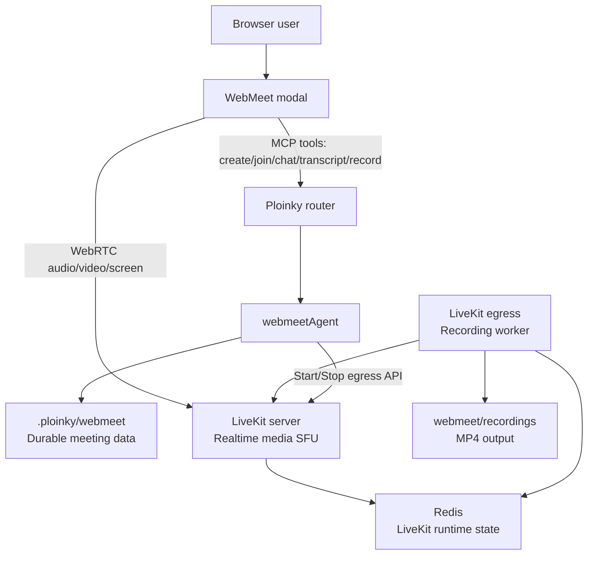
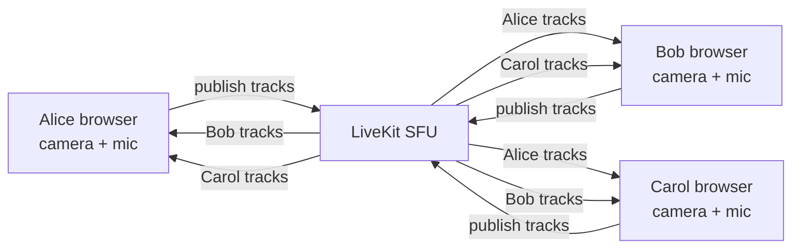
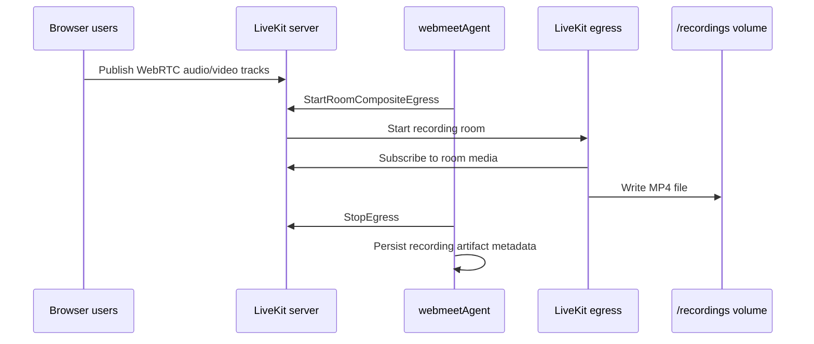
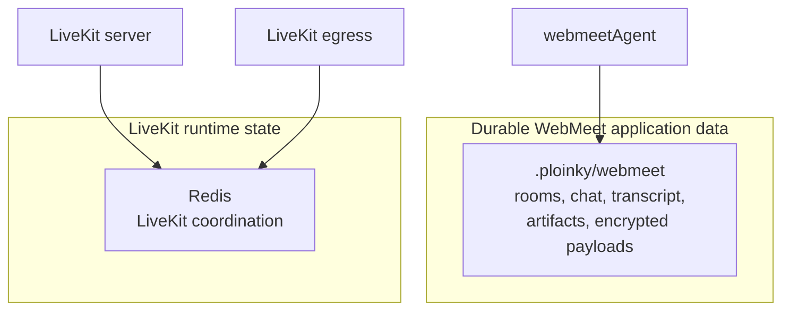
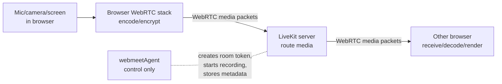
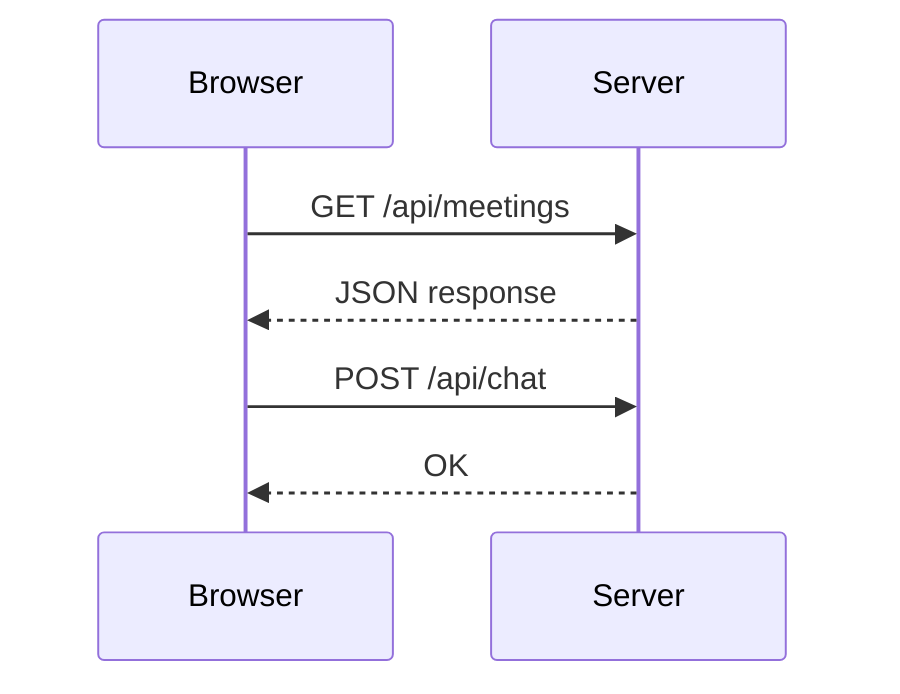
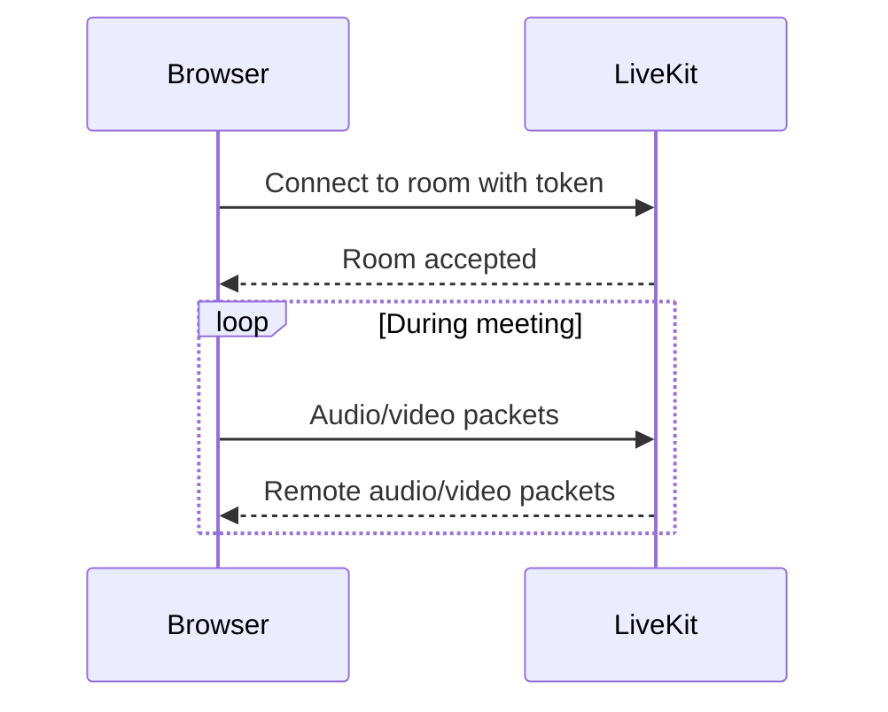
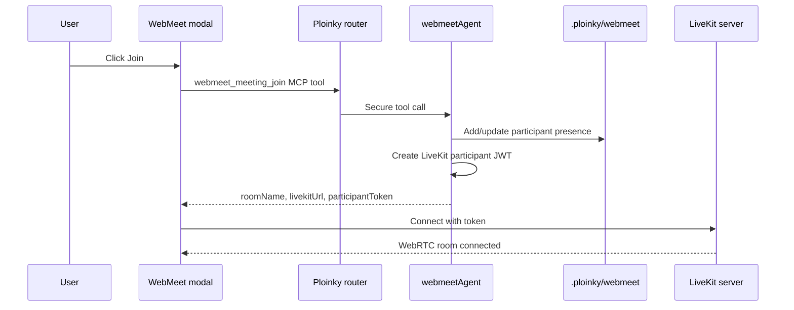
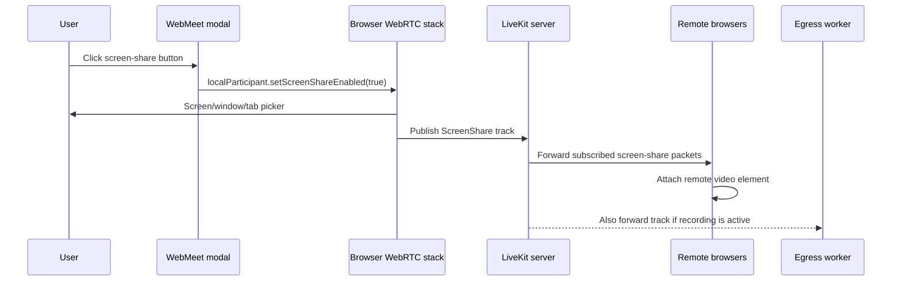
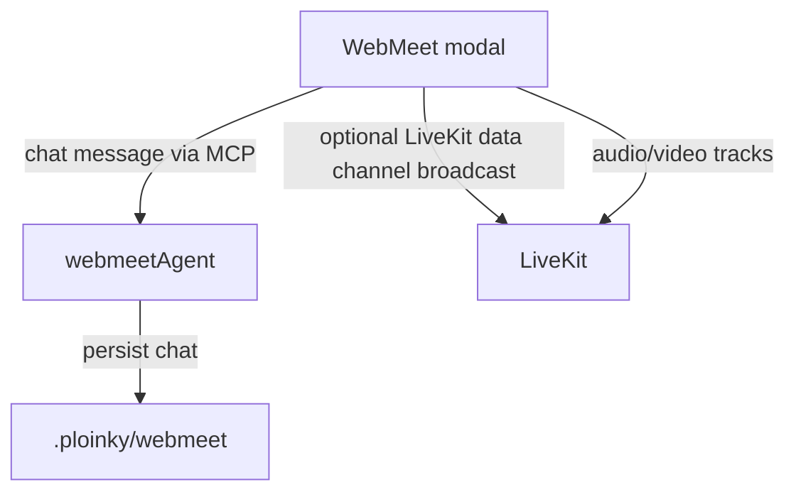

# WebMeet, LiveKit, Egress, Redis, And WebRTC

This document explains the WebMeet media stack in plain terms. It focuses only on WebMeet: what LiveKit does, why egress exists, what Redis stores, where streaming happens, and how WebRTC differs from normal HTTP.

## The Short Version

WebMeet has two different kinds of traffic:

| Plane | What it handles | Main code/service |
|---|---|---|
| Control plane | Rooms, users, chat, transcript, tokens, recording commands, artifacts | `webmeetAgent` through Ploinky MCP tools |
| Media plane | Live microphone, camera, screen share, and real-time media routing | LiveKit server through WebRTC |
| Recording plane | Capturing a LiveKit room into a file | LiveKit egress |
| LiveKit runtime state | Media-server coordination needed by LiveKit and egress | Redis |
| Durable WebMeet data | Meeting records, chat, transcript, artifacts, jobs | `.ploinky/webmeet` JSON files |

The most important point: `webmeetAgent` does not stream audio or video. It manages meeting state and gives the browser a LiveKit URL, room name, and token. The browser streams media directly to LiveKit.

## Direct Answers

- Is streamed media encrypted in flight? Yes for the WebRTC media hops between each browser and LiveKit. The browser-facing LiveKit signaling/API path is encrypted only when `WEBMEET_PUBLIC_LIVEKIT_URL` uses `wss://` and the deployment terminates TLS; the development defaults use local `ws://` and internal `http://` URLs.
- Does the LiveKit server decrypt it? Yes, in the current WebMeet configuration. End-to-end encryption is not enabled, so LiveKit terminates each WebRTC transport, can access the encoded media/data it forwards, and re-encrypts it on the outbound hop. It normally forwards encoded packets rather than decoding and compositing normal room media. The egress worker is the component that renders/composites and encodes recordings.
- What is stored in Redis? LiveKit runtime state: room data, node coordination, message-bus data, and egress coordination queues/messages. Redis does not store WebMeet chat, transcript, guest invite tokens as product data, AI artifacts, or MP4 recordings.
- How do users find each other? Authenticated users find rooms through `webmeetAgent` MCP room-list tools backed by `.ploinky/webmeet` JSON records. Guest users receive a room id plus guest token in an invite URL. After joining, participants see each other through LiveKit participant/track events and through WebMeet's presence list, which is updated by join, heartbeat, leave, and stale-presence cleanup.

## What LiveKit Server Is For

LiveKit is the media server. In this repo it runs as `webmeetInfra/webmeetLivekitServer`.

It is an SFU, or Selective Forwarding Unit. That means each browser sends its audio/video stream to LiveKit, and LiveKit forwards the right streams to the other browsers.

LiveKit helps with:

- joining a media room
- publishing microphone, camera, and screen-share tracks
- subscribing participants to each other's tracks
- adapting stream quality
- reducing bandwidth compared with every browser connecting directly to every other browser
- providing the backend API used by egress recording

Without LiveKit, WebMeet would need direct browser-to-browser WebRTC connections. That becomes difficult with more participants, firewalls, NAT, recording, and bandwidth management.

## How Users Find Rooms And Participants

WebMeet has its own room directory. LiveKit is used only after a room has been selected and a participant token has been minted.

For authenticated Explorer users:

1. The WebMeet modal calls `webmeet_workspace_list`.
2. `webmeetAgent` derives the workspace id from the current workspace root.
3. The modal calls `webmeet_meeting_list` for that workspace.
4. `webmeetAgent` reads the meeting JSON files under `.ploinky/webmeet/meetings`, filters active rooms for the current workspace, and returns the list.
5. The user selects a room and joins it.

For guest users:

1. An admin creates a guest room.
2. `webmeetAgent` stores a random `guestToken` in that meeting record.
3. The admin shares `/public-services/webmeet/guest?room=<meetingId>&token=<guestToken>`.
4. Ploinky treats the request as a scoped forced-guest HTTP service call.
5. The WebMeet guest join API checks the room id and guest token, creates or refreshes a guest participant identity, and returns a LiveKit token. Later guest state, chat, transcript, presence, and leave calls verify that participant identity.

Once joined, participants find each other in two ways:

- Live media discovery comes from LiveKit room signaling. The browser receives participant, publication, subscription, mute, unmute, and disconnect events and renders tracks from those events.
- WebMeet presence comes from the encrypted meeting payload. `joinMeeting()` adds the participant to `payload.members`, the browser sends a heartbeat every 10 seconds, `leaveMeeting()` removes the member, and stale members are removed after the configured presence TTL or the 30-second default.

Redis is not part of user-facing room discovery. It is LiveKit infrastructure state.

## What The LiveKit Server Actually Does

LiveKit is the middle point for every live media session. Each browser has one WebRTC session with LiveKit. Browsers do not open direct media sessions to every other browser.

When the WebMeet UI joins a room:

1. The UI asks `webmeetAgent` to join a meeting.
2. `webmeetAgent` returns a LiveKit URL and a signed participant token.
3. The browser connects to LiveKit over WebSocket signaling.
4. LiveKit verifies the token, room name, identity, and media grants.
5. The browser and LiveKit negotiate a WebRTC transport.
6. Media starts only when the user enables microphone, camera, or screen share.

During the call, LiveKit:

- receives RTP media packets from publishers
- tracks which participants are subscribed to which tracks
- forwards selected audio/video packets to subscribers
- manages WebRTC feedback such as packet loss, retransmission requests, and bandwidth estimates
- chooses appropriate video layers when the browser publishes multiple qualities
- re-encrypts media for each browser connection
- sends track events when participants join, leave, mute, unmute, publish, or unpublish
- provides the backend API used to start and stop recordings

LiveKit usually does not decode and re-encode normal room media. The browser captures and encodes media. LiveKit forwards the encoded streams and adapts which layers are sent. Recording is different: the egress worker subscribes to the room, composites a layout, encodes an MP4, and writes it to disk.

In the current WebMeet codebase, LiveKit is trusted infrastructure. WebRTC encrypts media on the browser-to-LiveKit hop and on the LiveKit-to-browser hop, but LiveKit terminates those encrypted transports. Because WebMeet does not configure LiveKit end-to-end encryption in `RoomOptions`, LiveKit can access the encoded media packets and LiveKit data-channel messages it forwards. This is different from LiveKit E2EE mode, where clients add an application encryption layer and LiveKit servers cannot access media or data-channel content.

Signaling and API traffic are separate from WebRTC media. They are encrypted in transit only when the deployment uses TLS, such as `wss://` for the public LiveKit URL and `https://` for server APIs. The local/default WebMeet manifests use `ws://` and `http://` endpoints for development and private container-network calls.

The current WebMeet UI connects to LiveKit with:

- `adaptiveStream: false` and `dynacast: false`, so LiveKit does not defer or pause video downtracks based on SDK visibility heuristics. WebMeet keeps this explicit because the UI renders media elements after room events and relies on immediate remote track subscription, especially for screen share.
- `autoSubscribe: true`, with explicit subscription sweeps kept as a recovery path for late publications, reconnects, and stale subscribed publications.
- optional TURN/STUN ICE servers from the join payload. `buildRtcConfigForSession()` returns a config when `session.rtcConfig.iceServers` is present, and returns `undefined` only when no custom ICE servers are configured.

That means coturn exists as a relay fallback when configured through `WEBMEET_TURN_*` variables. With `WEBMEET_ICE_TRANSPORT_POLICY=all`, browsers may still choose direct LiveKit media candidates when those work.

## What LiveKit Does Not Do

LiveKit does not own the WebMeet product data:

- It does not own or persist WebMeet's durable room directory.
- It does not store durable chat history.
- It does not store transcript entries.
- It does not create meeting summaries or tasks.
- It does not own WebMeet authorization rules for room creation/renaming/closing.

Those actions go through Ploinky MCP tools and `webmeetAgent`.

## What Egress Is For

Egress is the recording worker. In this repo it runs as `webmeetInfra/webmeetLivekitEgress`.

It is separate from LiveKit server because recording is heavy work:

- joining or subscribing to a room as a backend process
- receiving audio/video tracks
- compositing the room layout
- encoding the output
- writing an MP4 file

`webmeetAgent` starts and stops recording, but it does not record the media itself. It calls LiveKit's egress API. Egress writes the file to the shared `webmeet/recordings` volume.

## What Redis Stores

Redis is for LiveKit infrastructure state. In this repo it runs as `webmeetInfra/webmeetRedis`.

Redis is used by LiveKit server and egress so they can coordinate runtime media state. It is not the durable WebMeet application database.

With Redis configured, LiveKit uses it for room data, node coordination, and message-bus behavior. Egress uses Redis messaging queues to communicate with LiveKit and to distribute recording work when more than one egress worker exists. In this Ploinky bundle, Redis is still runtime infrastructure state even though there is only one LiveKit server and one egress worker.

Redis can contain short-lived LiveKit room, participant, node, routing, and egress coordination data. Because `webmeetRedis` runs `redis-server --save 60 1`, Redis may also write snapshots of that runtime state. Those snapshots are not WebMeet's product database.

Redis does not store:

- WebMeet chat history
- transcript
- meeting artifacts
- tasks or decisions
- durable meeting records
- guest invite tokens as WebMeet product state
- MP4 recording files
- media packets as a durable archive

Those live under `.ploinky/webmeet` and are owned by `webmeetAgent`.

## Security Model In Plain Terms

WebMeet has two main security layers: application authorization through Ploinky and media authorization through LiveKit tokens.

Application layer:

- The browser calls WebMeet MCP tools through the authenticated Ploinky router.
- Ploinky forwards tool calls to `webmeetAgent` with router-minted invocation metadata.
- `webmeetAgent` derives user and role information from that invocation metadata.
- Admin-only room operations are checked in `webmeetStore.mjs`.
- Meeting payloads are encrypted at rest with AES-256-GCM using a per-meeting data key wrapped by `PLOINKY_WEBMEET_MASTER_KEY`.
- `PLOINKY_WEBMEET_MASTER_KEY` is a WebMeet data key derived from `PLOINKY_DERIVED_MASTER_KEY` through the manifest `derive: "derived-master"` contract. Older records created before the dedicated WebMeet key can be read only for migration and are rewrapped with `PLOINKY_WEBMEET_MASTER_KEY` on the next write.

Media layer:

- The browser cannot join LiveKit with only a room name. It needs a signed participant JWT.
- `webmeetAgent` signs participant JWTs with `WEBMEET_LIVEKIT_API_SECRET`.
- The token is scoped to one LiveKit room and grants room join, publish, subscribe, and data-channel permissions.
- The current participant token lifetime is 8 hours.
- Browser media is encrypted in transit on each WebRTC hop.
- LiveKit terminates those WebRTC hops in the current configuration, because no LiveKit E2EE options or key-distribution flow are configured.
- LiveKit signaling/API traffic needs `wss://` or `https://` deployment wiring for TLS in transit; the local development defaults are not TLS.

Recording layer:

- The browser does not directly control egress.
- `webmeetAgent` calls LiveKit's egress API using a short-lived server JWT with recording permissions.
- Egress joins/subscribes to room media as a backend worker and writes MP4 files to `/recordings`.

Infrastructure layer:

- LiveKit, egress, and Redis share the private `webmeet` container network.
- Redis stores LiveKit runtime coordination state, not WebMeet application data.
- Coturn can relay media when configured; the join response can include TURN ICE servers and the browser passes them into LiveKit.

Important limits:

- LiveKit is trusted infrastructure. End-to-end media/data-channel encryption is not configured, so LiveKit terminates WebRTC connections to route media and can read non-E2EE data-channel payloads.
- Redis has no auth in the manifest and should not be publicly exposed.
- Dev credentials are intentionally weak and must not be used for shared or public deployments.
- TURN credentials are static in the current manifests; production must use strong secrets and firewalling.
- Recording files are stored as files under `webmeet/recordings`; they are not encrypted by the meeting JSON payload encryption layer.

## Where Streaming Happens

Streaming is mostly client side plus LiveKit server side.

Client side:

- the browser captures microphone, camera, or screen
- the browser encodes media
- the browser sends WebRTC tracks to LiveKit
- the browser receives remote tracks from LiveKit and renders them

Server side:

- LiveKit receives streams
- LiveKit routes streams between participants
- egress can subscribe to a room and record it

Ploinky MCP and `webmeetAgent` are not in the live audio/video packet path.

## What WebRTC Is

WebRTC is a real-time communication technology built into browsers and native clients.

It lets browsers send low-latency:

- audio
- video
- screen share
- realtime data channel messages

WebRTC includes several pieces:

| Piece | Meaning |
|---|---|
| `getUserMedia` | Browser API for camera and microphone capture |
| `RTCPeerConnection` | Browser API for real-time media sessions |
| ICE | Finds a usable network path between peers or between browser and SFU |
| STUN | Helps discover public network addresses |
| TURN | Relays media when direct paths fail |
| SRTP | Encrypted realtime media transport |

In this project, the WebMeet plugin uses the LiveKit browser client, so most low-level WebRTC details are hidden behind LiveKit APIs.

## WebRTC vs HTTP

HTTP is request and response. It is excellent for pages, JSON APIs, files, and normal backend actions.

WebRTC is a long-lived real-time media session. After setup, packets flow continuously.

Main differences:

| Topic | HTTP | WebRTC |
|---|---|---|
| Shape | Request/response | Long-lived media session |
| Best for | APIs, pages, JSON, files | Live audio, video, screen share |
| Latency target | Normal web latency | Very low latency |
| Transport behavior | Reliable and ordered | Real-time; late media packets can be dropped |
| Common transport | TCP/TLS, HTTP/2, HTTP/3 | UDP when possible, with fallbacks |
| Browser API | `fetch`, forms, WebSocket, EventSource | `RTCPeerConnection`, media tracks |
| Scaling model | Standard web servers | Usually needs an SFU such as LiveKit |

The practical difference is this:

- With HTTP, waiting for missing data is usually correct.
- With live video, waiting for late packets causes freezing. It is often better to drop late media and keep the call moving.

## Where Bottlenecks Can Happen

The biggest scaling pressure is usually not `webmeetAgent`. Once a room is joined, audio/video bypasses MCP tools and flows between browsers and LiveKit.

Likely bottlenecks:

| Area | Why it matters |
|---|---|
| LiveKit outbound bandwidth | Every participant may need media from many other participants. Server outbound traffic grows quickly as rooms get larger. |
| LiveKit CPU | LiveKit avoids normal transcoding, but still handles WebRTC encryption, packet routing, congestion feedback, retransmission, and subscription state. |
| UDP/TCP media ports | The current manifests expose a narrow LiveKit media range: `7882-7892/udp` or `17882-17892/udp`, plus one TCP fallback port. |
| Browser CPU/GPU | Each browser decodes and renders remote streams. Large video grids can overload clients before the server is maxed out. |
| Egress CPU | Recording composites and encodes MP4, which is much heavier than normal SFU forwarding. |
| Disk I/O and space | Long recordings write large files to `webmeet/recordings`. |
| TURN relay bandwidth | If TURN is used, coturn relays media and can become a bandwidth bottleneck. |
| Redis | Redis does not carry media packets, but LiveKit and egress depend on it for runtime coordination. |

For a rough mental model, each participant uploads their own microphone/camera/screen tracks once to LiveKit. LiveKit then forwards selected remote tracks back to every subscribed participant. In a small meeting this is efficient. In a large meeting, the LiveKit server's outbound bandwidth and per-connection WebRTC work can grow much faster than any single user's upload.

Current mitigations:

- The UI connects with `autoSubscribe: true`; explicit subscription sweeps still run after connect and publication events so late publications are retried without toggling already-attached tracks off.
- The UI disables `adaptiveStream` and `dynacast` in the LiveKit `Room` constructor so remote video and screen-share downtracks are negotiated immediately after subscription.
- The UI does not set room-level `publishDefaults`, screen-share capture constraints, or screen-share publish options. WebMeet leaves screen-share capture and publishing to the LiveKit client defaults because the deployed path can stall after the first decoded screen frame when WebMeet forces custom screen-share settings.
- The media settings panel exposes camera quality only. Screen-share quality is intentionally not exposed until WebMeet can apply custom screen-share constraints without breaking sustained subscriber delivery.
- The UI allows camera and screen share to be active at the same time for one participant. They are separate LiveKit video tracks and render as multiple media elements in that participant's card.
- Chat and transcript are not sent through the media server as the source of truth.

Current scaling gaps:

- The repo defines a single LiveKit node, a single Redis node, and a single egress worker.
- The LiveKit UDP media range is small for high concurrency.
- Coturn is available as a browser ICE fallback when the deployment provides TURN env vars; relay-only mode is a separate policy choice.
- Recording can consume significant CPU and disk bandwidth when multiple rooms record at once.

## How Joining A WebMeet Room Works

After this point, audio/video does not go through the MCP tool path. It flows between the browser and LiveKit.

## How Screen Sharing Works

Screen sharing is just another LiveKit video track with a screen-share source. It is not uploaded to `webmeetAgent`, and the screen content is not stored in Redis.

Camera and screen share can be active at the same time. The browser publishes them as separate LiveKit video tracks: one camera source and one screen-share source. Remote browsers treat screen share as a normal subscribed video publication and can render multiple video elements for the same participant. WebMeet lets LiveKit choose the screen-share capture and publish defaults instead of forcing custom screen-share settings at room construction time or on the screen-share enable call. If recording is active, the egress worker subscribes to the room and captures the screen-share track as part of the room composite.

## How Chat Differs From Media

Chat is stored by `webmeetAgent`. Media is routed by LiveKit.

The UI may also broadcast a chat notification over LiveKit data channels, but the durable source of truth is the WebMeet store.

## Why This Split Exists

The split keeps each part doing the job it is good at:

| Need | Best component |
|---|---|
| Authenticated app actions | Ploinky router and MCP tools |
| Durable meeting data | `webmeetAgent` store under `.ploinky/webmeet` |
| Low-latency media routing | LiveKit server |
| Recording rooms | LiveKit egress |
| LiveKit service coordination | Redis |
| Browser UI | Explorer WebMeet plugin |

This is why WebMeet has more than one backend process. A normal HTTP/MCP agent is fine for commands and JSON state, but live audio/video needs WebRTC media infrastructure.

## External LiveKit References

- Encryption overview: `https://docs.livekit.io/transport/encryption/`
- LiveKit SFU internals: `https://docs.livekit.io/reference/internals/livekit-sfu/`
- Distributed Redis setup: `https://docs.livekit.io/home/self-hosting/distributed/`
- Egress service: `https://docs.livekit.io/home/self-hosting/egress/`
- RoomComposite egress: `https://docs.livekit.io/home/egress/composite-recording`
